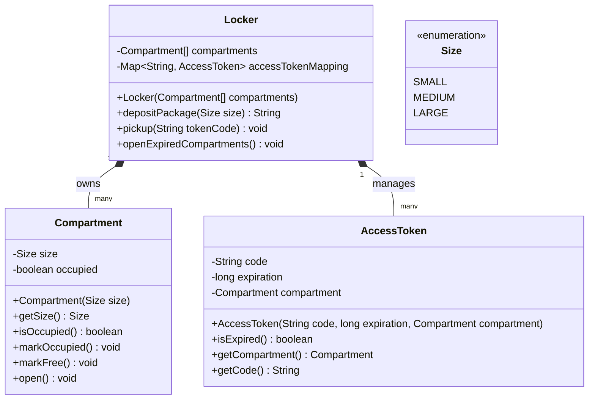

# Amazon Locker

**著者:** Evan King
**更新日:** 2026年1月9日
**難易度:** 初級 (easy)
**出題企業:** Amazon

## 問題の理解 (Understanding the Problem)

### 📦 Amazon Lockerとは？
Amazon Lockerは、セルフサービスの荷物受取システムです。配達員が利用可能なコンパートメント（ロッカーの枠）に荷物を預け入れると、システムがアクセストークンを生成し、顧客はそのコードを使用して荷物を受け取ります。

## 要件 (Requirements)

面接に臨むと、次のようなプロンプト（課題）が提示されます：

> 「配達員が荷物を預け入れ、顧客がコードを使って荷物を受け取れるような、Amazon Lockerのようなロッカーシステムを設計してください。」

これは出発点ですが、コーディングを始めるには詳細が不十分です。ホワイトボードに触れる前に、3〜5分かけて質問をし、何を構築するのかを正確に特定してください。

### 明確化のための質問 (Clarifying Questions)

ここでの目標は、実装の途中で足元をすくわれる前に、エッジケースや制約を明らかにしておくことです。実際のプロジェクトであれば、1行のコードを書く前にPM（プロダクトマネージャー）やテックリードと行う会話です。

質問は4つの分野を中心に組み立てます：コアとなる操作は何か、何が失敗する可能性があるか、スコープ（範囲）の境界はどこか、後で何を拡張する必要があるか。

Amazon Lockerを使ったことがない場合は、その旨を伝え、簡単な説明を求めてください：

**あなた:** 「Amazon Lockerを使ったことがないのですが、どのように機能するのか説明していただけますか？」
**面接官:** 「セルフサービスの受取所です。注文時にロッカーの場所を選択できます。荷物が預け入れられると、ロッカーを開けて荷物を取り出すためのコードが届きます。」

**あなた:** 「様々なサイズのコンパートメントはありますか？小さなコンパートメントがすべて埋まっている場合、小さな荷物を大きなコンパートメントに入れることはできますか？」
**面接官:** 「はい、小、中、大のコンパートメントがあります。今のところ、サイズは完全に一致させてください。適切なサイズのコンパートメントがない場合は、預け入れを拒否してください。」

*良いですね。サイズが重要であり、割り当てが厳密であることが分かりました。これは、フォールバック（代替）ロジックを扱うよりもシンプルです。*

**あなた:** 「このシステムのスコープは何ですか？配達フロー全体をモデル化するのですか、それとも配達員がロッカーに到着してから顧客が受け取るまでの部分だけですか？」
**面接官:** 「ロッカーの操作だけです。荷物はすでにロッカーの場所にあると仮定してください。配達のルーティングや配達員の割り当てはスコープ外です。」

*完璧です。これにより多くの複雑さが解消されます。私たちは物流システムを設計しているわけではありません。ロッカー自体だけです。*

**あなた:** 「顧客はどのようにしてコードを受け取りますか？SMSやメールを送信する必要がありますか、それともコードを返すだけで、通知は他のシステムに任せればよいですか？」
**面接官:** 「コードを返してください。それがどのように顧客に届くかは他のシステムの仕事です。」

*これはクリーンな境界です。私たちのシステムはコードを生成します。通知は下流（ダウンストリーム）の役割です。*

**あなた:** 「誰かが間違ったコードを複数回入力した場合はどうなりますか？セキュリティのためにロックアウト（締め出し）すべきですか？」
**面接官:** 「興味深い質問ですが、シンプルにしましょう。コードを検証するだけでいいです。間違っていればエラーを返します。今のところロックアウトのロジックは不要です。」

*状態の追跡や時間枠を必要とする機能をスコープから外しました。それを特定できたのは良いことですが、今日は作りません。*

**あなた:** 「1人の顧客がシステム内に複数の荷物を同時に持つことはできますか？アクセストークンは荷物ごとに固有ですか？」
**面接官:** 「荷物1つにつき1つのアクセストークンです。顧客は複数の荷物を持つことができ、それぞれが独自のコードを持ち、それぞれのコンパートメントに保管されます。」

*つまり、アクセストークンは荷物と1対1で対応します。共有コードや一括での受け取りはありません。*

**あなた:** 「コードの有効期限はどれくらいですか？荷物が一度も受け取られなかった場合はどうなりますか？」
**面接官:** 「コードは7日後に期限切れになります。期限切れのコードを使おうとした場合は拒否します。荷物はスタッフが取り出して差出人に返送するまでコンパートメントに残ります。」

*これでTTL（有効期間）と期限切れ時の動作が分かりました。コードは機能しなくなりますが、コンパートメントが再び利用可能になる前に、スタッフが物理的に荷物を取り出す必要があります。*

**あなた:** 「最後にもう一つ。配達員が預け入れようとしたときに、特定のサイズのコンパートメントがすべて満杯だったらどうなりますか？」
**面接官:** 「エラーを返してください。配達員は別のロッカーの場所を試すか、後で出直す必要があります。」

*シンプルです。キュー（待ち行列）も予約もありません。スペースがあるか、ないかのどちらかです。*

### 最終要件 (Final Requirements)

このやり取りの後、ホワイトボードに次のように要約します：

**要件:**
1. 配達員はサイズ（小、中、大）を指定して荷物を預け入れる
   - システムは一致するサイズの空きコンパートメントを割り当てる
   - コンパートメントを開け、アクセストークンを返す。空きがない場合はエラーを返す
2. 預け入れが成功すると、アクセストークンが生成されて返される
   - 荷物1つにつき1つのアクセストークン
3. ユーザーはアクセストークンを入力して荷物を受け取る
   - システムはコードを検証し、コンパートメントを開ける
   - コードが無効または期限切れの場合は、特定のエラーをスローする
4. アクセストークンは7日後に期限切れになる
   - 受け取り時に使用された場合、期限切れのコードは拒否される
   - スタッフが取り出すまで荷物はコンパートメントに残る
5. スタッフは期限切れのコンパートメントをすべて開けて、手動で荷物を処理できる
   - システムは期限切れのトークンを持つすべてのコンパートメントを開ける
   - スタッフは物理的に荷物を取り出し、差出人に返送する
6. 無効なアクセストークンは明確なエラーメッセージと共に拒否される
   - 間違ったコード、既に使用済み、または期限切れ - ユーザーは具体的なフィードバックを得る

**スコープ外:**
- 荷物がロッカーにどう届くか（配達のロジスティクス）
- アクセストークンが顧客にどう届くか（SMS/メール通知）
- アクセストークンの入力失敗後のロックアウト
- UI/レンダリング層
- 複数のロッカーステーション
- 支払いや料金

*注目すべきは、2つのトレードオフ（ロックアウトのロジックとアクセストークンの配信）を明示的に除外したことです。面接では、検討した結果として構築しないことを選択した機能について言及するのは賢明です。それは過剰な設計をせずに先を見据えていることを示しています。これらについては、拡張性のセクションでいつでも立ち戻ることができます。*

## コアとなるエンティティと関係性 (Core Entities and Relationships)

明確な要件が手に入ったので、次のステップはシステムを構成するオブジェクトを見つけ出すことです。要件の中にある名詞を探して、それらをクラスにするのが直感的なアプローチです。しかし、すべての名詞がエンティティに値するわけではないことに注意してください。一部の概念は、他のクラスのフィールドや入力パラメータとして属するべきものです。

候補を見ていき、どれが本当に役立つか確認しましょう。

- **Package (荷物)** - これは最初明らかに見えます。荷物を保管しているのだから `Package` クラスが必要ですよね？しかし、私たちのシステムで `Package` が実際に何をするのか立ち止まって考えてみてください。荷物はロッカーシステムの外部にあります。つまり、他のシステム（Amazonのフルフィルメントシステム）が荷物ID、配送情報、顧客の詳細などをすべて追跡しています。私たちのシステムが気にするのはただ1つ、荷物のサイズです。小、中、大のどれかを知って、適切なコンパートメントを選ぶ必要があります。それだけです。`Package` はエンティティである必要はありません。サイズは預け入れ操作への単なる入力パラメータです。
- **Compartment (コンパートメント)** - これは実体のあるものです。サイズとIDを持つ物理的な容器です。明確なエンティティです。
- **Locker (ロッカー)** - 誰かがシステム全体をオーケストレーション（調整）する必要があります。配達員が「中サイズの荷物がある」と言ったとき、何かがコンパートメントをスキャンし、利用可能なものを見つけ、コードを生成し、すべてを結びつける必要があります。それが `Locker` です。これはエントリーポイントです。
- **AccessToken (アクセストークン)** - 最初、アクセストークンは `Package` や `Compartment` の単なる文字列フィールドだと思うかもしれません。しかし、`AccessToken` はただのコードではありません。それは有効期限を持つベアラートークン（所持者認証トークン）です。特定のコンパートメントを開ける権利を表します。それはモデル化する価値のある概念です。`AccessToken` を独自のエンティティにすれば、有効期限のロジックとコンパートメントへのマッピングを所有させることができます。

これらの考慮を踏まえ、最終的なエンティティのセットは次のようになります：

| エンティティ | 責務 |
| --- | --- |
| **Locker** | オーケストレーター。すべてのコンパートメントと AccessToken のルックアップマップを所有する。預け入れと受け取りの操作を処理する。 |
| **AccessToken** | コンパートメントアクセスのためのベアラートークンを表す。コード、有効期限のタイムスタンプ、およびそれが開錠するコンパートメントへの参照を保持する。検証時に期限切れを強制する。 |
| **Compartment** | 物理的なロッカーのスロット。IDとサイズを持ち、自身の占有状態（物理的に荷物が存在するかどうか）を追跡する。 |

1回目の挑戦でエンティティ設計を完璧にできなくても大丈夫です。明白に見えるものから始めて、クラス設計を進めながら洗練させてください。不自然な間接化や、実質的な振る舞いを持たないクラスに気づいたら、戻って調整します。設計は反復的なプロセスです。

## クラス設計 (Class Design)

3つのエンティティが決まったので、それらのインターフェースを定義する必要があります。それぞれがどのような状態を保持し、どのようなメソッドを公開するのでしょうか？オーケストレーターから始めて、下へと進めていきます。`Locker` がシステムのエントリーポイントなので、最初にこれを設計し、次に `AccessToken` と `Compartment` に進みます。

各クラスについて要件まで遡り、次の2つの質問をします：このエンティティは何を覚えておく必要があるか（これがクラスの**状態**になります）、そしてどのような操作をサポートする必要があるか（これがクラスの**公開メソッド**になります）？

### Locker

`Locker` はシステムの公開APIです。外部のコードは、荷物を預け入れたり受け取ったりするためにこれと相互作用するので、すべてがこのクラスを通ります。

要件から、状態を導き出すことができます：

| 要件 | Lockerが追跡すべきもの |
| --- | --- |
| 「システムは一致するサイズの空きコンパートメントを割り当てる」 | すべてのコンパートメントのコレクションと、どれが占有されているか |
| 「ユーザーはアクセストークンを入力して荷物を受け取る」 | 高速検索のためのアクセストークンコードから AccessToken オブジェクトへのマップ |

これにより、次のようになります：

```java
class Locker {
    Compartment[] compartments;
    Map<String, AccessToken> accessTokenMapping;
}
```

上記の表からここで欠けているのは、コンパートメントに関して「どれが占有されているか」ということです。ここに `occupiedCompartments` セットを追加することもできますが、コンパートメントが占有されているかどうかの状態は `Compartment` エンティティ自体の一部として保持することにします。そうすれば、コンパートメントを反復処理し、占有フラグ（occupied flag）をチェックするだけで空き状況を確認できます。この決定のトレードオフについては、後ほど実装セクションでより詳しく検討します。

> 状態をどこに置くかを決める際は、それが**物理的**なものか**関係的（リレーショナル）**なものかを自問してください。物理的な状態（荷物が入っている、壊れている、メンテナンスが必要）は、エンティティの状態を説明するため、エンティティ上に配置します。関係的な状態（このトークンに割り当てられている、このユーザーに予約されている）は、システムが管理する関係性を説明するため、オーケストレーター内に配置します。
> 
> そうは言っても、この区別が常に明確なわけではないことを覚えておいてください。駐車場 (Parking Lot) の問題では、占有を関係的な状態として扱い、オーケストレーター内の Set で追跡するという異なる選択をします。どちらのアプローチも機能します。
> 
> 重要なのは、弁護できる根拠を持つことです。「物理的な存在はコンパートメントに内在するものだから、Compartmentに occupied フラグを置いた」というのは良い答えです。「割り当てはシステムが管理する関係性だと考えるから、Lockerに Set を使った」も同様に良い答えです。重要なのはトレードオフを理解することであり、「正解」を選ぶことではありません。

次に、操作です。すべての公開メソッドは、要件の具体的なユーザーアクションにマッピングされるべきです：

| 要件からのニーズ | Locker のメソッド |
| --- | --- |
| 「配達員はサイズを指定して荷物を預け入れる」 | `depositPackage(size)` コンパートメントを開け、アクセストークンコードを返す |
| 「預け入れが成功すると、アクセストークンが生成されて返される」 | アクセストークンを生成し、検索する方法 |
| 「ユーザーはアクセストークンを入力して荷物を受け取る」 | `pickup(tokenCode)` コンパートメントを開けるか、エラーをスローする |
| 「スタッフは期限切れのコンパートメントをすべて開けて、手動で荷物を処理できる」 | `openExpiredCompartments()` 期限切れのトークンを持つすべてのコンパートメントを開ける |

要約すると、荷物を預け入れる、荷物を受け取る、そして期限切れのコンパートメントを開ける機能が必要です。`Locker` のコンストラクタを加えると、次のようになります：

```java
class Locker {
    Compartment[] compartments;
    Map<String, AccessToken> accessTokenMapping;
    
    Locker(Compartment[] compartments) { ... }
    String depositPackage(Size size) { ... }
    void pickup(String tokenCode) { ... }
    void openExpiredCompartments() { ... }
}
```

特筆すべき設計上の選択がいくつかあります：

- **なぜ `depositPackage` はトークンコードだけを返すのか？** `depositPackage` を呼び出すと自動的にコンパートメントが開くので、配達員はそれが何番のコンパートメントかを知る必要はありません。近づいて行けば、どの扉が開いたか見えます。顧客に送信できるようにアクセストークンを返します。
- **なぜ `pickup` は `void` を返すのか？** 顧客がコードを入力し、それが有効であればコンパートメントが開きます。物理的な扉が目の前で開くため、コンパートメント番号を返す必要はありません。コードが無効または期限切れの場合は、何が悪かったのか分かるように具体的なメッセージ付きのエラーをスローします。

### AccessToken

`AccessToken` は、コンパートメントにアクセスするためのベアラートークンを表します。コードそのものを保持し、いつ期限切れになるかを知り、それが開錠するコンパートメントを指し示す必要があります。

要件から：

| 要件 | AccessTokenが追跡すべきもの |
| --- | --- |
| 「アクセストークンが生成されて返される」 | 実際のコードの文字列 |
| 「アクセストークンは7日後に期限切れになる」 | 有効期限のタイムスタンプ |
| 「システムはコードを検証し、コンパートメントを開ける」 | このアクセストークンが開錠するコンパートメントへの参照 |

状態：
```java
class AccessToken {
    String code;
    long expiration;
    Compartment compartment;
}
```

操作について、`AccessToken` は自身のデータを公開し、期限切れを確認する方法を提供する必要があります。

```java
class AccessToken {
    String code;
    long expiration;
    Compartment compartment;
    
    AccessToken(String code, long expiration, Compartment compartment) { ... }
    boolean isExpired() { ... }
    Compartment getCompartment() { ... }
    String getCode() { ... }
}
```

`getCode()` を公開して、預け入れ時に `Locker` が呼び出し元に返せるようにします。`isExpired()` メソッドにより呼び出し元が有効性を確認でき、`getCompartment()` はコンパートメント参照へのアクセスを提供します。これによりメソッドはシンプルで焦点が絞られたものに保たれます — 呼び出し元は有効期限のステータスに基づいて何をすべきか決定できます。

### Compartment

`Compartment` は最もシンプルなエンティティです。これは物理的なロッカーのスロットを表します。サイズと、それが占有されているかどうかを追跡する方法が必要です。

要件から：

| 要件 | Compartmentが追跡すべきもの |
| --- | --- |
| 「システムは一致するサイズの空きコンパートメントを割り当てる」 | サイズ（小、中、大） |

状態：
```java
class Compartment {
    Size size;
    boolean occupied;
}
```

`Compartment` は自身の物理的な状態を追跡します。`occupied` フラグは、荷物がコンパートメント内に物理的に存在するかどうかを表します。

操作について：
```java
class Compartment {
    Size size;
    boolean occupied;
    
    Compartment(Size size) { ... }
    Size getSize() { ... }
    boolean isOccupied() { ... }
    void markOccupied() { ... }
    void markFree() { ... }
    void open() { ... }
}
```

そして最後に `Size` 列挙型です：

```java
enum Size {
    SMALL,
    MEDIUM,
    LARGE
}
```

## 最終的なクラス設計 (Final Class Design)

これが完全なクラス設計です。3つのエンティティがそれぞれ焦点の絞られた責務を持っています：`Locker` はワークフローをオーケストレーションし、`AccessToken` は有効期限によるアクセス制御を強制し、`Compartment` は占有状態を含む自身の物理的な状態を管理します。関心事のクリーンな分離です。

すべてを組み合わせると、次のようになります：



この設計は Information Expert (情報エキスパートパターン) に従っています。`Locker` は割り当てとトークンのマッピングを管理します。`AccessToken` は有効期限のロジックを所有します。`Compartment` は自身の物理的な状態（占有か空きか）を管理します。

## 実装 (Implementation)

クラス設計が確定したら、実際のメソッド本体を実装する必要があります。深く飛び込む前に、面接官に確認してください。動くコードを求める人もいれば、擬似コードを好む人もいて、ロジックを口頭で説明するだけでいいという人もいます。ここでは最も一般的な擬似コードを使用しますが、最後には複数の言語での完全な実装を含めます。

各メソッドについて、以下のパターンに従います：
1. コアロジックを定義する - 要件を満たす正常系
2. エッジケースを処理する - 無効な入力、境界条件、予期しない状態

面接官は通常、最も興味深いメソッドに焦点を当てます。このロッカーシステムでは以下の通りです：
- `Locker.depositPackage` - 割り当てロジックと、コンパートメントとアクセストークンをどのように結びつけるかを示します。
- `Locker.pickup` - 検証フローとクリーンアップを示します。

### Locker

コアとなるワークフローである `depositPackage` から始めましょう。

**コアロジック:**
1. リクエストされたサイズの利用可能なコンパートメントを見つける
2. そのコンパートメントのアクセストークンを生成する
3. コンパートメントを占有済みとしてマークする
4. アクセストークンをルックアップマップに保存する

**エッジケース:**
- リクエストされたサイズのコンパートメントが空いていない
- 無効なサイズパラメータ

擬似コードは次のとおりです：

```java
String depositPackage(Size size) {
    Compartment compartment = getAvailableCompartment(size);
    if (compartment == null) {
        throw new Error("No available compartment of size " + size);
    }
    
    compartment.open();
    compartment.markOccupied();
    
    AccessToken accessToken = generateAccessToken(compartment);
    accessTokenMapping.put(accessToken.getCode(), accessToken);
    
    return accessToken.getCode();
}
```

フローは単純です。コンパートメントを見つけ、配達員が荷物を入れられるようにロックを解除し、アクセストークンを作成し、占有済みとしてマークして、トークンコードだけを返します。配達員はそれが何番のコンパートメントかを知る必要はありません。目の前で扉が開くからです。サイズが有効かどうかのチェックは行っていません。それは一致するコンパートメントを探す `getAvailableCompartment` の中で行われるからです。

`compartment.open()` 呼び出しは、物理的なロック解除メカニズムをトリガーします。ハードウェアが（実際の Amazon Locker のように）約30秒後に自動的に扉を閉じてロックすると仮定しています。

このアプローチは、配達員がコンパートメントを開けた後に実際に荷物を預け入れると仮定しています。本番システムでは、2フェーズのアプローチ（開ける → 配達員が預け入れを確認する）や、アクセストークンを生成する前に物理センサーを使用して荷物が存在することを確認するアプローチを使用するかもしれません。しかし、それはこの面接問題の範囲を超えた状態管理の複雑さを追加することになります。

同じパターンは `pickup` 時にも適用されます。顧客のために扉をロック解除し、顧客が荷物を取り出した後の自動閉鎖はハードウェアが処理します。

`getAvailableCompartment` の実装については、いくつかできることがあります。ここでは2つの可能なアプローチのトレードオフを後で検討します。

次に、`pickup` の実装を掘り下げていきましょう。コアロジックから始めて、エッジケースを処理します。

**コアロジック:**
1. コードによってアクセストークンを検索する
2. トークンを検証する（期限切れをチェック）
3. 有効であれば、コンパートメントを開けてクリーンアップを行う
4. 無効な場合（期限切れ、または存在しない）、具体的なエラーをスローする

**エッジケース:**
- アクセストークンがマップに存在しない
- アクセストークンは存在するが期限切れ
- アクセストークンコードが null または空

```java
void pickup(String tokenCode) {
    if (tokenCode == null || tokenCode.isEmpty()) {
        throw new Error("Invalid access token code");
    }
    
    AccessToken accessToken = accessTokenMapping.get(tokenCode);
    if (accessToken == null) {
        throw new Error("Invalid access token code");
    }
    
    if (accessToken.isExpired()) {
        throw new Error("Access token has expired");
    }
    
    // 有効な受け取り - 扉をロック解除しクリーンアップ
    Compartment compartment = accessToken.getCompartment();
    compartment.open();
    clearDeposit(accessToken);
}
```

`isExpired()` を使ってアクセストークンが期限切れかどうかをチェックします。期限切れの場合は、ユーザーにコードが期限切れであることを伝えるエラーをスローします。荷物はまだ物理的にコンパートメント内にあるため、トークンはマップ内に残ります。後でスタッフが `openExpiredCompartments()` を使ってこれを処理する必要があります。トークンが有効であれば、コンパートメントを取得し、開け、コンパートメントを解放してマッピングからトークンを削除することで預け入れをクリーンアップします。`pickup` は何も返さないことに注意してください。物理的なコンパートメントの扉が開くことが、顧客が必要とする唯一のフィードバックです。

「一度も存在しなかったコード」と「すでに使用されたコード」の両方に対して "Invalid access token code" をスローしていることに注目してください。荷物を受け取ると `accessTokenMapping` からアクセストークンを削除するため、同じコードでの2回目の試みは、生成されたことのないランダムなコードを入力するのと全く同じに見えます。

もし「すでに使用された」と「一度も存在しなかった」を区別したいなら、使用済みのコードを別途追跡する必要があります（例えば `usedTokens` セットや、削除する前に `AccessToken` に `isUsed` フラグを立てるなど）。しかし、それはわずかなUX（ユーザー体験）の向上のために状態管理を追加することになります。ほとんどのシステムでは、どちらのケースでも「無効なアクセストークンコード」というフィードバックで十分です。ユーザーは単に自分のコードが使えないことを知るだけでいいのです。

期限切れのコードに対しては、具体的なフィードバック ("Access token has expired") を提供します。これはユーザーが次のアクション（まだロッカー内にある荷物についてサポートに連絡するなど）を取れるためです。

さて、次に `generateAccessToken` と `clearDeposit` の実装を見てみましょう。どちらも比較的単純です。

```java
AccessToken generateAccessToken(Compartment compartment) {
    String code = generateRandomCode();  // 6桁の数字やUUIDなど
    long expiration = now() + 7_days;
    return new AccessToken(code, expiration, compartment);
}
```

実際のコード生成はごまかしています（hand-waving）。実際のシステムでは、暗号論的に安全な乱数ジェネレータを使用します。重要なのは、有効期限を今から7日後に設定することです。

```java
void clearDeposit(AccessToken accessToken) {
    Compartment compartment = accessToken.getCompartment();
    compartment.markFree();
    accessTokenMapping.remove(accessToken.getCode());
}
```

ここがすべての状態追跡をクリーンアップする場所です。コンパートメントを空きとしてマークし（`occupied` フラグをクリア）、アクセストークンをマップから削除します。これらのステップのいずれかを忘れると、矛盾した状態になってしまいます。コンパートメントが実際には空いているのに占有されているように見えたり、利用可能なコンパートメントに対するアクセストークンがマップに残ったりします。

次に `openExpiredCompartments` を見てみましょう。これは、スタッフが受け取られなかった荷物を物理的に回収するために使用します：

```java
void openExpiredCompartments() {
    for (AccessToken accessToken : accessTokenMapping.values()) {
        if (accessToken.isExpired()) {
            Compartment compartment = accessToken.getCompartment();
            compartment.open();
        }
    }
}
```

このメソッドはすべてのアクセストークンをスキャンし、期限切れのトークンを持つコンパートメントを開けます。その後、スタッフはどのコンパートメントが開いたかを物理的に確認し、荷物を取り出し、返品処理を行うことができます。ここでは `clearDeposit` を呼び出していません。なぜなら、スタッフが物理的に荷物を取り出すまではコンパートメントは占有されたままだからです。スタッフが作業を終えたら、別途のメソッド（スコープ外）を呼び出して荷物が取り出されたことをマークし、それがコンパートメントを解放し、期限切れのトークンをマッピングから削除することで状態をクリーンアップします。

### AccessToken

ここでの重要なメソッドは `isExpired` と `getCompartment` です：

**コアロジック:**
- `isExpired` は現在時刻が有効期限を過ぎているかチェックする
- `getCompartment` はコンパートメントへの参照を返す

**エッジケース:**
- 有効期限のタイムスタンプが過去である

```java
boolean isExpired() {
    return now() >= expiration;
}

Compartment getCompartment() {
    return compartment;
}

String getCode() {
    return code;
}
```

シンプルで焦点が絞られています。`AccessToken` は有効期限のタイムスタンプを所有しているため、有効性をチェックする方法を提供します。呼び出し元は、その情報に基づいて何をすべきか決定します。

### Compartment

ここのメソッドは物理的な状態を管理し、プロパティへのアクセスを提供します：

```java
Size getSize() {
    return size;
}

boolean isOccupied() {
    return occupied;
}

void markOccupied() {
    occupied = true;
}

void markFree() {
    occupied = false;
}
```

`Compartment` は `markOccupied()` と `markFree()` を通じて自身の物理的な状態を管理しますが、ビジネスロジックは持ちません。オーケストレーションとアクセス制御は `Locker` と `AccessToken` にあります。

これが実装の全体です。ロジックがシンプルなのは、設計の段階で難しい作業を先に行っているからです。各クラスには明確な仕事が1つあり、メソッドは短く焦点を絞ったものになっています。

## 検証 (Verification)

預け入れと受け取りのフローをトレースして、状態管理とクリーンアップのロジックが正しく機能するかどうかを検証しましょう。これは、バグになる前に問題をキャッチするのに役立ちます。

Lockerにはコンパートメント A (SMALL), B (MEDIUM), C (LARGE) があり、すべて `occupied = false` です。AccessToken マップは空です。

**MEDIUM の荷物を預け入れる:** `depositPackage(MEDIUM)`
- 初期状態: compartments=[A, B, C], accessTokenMapping={}
- `getAvailableCompartment(MEDIUM)` → Compartment B (サイズ一致、占有されていない)
- `B.open()` → ハードウェアのロック解除をトリガー
- `B.markOccupied()` → B.occupied = true
- `generateAccessToken(B)` → AccessToken("ABC123", expiration=今から7日後, compartment=B)
- `accessTokenMapping.put("ABC123", accessToken)` → マップにエントリが追加される
- 結果: "ABC123" を返す
- **状態:** B.occupied=true, accessTokenMapping={"ABC123" → AccessToken}

各Compartmentが自身の占有状態を管理し、扉が即座に開くことに注目してください。

**成功する受け取り:** `pickup("ABC123")`
- `accessTokenMapping.get("ABC123")` → AccessToken が存在する
- `accessToken.isExpired()` → 現在 < 有効期限、false を返す
- `accessToken.getCompartment()` → B を返す
- `B.open()` → ハードウェアのロック解除をトリガー
- `clearDeposit(accessToken)`:
  - `accessToken.getCompartment()` → B を返す
  - `B.markFree()` → B.occupied = false
  - `accessTokenMapping.remove("ABC123")`
- 結果: void (コンパートメントが開いた)
- **状態:** B.occupied=false, accessTokenMapping={}

両方のクリーンアップステップが実行され、物理的な扉が開きました。

**期限切れの受け取り試行 (8日後):** `pickup("ABC123")`
- `accessTokenMapping.get("ABC123")` → AccessToken はまだ存在する
- `accessToken.isExpired()` → 現在 > 有効期限、true を返す
- `throw Error("Access token has expired")` をスロー
- 結果: エラーがスローされる (コンパートメントは開かない)
- **状態:** B.occupied=true, accessTokenMapping={"ABC123" → AccessToken (期限切れ)}

期限切れのトークンはマッピングに残り、コンパートメントは占有されたままです。後でスタッフが `openExpiredCompartments()` を呼び出して物理的に荷物を取り出し、その後クリーンアップメソッドを呼び出してコンパートメントを解放し、トークンを削除します。

## 拡張性 (Extensibility)

時間が許せば、面接官は設計がクリーンに進化できるかどうかをテストするために、小さな「ひねり」を加えることがあります。通常、これらの変更を完全に実装する必要はありません。クラスがどのように適応するかを説明するだけです。拡張性のフォローアップの深さと量は、候補者のターゲットレベル（ジュニア、ミッド、シニア）と相関します。

### 1. 「サイズのフォールバック（代替）をどのように処理しますか？」

現在、中サイズのコンパートメントがすべて満杯の場合、大サイズのコンパートメントが空いていても預け入れを拒否しています。小さな荷物に代替として大きなコンパートメントを使用させるにはどうすればよいでしょうか？

「`getAvailableCompartment` を変更して、まず正確なサイズを試し、何も空いていなければより大きなサイズにフォールバックするようにします。MEDIUM の荷物の場合、最初に MEDIUM をチェックし、次に LARGE をチェックします。SMALL の場合、SMALL、MEDIUM、LARGE の順にチェックします。荷物が入らないので、より小さなサイズにフォールバックすることはありません。

重要な変更はスキャンロジックにあります。正確なサイズ一致をチェックする単一のループの代わりに、リクエストされたサイズから始めて最大のサイズまで、サイズを順に反復処理します。」

```java
Compartment getAvailableCompartment(Size requestedSize) {
    Size[] sizesInOrder = {Size.SMALL, Size.MEDIUM, Size.LARGE};
    int startIndex = indexOf(sizesInOrder, requestedSize);
    
    for (int i = startIndex; i < sizesInOrder.length; i++) {
        Size currentSize = sizesInOrder[i];
        for (Compartment c : compartments) {
            if (c.getSize() == currentSize && !c.isOccupied()) {
                return c;
            }
        }
    }
    return null;  // 利用可能なコンパートメントなし
}
```

これにより、設計の残りの部分は変更されません。割り当てロジックは1つのメソッド内にカプセル化されており、フォールバックの順序は別々のヘルパーメソッドで維持されるのではなく、サイズの順序付けの中に暗黙的に含まれています。

### 2. 「壊れている、またはメンテナンス中のコンパートメントをどのように処理しますか？」

現在、すべてのコンパートメントは占有中か空きかのどちらかです。しかし現実には、コンパートメントの扉が壊れたり、ロックが故障したり、スタッフがメンテナンスのためにコンパートメントをオフラインにする必要があるかもしれません。

「鋭い指摘です。コンパートメントが稼働中かどうかを追跡するために、`Compartment` に `status`（ステータス）フィールドを追加する必要があります。コンパートメントは占有中（occupied）、利用可能（available）、またはサービス停止中（out of service）のいずれかになります。コンパートメントがサービス停止中の場合は、占有中のものをスキップするのと同じように、割り当て時にそれをスキップします。」

コードへの実際の変更は簡単です。ステータスの列挙型を追加し、`Compartment` を更新して、単なる占有/空きの二値状態ではなくするだけです。

```java
enum CompartmentStatus {
    AVAILABLE,
    OCCUPIED,
    OUT_OF_SERVICE
}

class Compartment {
    Size size;
    CompartmentStatus status;
    
    boolean isAvailable() { return status == CompartmentStatus.AVAILABLE; }
    void markOccupied() { ... }
    void markAvailable() { ... }
    void markOutOfService() { ... }
    void markInService() { ... }
}
```

そして `getAvailableCompartment` の可用性チェックを更新します：

```java
Compartment getAvailableCompartment(Size size) {
    for (Compartment compartment : compartments) {
        if (compartment.getSize() == size && compartment.isAvailable()) {
            return compartment;
        }
    }
    return null;
}
```

`status` フィールドはシンプルな `occupied` ブール値を置き換えます。`isAvailable()` が false を返すため、割り当てロジックはサービス停止中のコンパートメントを自動的にスキップします。

### 3. 「アクセストークンを生成する前に、荷物が実際に預け入れられたことをどのように保証しますか？」

現在、コンパートメントのロックを解除すると、配達員が荷物を預け入れると仮定して、すぐに占有済みとマークしています。しかし、彼らが開けただけで歩き去ってしまったらどうでしょうか？空のコンパートメントに対してアクセストークンを生成することになります。

「ご指摘の通りです。現在は `compartment.open()` で扉をロック解除し、配達員が預け入れを完了すると想定する、Fire-and-forget（撃ち放し）のアプローチを取っています。荷物が実際にそこにあることを確認するには、**2フェーズコミット (two-phase commit)** パターンが必要です。

`depositPackage` で全てを一度に行うのではなく、操作を2つに分割します：`reserveCompartment` (コンパートメントの予約) と `confirmDeposit` (預け入れの確認) です。配達員は予約を呼び出してコンパートメントを取得しロック解除し、物理的に荷物を置いた後、確認を呼び出します。確認された後にのみ、アクセストークンを生成し、占有済みとしてマークします。」

```java
class Locker {
    String reserveCompartment(Size size) { ... }
    String confirmDeposit(String reservationId) { ... }
    void cancelReservation(String reservationId) { ... }
}
```

「このアプローチは新しい状態（RESERVED：予約済み）を追加し、予約をアクセストークンとは別に追跡する必要があります。また、タイムアウトのロジックも必要になります。配達員が予約したものの2〜3分以内に確認しない場合、システムは自動的にキャンセルし、コンパートメントを解放する必要があります。

トレードオフは複雑さが増すことです。面接のスコープであれば、1フェーズのアプローチの方がクリーンで十分です。しかし、物理的な荷物の存在を保証する必要がある本番環境では、センサーや手動確認による2フェーズコミットが不可欠になります。」
