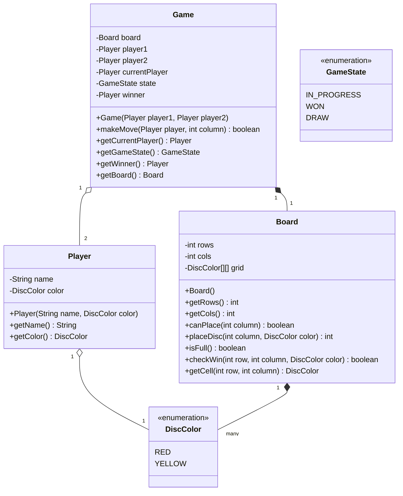

# コネクトフォー (Connect Four)

**著者:** Evan King
**公開日:** 2025年12月8日
**難易度:** 初級 (easy)
**出題企業:** Amazon, Microsoft

## 問題の理解 (Understanding the Problem)

### 🔍 コネクトフォーとは？
コネクトフォー（立体四目並べ）は、2人のプレイヤーが交互に7×6のグリッドに自分のディスク（コマ）を落としていくゲームです。自分のディスクを縦、横、または斜めに4つ先に並べたプレイヤーが勝ちとなります。

## 要件 (Requirements)

面接が始まると、設計すべきアーキテクチャの舞台設定として、次のようなシンプルなプロンプトが提示されるでしょう。

「2人プレイのコネクトフォーゲームのオブジェクト指向設計を構築してください。プレイヤーは交代で、7列6行のボードにディスクを落とします。縦、横、または斜めに自分のディスクを4つ先に並べた方が勝ちです。」

クラス設計に飛び込む前に、面接官に質問するべきです。ここでの目標は、曖昧なプロンプトを具体的な仕様——実際に構築の基準となるもの——に変えることです。

### 明確化のための質問 (Clarifying Questions)

目標は、早い段階で曖昧さを表面化させ、具体的な仕様を導き出すことです。これは、実際のプロジェクトで要件を明確にする際に使用するプロセスと同じです。

質問を構成する信頼できる方法は、**主要なアクションは何か**、**エラーはどのように処理すべきか**、**システムの境界は何か**、そして**将来の拡張を計画する必要があるか**、という4つの領域をカバーすることです。

あなたと面接官の会話は次のようになるかもしれません：

**あなた:** 「プレイヤーはどのようにゲームを操作しますか？列の番号を指定するだけでディスクが落ちるのでしょうか？」
**面接官:** 「はい、プレイヤーは0から6までの列を選び、ディスクは一番下の空いている場所に落ちます。」
*よし。主要なアクションが確認できました。次に、ゲームの終了条件について考えます。*

**あなた:** 「ゲームが終了するすべてのパターンは何ですか？4つ並ぶだけですか、それとも引き分け（ドロー）もありますか？」
**面接官:** 「縦、横、斜めのいずれかで4つ並べば勝ちです。ボードが埋まって勝者がいない場合は引き分けです。」
*これで勝利条件と引き分け条件が分かりました。次に、問題が起きた場合の対処を考えます。*

**あなた:** 「すでに満杯の列にディスクを落とそうとした場合はどうすべきですか？エラーを返すか、例外を投げるか、単に無視しますか？」
**面接官:** 「`false`を返すか、エラーを発生させてください。無効な操作によってゲームのステート（状態）を壊さないようにしてください。」

**あなた:** 「プレイヤーが自分の番ではないのに操作しようとした場合は？」
**面接官:** 「同じです。明確に拒否してください。」
*これでエラー処理はカバーできました。次に、スコープを特定します。*

**あなた:** 「このシステムは一度に1つのゲームをサポートするように設計しますか、それとも複数の並行するゲームを処理する必要がありますか？」
**面接官:** 「1つのゲームだけでいいです。シンプルにしてください。」

**あなた:** 「わかりました。そして、これはバックエンドのロジックのみですか、それともUIのサポートも必要ですか？」
**面接官:** 「バックエンドのみです。レンダリングは他の誰かが処理します。」
*この最後の質問は、あなたが思う以上に重要です。UIサポートが必要な場合は、何かをレンダリングできるように `getBoardState()` や `getValidMoves()` のようなメソッドが必要になります。バックエンドのみであれば、APIを最小限に抑え、ゲームのルールに純粋に焦点を当てることができます。*

最後に、計画すべき将来の機能があるかどうかを確認します。

**あなた:** 「操作の履歴を追跡したり、元に戻す（アンドゥ）機能のサポートは必要ですか？」
**面接官:** 「いいえ、複雑にしすぎないでください。」

**あなた:** 「ボードのサイズについてですが、設定可能にする必要がありますか、それとも常に7x6ですか？」
**面接官:** 「常に7x6です。」
*完璧です。これでスコープを明確にし、不要な複雑さを排除できました。*

### 最終要件 (Final Requirements)

このやり取りの後、ホワイトボードに最終的な要件や、スコープ外として学んだことを書き出すことができます。

**要件:**
1. 2人のプレイヤーが交互に7列6行のボードにディスクを落とす。
2. ディスクは、選んだ列の利用可能な一番下の行に落ちる。
3. 次の場合にゲームは終了する：
    - プレイヤーがディスクを（縦、横、または斜めに）4つ並べた場合。そのプレイヤーの勝ち。
    - ボードが満杯になった場合。引き分け。
4. 無効な操作は明確に拒否されなければならない：
    - 満杯の列に落とすこと。
    - 順番外で操作すること。
    - ゲーム終了後に操作すること。

**スコープ外:**
- UIサポート
- 並行ゲームの処理
- 操作履歴（Move history）
- 元に戻す（Undo）機能
- ボードサイズの設定

## コアとなるエンティティと関係性 (Core Entities and Relationships)

明確な要件のセットが手に入ったら、次のステップはどのオブジェクトが必要で、それらがどのように相互作用するかを考えることです。

自分自身に問いかけてみてください：この問題における主な「事柄（名詞）」は何ですか？要件から名詞を探し、それぞれがどのような責任を持つべきかを考えます。コネクトフォーでは、すぐにいくつか思い浮かびます：**ゲーム自体**、ディスクが置かれる**ボード**、そして操作を行う**プレイヤー**です。

よくある間違いは、すべてを1つの巨大なクラスにまとめたり、不必要に分割したりすることです。優れた設計とは、各クラスが単一の明確な仕事を持つことを意味します。`Board`（ボード）はグリッドの状態と配置ルールを管理します。`Game`（ゲーム）はターンと勝利判定を調整します。`Player`（プレイヤー）は単なるデータであり、名前と使用している色を保持します。

コネクトフォーでは、次のように分けるのが合理的です：

| エンティティ | 責務 |
| --- | --- |
| **Game** | オーケストレーター。`Board` を保持し、どの `Player` の番かを追跡し、ゲーム状態（進行中、勝ち、引き分け）を管理し、ターンベースのルールを強制します。プレイヤーが操作を行うと、`Game` はそれを検証し、`Board` にディスクを配置するよう指示し、その操作で勝ったかどうかを確認し、ターンを切り替えます。 |
| **Board** | ディスクが存在する7x6のグリッド。グリッドの状態を所有し、ディスクの配置を処理します。列が満杯かどうか、ディスクがどこに落ちるべきか、そして4つのディスクが繋がっているかを確認する方法を知っています。誰の番か、誰が勝っているかは気にしません。 |
| **Player** | ゲームの参加者を表します。名前とディスクの色を持つシンプルなデータ保持者です。ここにゲームのロジックはありません。 |

## クラス設計 (Class Design)

3つのコアエンティティを特定したので、次はそれらのインターフェースを定義します。これは、各クラスがどのようなデータを保持し、外部にどのようなメソッドを公開するかを決定することを意味します。

トップダウンのアプローチから始めることをお勧めします。`Game` クラスはオーケストレーターであり主要なエントリーポイントなので、そこから設計を始めましょう。`Game` のインターフェースを定義したら、`Board`、そして `Player` へと下げていきます。これにより、実装の詳細に迷い込むことなく、パブリックAPIに集中できます。

各エンティティについて、要件を使用してクラスの状態と振る舞い（メソッド）の両方を導き出します。まずは `Game` から始めましょう。

### Game

`Game` クラスはオーケストレーションのレイヤーです。外部コードは、新しいゲームの作成、誰の番かの確認、操作の実行、ゲームが終わったかどうかの確認など、このクラスのみを通じてゲームと対話するべきです。

`Game` についてのほぼすべては、最終要件から直接導き出すことができます。面接中は要件を再確認し、「これを強制するために、ゲームは何を記憶しておく必要があるか？」と問いかけてください。こうして `Game` クラスの状態を導き出します。

| 要件 | Game が追跡すべきもの |
| --- | --- |
| 「2人のプレイヤーが交互に...ボードにディスクを落とす」 | 2人のプレイヤー、誰の番か、そしてボード |
| 「ゲームはプレイヤーが勝つかボードが満杯になると終了する」 | ゲームの状態（進行中、勝ち、引き分け） |
| 「プレイヤーがディスクを4つ並べる。彼らの勝ち。」 | 誰が勝ったか（もし誰も勝っていない/引き分けなら null） |

これにより、シンプルな状態オブジェクトが得られます：

```java
class Game {
    Board board;
    Player player1;
    Player player2;
    Player currentPlayer;
    GameState state; // IN_PROGRESS, WON, DRAW
    Player winner;   // 誰も勝っていないか引き分けの場合は null
}
```
重要なのは、`winner` を null 可能にすることです。引き分けの場合、単に勝者は存在しません。これは特別な「NONE」値をオーバーロードするよりも明確です。

次に、外界が実行する必要のあるアクションを見てみましょう。`Game` 上のすべてのメソッドは、問題文の具体的なニーズに対応している必要があります。

| 要件からのニーズ | Game 上のメソッド |
| --- | --- |
| 「プレイヤーが交互にディスクを落とす」 | `makeMove(player, column)` - コアなアクション |
| 「順番外の操作を拒否する」 | `getCurrentPlayer()` - 呼び出し元は誰の番か知る必要がある |
| 「ゲームが終了するのは...」 | `getGameState()` - 呼び出し元はゲームが終わったか確認する必要がある |
| 「プレイヤーがディスクを4つ並べる」 | `getWinner()` - 呼び出し元は誰が勝ったか知る必要がある |

メソッドを追加すると、次のようになります：

```java
class Game {
    Board board;
    Player player1;
    Player player2;
    Player currentPlayer;
    GameState state; 
    Player winner;
    
    Game(Player player1, Player player2) { ... }
    boolean makeMove(Player player, int column) { ... }
    Player getCurrentPlayer() { ... }
    GameState getGameState() { ... }
    Player getWinner() { ... }
    Board getBoard() { ... }
}
```

コンストラクタはゲームの状態を初期化します：

```java
Game(Player player1, Player player2) {
    this.board = new Board();
    this.player1 = player1;
    this.player2 = player2;
    this.currentPlayer = player1; // player1 が先手
    this.state = GameState.IN_PROGRESS;
    this.winner = null;
}
```

`makeMove` はゲーム状態を変更（ミュテート）する唯一のメソッドです。その他はすべて読み取り専用です。

### Board

`Board` はグリッドを所有します。ディスクがどこにあるか、列に空きがあるか、ディスクがどのように「落ちる」か、与えられた操作で4つ並んだかどうかを知っています。

要件から状態を導き出すことができます：

| 要件 | Board が追跡すべきもの |
| --- | --- |
| 「7列6行のボード」 | 固定の寸法：行数と列数 |
| 「ディスクは...利用可能な一番下の行に落ちる」 | 各列の現在の占有状態（グリッド） |
| 「ボードが満杯になった。引き分け」 | 少なくとも1つの空きセルが残っているかどうか |
| 「プレイヤーがディスクを4つ並べる...」 | 特定のプレイヤーの連続したディスクを確認するのに十分な情報 |

これにより、次のようになります：

```java
class Board {
    int rows = 6;
    int cols = 7;
    DiscColor[][] grid; // 空の場合は null、それ以外はディスクの色
}
```
ボードを個別にテスト可能にするため、グリッドには `Player` ではなく `DiscColor` を保存します。

外部から見て、`Board` はいくつかの小さなアクションをサポートする必要があります：

| 要件からのニーズ | Board 上のメソッド |
| --- | --- |
| 「配置前に列に空きがあるか確認する」 | `canPlace(column)` |
| 「一番下の利用可能な行に落ちる」 | `placeDisc(column, color)` : ディスクが落ちた行を返す |
| 「ボードが満杯になった。引き分け」 | `isFull()` |
| 「プレイヤーがディスクを4つ並べる」 | `checkWin(row, column, color)` |
| UI等がグリッドを描画する必要がある | `getCell(row, column)` |

これにより、次のようなインターフェースが得られます：

```java
class Board {
    int rows = 6;
    int cols = 7;
    DiscColor[][] grid;
    
    Board() { ... }
    int getRows() { ... }
    int getCols() { ... }
    boolean canPlace(int column) { ... }
    int placeDisc(int column, DiscColor color) { ... } // ディスクが着地した行を返す
    boolean isFull() { ... }
    boolean checkWin(int row, int column, DiscColor color) { ... }
    DiscColor getCell(int row, int column) { ... }
}
```
`Board` はグリッドの計算と勝利判定をすべてカプセル化します。`Game` は4つ並んでいるかをスキャンする方法を知りません。単に `Board` に尋ね、自身の状態を更新するだけです。

### Player

`Player` はゲームの参加者を1人表します。要件から、システムが必要とするのはプレイヤーを区別する方法と、それぞれが使用するディスクの色を知る方法の2つだけです。

```java
class Player {
    String name;
    DiscColor color; // RED または YELLOW
}
```

インターフェースもそれに応じて小さくなります：

```java
class Player {
    String name;
    DiscColor color;
    
    Player(String name, DiscColor color) { ... }
    String getName() { ... }
    DiscColor getColor() { ... }
}
```
`Player` は意図的にシンプルに保たれています。すべてのゲームの進行、操作の検証、および勝利のロジックは他の場所に属します。

## 最終的なクラス設計 (Final Class Design)



## 実装 (Implementation)

最も興味深いメソッドを実装します。
- `makeMove`: ターンの強制とゲームの進行を示す
- `placeDisc`: ディスクが列にどのように落ちるかを示す
- `checkWin`: 方向スキャンを示す

### Game: makeMove

```java
boolean makeMove(Player player, int column) {
    if (state != GameState.IN_PROGRESS) return false;
    if (player != currentPlayer) return false;
    
    int row = board.placeDisc(column, player.getColor());
    if (row == -1) return false; // 列が満杯、または無効
    
    if (board.checkWin(row, column, player.getColor())) {
        state = GameState.WON;
        winner = player;
    } else if (board.isFull()) {
        state = GameState.DRAW;
    } else {
        // ターンの切り替え
        currentPlayer = (player == player1) ? player2 : player1;
    }
    return true;
}
```
ここでは列の境界チェックや列が満杯かどうかの確認は `Game` では行わず、`Board.placeDisc` の結果（-1か否か）に依存しています。これにより、関心事のクリーンな分離が保たれます。

### Board: placeDisc

```java
int placeDisc(int column, DiscColor color) {
    if (column < 0 || column >= cols) return -1;
    if (!canPlace(column)) return -1;
    
    for (int row = rows - 1; row >= 0; row--) {
        if (grid[row][column] == null) {
            grid[row][column] = color;
            return row;
        }
    }
    return -1;
}

boolean canPlace(int column) {
    if (column < 0 || column >= cols) return false;
    return grid[0][column] == null; // 一番上の行が空なら配置可能
}
```

### Board: checkWin

方向ベクトルの配列を使って、重複するコードを避けるエレガントな実装にします。

```java
boolean checkWin(int row, int col, DiscColor color) {
    if (!inBounds(row, col)) return false;
    if (grid[row][col] != color) return false;
    
    // 水平、垂直、斜め右下、斜め右上の4方向のペア
    int[][] directions = {{0,1}, {1,0}, {1,1}, {-1,1}};
    
    for (int[] dir : directions) {
        int count = 1;
        count += countInDirection(row, col, dir[0], dir[1], color);  // 一方向へ
        count += countInDirection(row, col, -dir[0], -dir[1], color); // 逆方向へ
        
        if (count >= 4) return true;
    }
    return false;
}

int countInDirection(int row, int col, int dr, int dc, DiscColor color) {
    int count = 0;
    int r = row + dr;
    int c = col + dc;
    
    while (inBounds(r, c) && grid[r][c] == color) {
        count++;
        r += dr;
        c += dc;
    }
    return count;
}

boolean inBounds(int row, int col) {
    return row >= 0 && row < rows && col >= 0 && col < cols;
}
```

## 拡張性 (Extensibility)

### 1. 「ボードのサイズを異なるものにするにはどうサポートしますか？」
現在、要件によりボードは常に7x6なので、`Board` にハードコードされています。
「もしサイズを設定可能にしたい場合は、`rows` と `cols` を `Board` のコンストラクタのパラメータにします。配置や勝利判定のロジックはすでに `rows`、`cols`、`inBounds` に依存しているため、任意の寸法でそのまま機能します。」

### 2. 「元に戻す（アンドゥ）機能や操作履歴を追加するにはどうしますか？」
`Game` クラス内に `Stack<Move>` のような履歴スタックを保持します。すべての操作は `Game.makeMove` を通るため、そこで成功した操作を履歴に積むことができます。アンドゥする際はポップして、`Board.clearCell` を呼び出し、ターンを元に戻します。

### 3. 「コンピュータの対戦相手（ボット）を追加するにはどうしますか？」
ゲームのルール（`Game` や `Board`）は一切変更しません。ボットは単に列を選ぶだけの決定を行うレイヤー（`BotEngine` など）を導入します。メインループで、現在のプレイヤーが人間の場合は入力を待ち、ボットの場合は `BotEngine.chooseMove(game)` を呼んで `makeMove` を実行するようにします。
