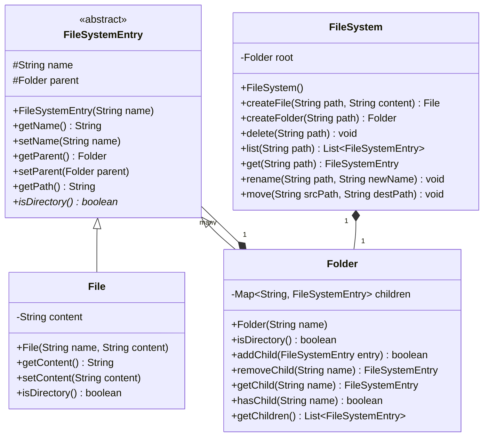

# ファイルシステム (File System)

**著者:** Evan King
**公開日:** 2026年1月19日
**難易度:** 中級 (medium)

## 問題の理解 (Understanding the Problem)

### 📁 インメモリ・ファイルシステムとは？
ファイルシステムとは何であるか、あなたは既に知っているでしょう。毎日使っているはずです。Finder や Windows Explorer を開けば、フォルダを移動したり、ファイルを作成したり、移動したりしています。インメモリ・ファイルシステムはまさにそれですが、ディスクが存在しません。すべてがRAM上に存在するため、永続化、キャッシュ、I/Oパフォーマンスを気にすることなく、純粋にデータ構造と操作に集中することができます。

## 要件 (Requirements)

面接が始まると、次のようなお題が出されます：
「ファイルとディレクトリの作成、パスのナビゲーション、基本的なファイル操作をサポートするインメモリ・ファイルシステムを設計してください。」

ファイルシステムは馴染みのある領域であるため、この問題は見た目以上に厄介です。コンピュータを使っていてファイルシステムの仕組みは誰でも知っているため、候補者は明確化を省いてすぐに設計を始めがちです。それは間違いです。面接官はスコープについて具体的な期待を持っており、あなたの「ファイルシステム」のメンタルモデルが彼らのものと一致しない可能性があります。

### 明確化のための質問 (Clarifying Questions)

システムが何を行うか、構造はどのようになっているか、そして何が明示的にスコープ外であるか、を中心に質問を組み立てます。

会話は次のように進むかもしれません：

**あなた:** 「階層についてですが、Unixのような単一のルート（root）ですか、それともWindowsのドライブ文字のような複数のルートですか？」
**面接官:** 「単一のルートです。`/home/user/file.txt` のようなパスを持つUnixスタイルにしてください。」
*これにより、パス解決が大幅に簡素化されます。*

**あなた:** 「どのような操作をサポートする必要がありますか？作成、削除、コンテンツのリストアップなどを考えていますが、他には？」
**面接官:** 「それらに加えて、移動（move）と名前変更（rename）です。また、任意のパスに移動してそのコンテンツを取得できる必要があります。」

**あなた:** 「特にファイルについてですが、実際のコンテンツを保存するのですか、それともツリー上の単なる名前ですか？」
**面接官:** 「コンテンツを保存する必要があります。シンプルな文字列のコンテンツで十分です。」

**あなた:** 「エラーケースについてどうでしょうか？親フォルダが存在しないパスにファイルを作成しようとしたり、ルートを削除しようとした場合はどうなりますか？」
**面接官:** 「例外を投げる（スローする）必要があります。呼び出し元が異なる失敗モードを適切に処理できるように、特定の例外タイプを使用してください。」

**あなた:** 「ターゲットとするスケールはどの程度ですか？数十個のファイルですか、それとも数千個になる可能性もありますか？」
**面接官:** 「数万個のエントリを想定してください。深いフォルダ階層でも応答性を維持する必要があります。」
*これは知っておく価値があります。後でデータ構造の選択に影響します。*

**あなた:** 「最後の質問です。何がスコープ外ですか？権限（パーミッション）、タイムスタンプ、シンボリックリンクなどですか？」
**面接官:** 「それらはすべてスコープ外です。コアとなるツリー構造と操作に集中してください。」

### 最終要件 (Final Requirements)

このやり取りの後、ホワイトボードに次のように書くことになります：

**要件:**
1. 単一のルートディレクトリを持つ階層型ファイルシステム
2. ファイルは文字列のコンテンツを保存する
3. フォルダはファイルや他のフォルダを含む
4. ファイルとフォルダの作成および削除
5. フォルダのコンテンツのリストアップ
6. 絶対パスのナビゲート/解決（例: `/home/user/docs`）
7. ファイルとフォルダの名前変更（rename）および移動（move）
8. 任意のファイル/フォルダの参照からフルパスを取得する
9. メモリ内で数万個のエントリに対応できるスケール

**スコープ外:**
- 検索機能
- 相対パスの解決（`../` や `./`）
- 権限、所有権、タイムスタンプ
- ファイルタイプ固有の振る舞い
- 永続化 / ディスクストレージ
- シンボリックリンク
- UIレイヤー

私たちは問題を厳密にスコープ化しました。これで何を構築すべきか正確に分かりました。

## コアとなるエンティティと関係性 (Core Entities and Relationships)

要件が明確になったので、このシステムを構成するオブジェクトを特定する必要があります。

要件をスキャンして、状態や振る舞いを持つものを表す名詞を探します：

- **File (ファイル)** - 間違いなくエンティティです。ファイルは名前を持ち、コンテンツを保存し、ツリー内の特定の場所に存在します。他のエントリを含むことができないリーフノード（葉）です。
- **Folder (フォルダ、またはDirectory)** - これも明らかにエンティティです。フォルダは名前を持ち、他のエントリ（ファイルまたは他のフォルダ）を含みます。ファイルとは異なり、コンテンツは保存しません。コンテナです。
- **Path (パス)** - パスは要件の至る所に登場しますが、パスはエンティティでしょうか？そうではありません。パスは `/home/user/docs` のように場所を特定する文字列です。操作の入力であり、独自の状態や振る舞いを持つものではありません。パスは解析しますが、クラスとしてモデル化はしません。
- **FileSystem (ファイルシステム)** - 何かがルートフォルダを所有し、パブリックAPIを提供する必要があります。誰かが `createFile("/home/user/notes.txt", "hello")` と言ったとき、何かがそのパスを解析し、`/home/user` に移動し、ファイルを作成しなければなりません。そのオーケストレーションのロジックには居場所が必要です。これに別個のクラスが必要か、それとも単にルートの `Folder` を直接使えるかは議論の余地がありますが、クラス設計でそのトレードオフを検討します。

フィルタリングの結果、3つのエンティティが残りました：

| エンティティ | 責務 |
| --- | --- |
| **FileSystem** | オーケストレーター。ルートフォルダを所有し、パスを解析し、すべての操作のためのパブリックAPIを提供します。外部コードはこのクラスと対話しますが、フォルダやファイルと直接対話することはありません。 |
| **Folder** | ディレクトリを表します。名前を持ち、子エントリ（ファイルまたは他のフォルダ）を含み、子を追加、削除、検索するメソッドを提供します。パスやツリー全体の構造については知りません。 |
| **File** | ファイルを表します。名前を持ち、コンテンツを保存します。子を持たないリーフノードです。 |

関係はシンプルなツリーを形成します：
```
FileSystem
    └── root: Folder
            ├── Folder ("home")
            │       └── Folder ("user")
            │               ├── File ("notes.txt")
            │               └── Folder ("docs")
            └── File ("readme.txt")
```
`FileSystem` はルートの `Folder` を所有します。各 `Folder` は、`File` と他の `Folder` を任意の組み合わせで含むことができます。`File` はリーフノードです。ツリーは任意の深さになる可能性があります。

## クラス設計 (Class Design)

### FileSystem

多くの候補者は `FileSystem` クラスを全く作成せずに始めます。単にルートの `Folder` を公開し、呼び出し元にそこからナビゲートさせます。これは機能しますが、いくつかの問題にぶつかります。ここではオーケストレーターのアプローチを採用することにします。

要件から `FileSystem` の状態を導き出します：

| 要件 | FileSystem が追跡すべきもの |
| --- | --- |
| 「単一のルートを持つ階層型ファイルシステム」 | ルートフォルダ |

これだけです。`FileSystem` はルートのみを保存します。

```java
class FileSystem {
    Folder root;
}
```

次に操作についてです。`FileSystem` のすべてのメソッドは要件に対応している必要があります：

| 要件からのニーズ | FileSystem 上のメソッド |
| --- | --- |
| 「指定されたパスにファイルを作成する」 | `createFile(path, content)` -> File を返し、エラー時はスローする |
| 「指定されたパスにフォルダを作成する」 | `createFolder(path)` -> Folder を返し、エラー時はスローする |
| 「ファイルとフォルダを削除する」 | `delete(path)` -> エラー時はスローする |
| 「フォルダのコンテンツをリストアップする」 | `list(path)` -> エントリのリストを返し、エラー時はスローする |
| 「絶対パスをナビゲート/解決する」 | `get(path)` -> エントリを返し、見つからない場合はスローする |
| 「ファイルとフォルダの名前変更」 | `rename(path, newName)` -> エラー時はスローする |
| 「ファイルとフォルダの移動」 | `move(srcPath, destPath)` -> エラー時はスローする |

`FileSystem` は外部コードのエントリーポイントであるため、ユーザーがファイルシステムで必要とするすべての操作は、このクラスのパブリックメソッドに直接マッピングされます。

### File

よりシンプルなエンティティから始めましょう。ファイルはコンテンツを保存するリーフノードです：

| 要件 | File が追跡すべきもの |
| --- | --- |
| 「ファイルは文字列のコンテンツを保存する」 | `content: string` |
| 「任意の参照からフルパスを取得する」 | ツリーを上るための `parent: Folder?` |

```java
class File {
    String name;
    String content;
    Folder parent;
    
    File(String name, String content) { ... }
    String getName() { ... }
    void setName(String name) { ... }
    String getContent() { ... }
    void setContent(String content) { ... }
    Folder getParent() { ... }
    void setParent(Folder parent) { ... }
    String getPath() { ... }
    boolean isDirectory() { return false; }
}
```

### Folder

フォルダは他のエントリを保持するコンテナです：

| 要件 | Folder が追跡すべきもの |
| --- | --- |
| 「フォルダはファイルや他のフォルダを含む」 | 子エントリのコレクション |
| 「フォルダのコンテンツのリストアップ」 | 子を列挙する必要がある |
| 「パスのナビゲート」 | 名前で子を検索する必要がある |
| 「任意の参照からフルパスを取得する」 | `parent: Folder?` |

子のコレクションには何を使うべきでしょうか？O(1)のルックアップのために `Map` を使用します。また、マップをプライベートに保ち、マップを直接公開するのではなく、`addChild()`、`removeChild()`、`getChild()` のようなメソッドを公開します。これにより、フォルダは独自の不変条件を制御できます。

### 共有される抽象化: FileSystemEntry

`File` と `Folder` を並べて見ると、明らかな重複があります。両方とも以下のものを持っています：
- `name` と `parent` フィールド
- `getName()`, `setName()`, `getParent()`, `setParent()`, `getPath()` メソッド
- `isDirectory()` メソッド（戻り値は異なる）

そして、`Folder` の子のコレクションにはどのような型を使えばいいのでしょうか？抽象基底クラス（Abstract Base Class）がこの重複を排除し、子のコレクションに適切な型を与えてくれます。

## 最終的なクラス設計 (Final Class Design)



設計には関心事の明確な分離があります：
- `FileSystem` はオーケストレーションを処理します。パブリックAPIを所有し、パスを解析し、ツリー全体の操作を調整します。
- `FileSystemEntry` は共有されたアイデンティティを捉えます。ファイルとフォルダの両方が名前を持ち、ツリー内のどこかに存在し、パスを報告できます。
- `Folder` は包含関係（コンテインメント）を管理します。子を知っており、それらを操作するメソッドを提供します。
- `File` はコンテンツを保存します。

## 実装 (Implementation)

（※以下、シングルスレッドアクセスを前提とします。並行処理については拡張性のセクションで扱います。）

### FileSystem

`FileSystem` こそが興味深いロジックが存在する場所です。主要なメソッドはツリーの操作を処理します。

```java
File createFile(String path, String content) {
    if (path.equals("/")) {
        throw new InvalidPathException("Cannot create file at root");
    }
    Folder parent = resolveParent(path);
    String fileName = extractName(path);  // "/home/user/notes.txt" -> "notes.txt"
    
    if (parent.hasChild(fileName)) {
        throw new AlreadyExistsException("Entry already exists: " + fileName);
    }
    
    File file = new File(fileName, content);
    parent.addChild(file);
    return file;
}
```

同様に `createFolder` も実装します。一部の候補者はこれらを1つのメソッドにまとめようとしますが、2つの独立したメソッドの方がAPIとして明確です。

```java
FileSystemEntry get(String path) {
    return resolvePath(path);
}

List<FileSystemEntry> list(String path) {
    FileSystemEntry entry = resolvePath(path);
    if (!entry.isDirectory()) {
        throw new NotADirectoryException("Cannot list a file");
    }
    return ((Folder)entry).getChildren();
}
```

削除操作です。`removeChild` を利用します。
```java
void delete(String path) {
    if (path.equals("/")) {
        throw new InvalidPathException("Cannot delete root");
    }
    Folder parent = resolveParent(path);
    String name = extractName(path);
    
    FileSystemEntry removed = parent.removeChild(name);
    if (removed == null) {
        throw new NotFoundException("Entry not found: " + path);
    }
}
```

名前の変更では、親のマップのキーを変更する必要があるため、一度削除して再追加します。
```java
void rename(String path, String newName) {
    if (path.equals("/")) throw new InvalidPathException("Cannot rename root");
    if (newName == null || newName.isEmpty() || newName.contains("/")) {
        throw new InvalidPathException("Invalid name");
    }
    
    Folder parent = resolveParent(path);
    String oldName = extractName(path);
    
    if (!parent.hasChild(oldName)) throw new NotFoundException("Entry not found");
    if (parent.hasChild(newName)) throw new AlreadyExistsException("Entry already exists");
    
    FileSystemEntry entry = parent.removeChild(oldName);
    entry.setName(newName);
    parent.addChild(entry);
}
```

`move` は最も複雑な操作です。なぜならツリーの2つの異なる場所が関与し、さらに「サイクル（循環）」を防ぐ必要があるからです。

```java
void move(String srcPath, String destPath) {
    if (srcPath.equals("/")) throw new InvalidPathException("Cannot move root");
    
    Folder srcParent = resolveParent(srcPath);
    String srcName = extractName(srcPath);
    FileSystemEntry entry = srcParent.getChild(srcName);
    if (entry == null) throw new NotFoundException("Source not found");
    
    Folder destParent = resolveParent(destPath);
    String destName = extractName(destPath);
    
    // サイクルチェック: フォルダをそれ自身やその子孫の中に移動することはできない
    if (entry.isDirectory()) {
        Folder current = destParent;
        while (current != null) {
            if (current == entry) {
                throw new InvalidPathException("Cannot move folder into itself");
            }
            current = current.getParent();
        }
    }
    
    if (destParent.hasChild(destName)) {
        throw new AlreadyExistsException("Destination already exists");
    }
    
    srcParent.removeChild(srcName);
    entry.setName(destName);
    destParent.addChild(entry);
}
```

### パス解決のヘルパー (Path Resolution Helpers)

```java
FileSystemEntry resolvePath(String path) {
    if (path == null || path.isEmpty()) throw new InvalidPathException();
    if (!path.startsWith("/")) throw new InvalidPathException("Path must be absolute");
    
    if (path.equals("/")) return root;
    
    String[] parts = path.substring(1).split("/");
    Folder current = root;
    
    for (int i = 0; i < parts.length; i++) {
        String part = parts[i];
        if (part.isEmpty()) throw new InvalidPathException("Invalid path");
        
        FileSystemEntry child = current.getChild(part);
        if (child == null) throw new NotFoundException("Path not found");
        
        // 最後の要素以外はフォルダである必要がある
        if (i < parts.length - 1) {
            if (!child.isDirectory()) throw new NotADirectoryException();
            current = (Folder)child;
        } else {
            return child;
        }
    }
    return current;
}

Folder resolveParent(String path) {
    if (path.equals("/")) throw new InvalidPathException("Root has no parent");
    int lastSlash = path.lastIndexOf("/");
    String parentPath = lastSlash == 0 ? "/" : path.substring(0, lastSlash);
    
    FileSystemEntry parent = resolvePath(parentPath);
    if (!parent.isDirectory()) throw new NotADirectoryException();
    return (Folder)parent;
}

String extractName(String path) {
    int lastSlash = path.lastIndexOf("/");
    return path.substring(lastSlash + 1);
}
```

### FileSystemEntry と Folder

```java
// FileSystemEntry
String getPath() {
    if (parent == null) return name; // Root は "/"
    String parentPath = parent.getPath();
    if (parentPath.equals("/")) return "/" + name;
    return parentPath + "/" + name;
}
```

`Folder` では、子を追加・削除する際に双方向のリンク（親ポインタ）を同期させることが重要です。
```java
// Folder
boolean addChild(FileSystemEntry entry) {
    if (entry == null) return false;
    if (children.containsKey(entry.getName())) return false;
    
    children.put(entry.getName(), entry);
    entry.setParent(this); // 双方向リンクの維持
    return true;
}

FileSystemEntry removeChild(String name) {
    FileSystemEntry entry = children.remove(name);
    if (entry != null) {
        entry.setParent(null); // バックリファレンスをクリア
    }
    return entry;
}
```

## 拡張性 (Extensibility)

### 「このファイルシステムをスレッドセーフ（thread-safe）にするにはどうしますか？」
現状の実装はシングルスレッドアクセスを前提としています。複数のスレッドが同時にファイルを同じ場所に作成しようとすると、競合状態（チェック・アンド・アクトの競合）が発生します。
最もシンプルな修正は、`FileSystem` オブジェクト全体にロックをかける粗粒度（coarse-grained）ロックです。しかし、これでは並行性が低下します。
高スループットのためには、フォルダごとにロックを持つ細粒度（fine-grained）ロックを使用できます。ただし、`move` 操作のように2つのフォルダに触れる場合、デッドロックのリスクがあります。解決策は「ロックの順序付け（lock ordering）」です。常にパスのアルファベット順などで一貫した順序でロックを取得します。

### 「検索（search）機能を追加するにはどうしますか？」
最もシンプルなアプローチは再帰的なトラバーサル（探索）ですが、これはO(N)の時間がかかります。頻繁に検索される場合は、インデックス（名前からエントリのリストへのマップ）を維持することで空間を犠牲にして時間を短縮（O(1)）できます。作成・削除・名前変更の際にこのインデックスを更新します。前方一致検索が必要ならトライ木（Trie）を検討します。
