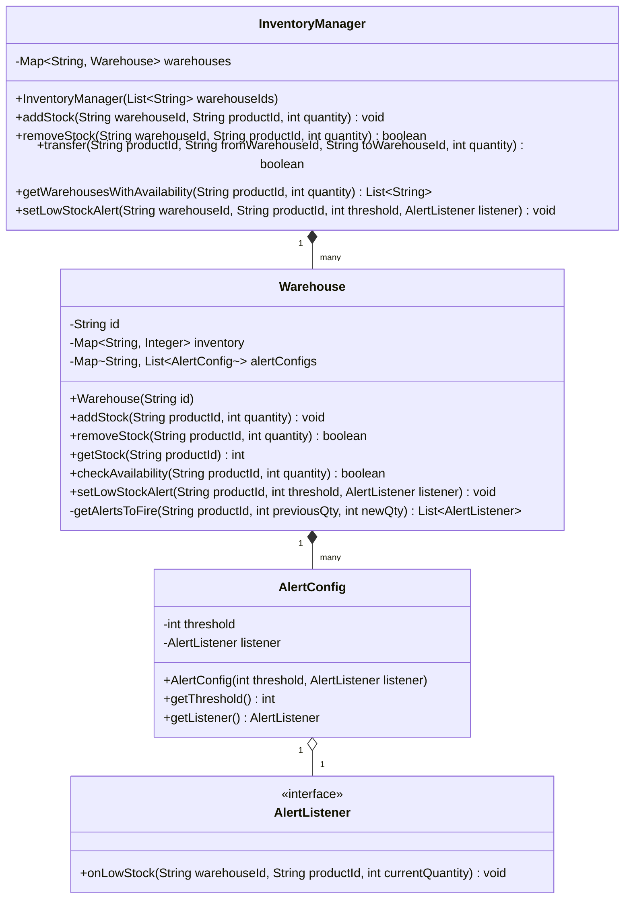

# 在庫管理 (Inventory Management)

**著者:** Evan King
**公開日:** 2025年12月18日
**難易度:** 上級 (hard)

## 問題の理解 (Understanding the Problem)

### 📦 在庫管理システムとは？
在庫管理システムは、複数の倉庫の場所にわたる商品の在庫を追跡します。在庫が到着すると、システムはそれを記録します。注文が出荷されると、システムは在庫を差し引きます。システムはまた、拠点間で在庫を移動（転送）したり、在庫が少なくなったときにマネージャーに警告（アラート）を出したりすることもできます。

## 要件 (Requirements)

面接が始まると、次のようなお題が出されます：
「複数の倉庫にわたって商品を追跡する在庫管理システムを設計してください。システムは、在庫の追加と削除、拠点間の在庫の移動、および在庫が少なくなったときのアラート送信を処理する必要があります。」

これは出発点ですが、解釈の余地がたくさんあります。ホワイトボードに触れる前に、数分かけて実際に何を構築するのかを明確にしてください。

### 明確化のための質問 (Clarifying Questions)

システムがサポートする操作、何が失敗する可能性があるか、何がスコープ内か、そして後で何を拡張する可能性があるか、という4つのテーマを中心に質問を組み立てます。

会話は次のように進むかもしれません：

**あなた:** 「『複数の倉庫』と言った場合、起動時に設定される固定された倉庫のセットですか、それとも倉庫を動的に追加できますか？」
**面接官:** 「シンプルにしましょう。倉庫のセットは固定です。システムが初期化されるときに構成されると仮定してかまいません。」
*よし、倉庫のライフサイクル管理は構築しません。*

**あなた:** 「言及された在庫減少アラート（low-stock alerts）についてですが、どのように機能しますか？商品ごとにしきい値を設定するのですか、それともより詳細ですか？」
**面接官:** 「商品ごと、かつ倉庫ごとに設定する必要があります。同じ商品でも、倉庫が違えば必要なしきい値が異なる場合があります。在庫がしきい値を下回ったときに通知をトリガーしてください。」
*これは重要です。アラートはグローバルではなく倉庫固有です。ある商品は倉庫Aでは在庫が少なくても、倉庫Bでは十分かもしれません。*

**あなた:** 「通知はどのように行われるべきですか？メールを送信するのか、Webhookを呼び出すのか、それとも単に呼び出し元に何かを返すのでしょうか？」
**面接官:** 「いい質問ですね。プラグイン可能（pluggable）にしておきましょう。システムは在庫が少なくなったときに何らかのコールバックインターフェースを呼び出すべきです。その後どうなるか（メール、Webhook、ロギングなど）は、他の誰かの問題です。」
*完璧です。私たちはアラートメカニズムを構築するのであって、通知の配信システムを構築するわけではありません。*

**あなた:** 「無効な操作についてはどうですか？マイナスの在庫を許可すべきですか、それとも在庫をゼロ未満にするような操作は拒否すべきですか？」
**面接官:** 「拒否してください。もし誰かが100個削除しようとしても50個しかない場合は、失敗させるべきです。転送も同じで、移動する前に検証してください。」
*システムは不変条件（インバリアント）を強制します。在庫はマイナスにはなりません。*

**あなた:** 「並行アクセス（concurrent access）についてはどうですか？もし2つのプロセスが同時に同じ倉庫の在庫を変更しようとした場合、それを処理する必要がありますか？」
**面接官:** 「はい、ここでは並行性が重要です。複数の操作が同時に発生する可能性があります。ある倉庫が商品の入荷を受け入れながら、別の倉庫が同じ商品の注文を処理しているかもしれません。操作がスレッドセーフ（thread-safe）であることを確認してください。」
*よし、最初から同期について考える必要があります。*

**あなた:** 「最後にもう一つ。何がスコープ外ですか？製品カタログの管理や注文の処理などは行いますか？」
**面接官:** 「はい（それらはスコープ外です）。製品は外部に存在します。注文と支払いは上流で処理されます。在庫追跡ロジックに集中してください。」

### 最終要件 (Final Requirements)

このやり取りの後、ホワイトボードに次のように書くことになります：

**要件:**
1. 複数の倉庫にまたがる商品の在庫を追跡する
2. 特定の倉庫に在庫を追加する（入荷の受け入れ）
3. 特定の倉庫から在庫を削除する（注文の履行）
4. 空き状況の確認：商品と数量が与えられたとき、それを提供できる倉庫を返す
5. 倉庫間で在庫を移動（転送）する
6. 在庫減少アラート
7. マイナス在庫になるような操作を拒否する
8. 並行した操作を処理するため、システムはスレッドセーフでなければならない

**スコープ外:**
- 製品カタログ管理（製品は外部に存在する）
- 注文処理 / 支払い / サービス提供可能性
- 永続化（データベース等への保存）

完璧です。問題のスコープが定まり、作業の基盤となる具体的な要件ができました。次のステップは、このシステムを構築するためにどのようなオブジェクトが必要かを特定することです。

## コアとなるエンティティと関係性 (Core Entities and Relationships)

要件が明確になったので、システムを構成するオブジェクトを見つけ出す必要があります。コツは、要件をスキャンして、振る舞いや状態を持つ事物を表す名詞を探すことです。要件内の名詞を候補として検討し、モデル化する意味のあるエンティティのリストになるまで絞り込みます。

単純なフィルターを適用すると役立ちます：**「変化する状態を維持するか、あるいはルールを強制する場合、それはおそらく独自のエンティティに値する」**。もし単に他の何かに付随する情報であれば、おそらく別のクラスのフィールドにすぎません。

候補は以下の通りです：

- **Product (商品)** - 製品カタログは私たちのシステムの外部にあります。私たちは単に「商品Xが倉庫Yに何個あるか」を知る必要があるだけです。`Product` は私たちが数えているものを識別するキー（文字列や整数）であり、振る舞いを持つクラスではありません。
- **Warehouse (倉庫)** - これは間違いなくエンティティです。倉庫は複数の商品の在庫を保持し、各商品がいくつあるかを追跡し、いつアラートを発火させるかを知っています。数量がゼロ未満になるような操作を防ぐため、「マイナス在庫なし」のルールを強制する必要があります。また、在庫が変更されるたびにアラート構成を確認し、しきい値を超えたときに通知を発火させる必要があります。明確な状態と振る舞いがあります。
- **InventoryManager (在庫マネージャー)** - システム全体をオーケストレーションする何かが必要です。誰かが「商品Xを50個、倉庫Aから倉庫Bへ転送して」と言ったとき、何か両方の倉庫を検索し、操作を検証し、移動を調整する必要があります。誰かが「商品Yを100個注文したいが、どの倉庫が対応できるか？」と尋ねたとき、何かすべての倉庫に問い合わせて結果を集約する必要があります。それがマネージャーです。これがすべての操作のエントリーポイントであり、倉庫のコレクションを所有します。
- **AlertConfig (アラート構成)** - 在庫減少アラートを設定するとき、私たちは2つの情報を定義します：しきい値（いつアラートを出すか？）とコールバック（何をするか？）です。この組み合わせは、別々に保存するのではなく、小さな値オブジェクトとしてモデル化する価値があります。これにより関係が明確になり、コードの推論が容易になります。
- **AlertListener (アラートリスナー)** - 「在庫が少ないときに何をするか」の部分です。異なる実装で異なる方法で通知を処理できるように、これはインターフェースであるべきです。ある実装はメールを送り、別の実装はWebhookを呼び出し、3つ目はファイルにログを記録するかもしれません。在庫システムはどの通知メカニズムが使われるかを知る必要も気にする必要もありません。単に在庫がしきい値を下回ったときにインターフェースのメソッドを呼び出すだけです。

フィルタリングの結果、4つのエンティティが残りました：

| エンティティ | 責務 |
| --- | --- |
| **InventoryManager** | オーケストレーター。すべての倉庫を所有し、それらをまたぐ操作を調整します。在庫の移動、複数拠点の空き状況確認、アラートの設定を行う場合はこのクラスを経由します。システムで唯一のパブリックAPIです。 |
| **Warehouse** | 単一の保管場所を表します。`productId` → `quantity` (数量) のマップを保持します。「マイナス在庫なし」の不変条件を強制します。自身のアラート構成を所有し、在庫変更がしきい値をトリガーした際にアラートを発火します。他の倉庫のことは知りません。 |
| **AlertConfig** | しきい値と、在庫がそのしきい値を下回ったときに通知するリスナーをグループ化する値オブジェクト。 |
| **AlertListener** | コールバックの契約を定義するインターフェース。実装は、在庫がしきい値を下回ったときに、倉庫ID、商品ID、現在の数量を受け取ります。これにより「在庫が少ないこと」と「それについて何をするか」が分離されます。 |

これらのエンティティ間の関係は明確な階層に従います。`InventoryManager` が頂点にあり、倉庫IDの文字列から `Warehouse` オブジェクトへのマップを保持します。これにより、外部の呼び出し元から提供されたIDに基づいて、操作を正しい倉庫にルーティングする機能が提供されます。

## クラス設計 (Class Design)

エンティティが特定できたので、インターフェースを定義する時間です。それぞれがどのような状態を保持し、どのようなメソッドを公開するのでしょうか？

エントリーポイントである `InventoryManager` から始め、トップダウンで `Warehouse`、`AlertConfig`、`AlertListener` へと掘り下げていきます。
各クラスについて、要件に立ち返り、「このエンティティは何を記憶する必要があるか？」そして「どのような操作をサポートする必要があるか？」という2つの質問をします。

### InventoryManager

`InventoryManager` は外部コードがやり取りするファサード（窓口）です。要件からその状態を導き出しましょう：

| 要件 | InventoryManager が追跡すべきもの |
| --- | --- |
| 「複数の倉庫にまたがる商品の在庫を追跡する」 | すべての倉庫のコレクション |
| 「特定の倉庫に在庫を追加する」 | IDで倉庫を検索できること |
| 「倉庫間で在庫を移動する」 | 元（source）と先（destination）の両方の倉庫への参照が必要 |

これにより、以下のようになります：

```java
class InventoryManager {
    Map<String, Warehouse> warehouses;
}
```

**なぜ `warehouses` はマップなのか。** このフィールドは、倉庫IDの文字列（例："WAREHOUSE_EAST" や "DC_01"）を対応する `Warehouse` オブジェクトにマッピングします。呼び出し元が `addStock("WAREHOUSE_EAST", "PROD_123", 50)` と言ったとき、East倉庫を素早く見つける必要があります。マップはIDによるO(1)のルックアップを提供します。代替案としては毎回スキャンするリストがありますが、機能はするものの意図が分かりにくくなります。マップ構造は「倉庫IDが倉庫オブジェクトにマップされる」ことを明示的に表現します。

**なぜ倉庫IDは整数ではなく文字列なのか。** IDは技術的には整数でも構いませんが、実際のシステムでは文字列の方が柔軟です。任意の数字の代わりに、"WAREHOUSE_CALIFORNIA" や "DC_NY_01" のような意味のある識別子を使用できます。本番環境では、これらのIDは多くの場合、既に文字列として存在する外部システムやデータベースから来ます。面接の範囲内では、どちらの選択でも擁護可能ですが、一貫性を持たせてください。

次に操作についてです。`InventoryManager` の各メソッドは、要件からの具体的なニーズに対応しているべきです：

| 要件からのニーズ | InventoryManager 上のメソッド |
| --- | --- |
| 「特定の倉庫に在庫を追加する」 | `addStock(warehouseId, productId, quantity)` |
| 「特定の倉庫から在庫を削除する」 | `removeStock(warehouseId, productId, quantity)` (成功/失敗を示す boolean を返す) |
| 「倉庫横断で空き状況を確認する」 | `getWarehousesWithAvailability(productId, quantity)` (倉庫IDのリストを返す) |
| 「倉庫間で在庫を移動する」 | `transfer(productId, fromWarehouseId, toWarehouseId, quantity)` (booleanを返す) |
| 「在庫減少アラートを設定する」 | `setLowStockAlert(warehouseId, productId, threshold, listener)` |

まとめると：

```java
class InventoryManager {
    Map<String, Warehouse> warehouses;
    
    InventoryManager(List<String> warehouseIds) { ... }
    void addStock(String warehouseId, String productId, int quantity) { ... }
    boolean removeStock(String warehouseId, String productId, int quantity) { ... }
    boolean transfer(String productId, String fromWarehouseId, String toWarehouseId, int quantity) { ... }
    List<String> getWarehousesWithAvailability(String productId, int quantity) { ... }
    void setLowStockAlert(String warehouseId, String productId, int threshold, AlertListener listener) { ... }
}
```

コンストラクタは倉庫IDのリストを受け取り、それぞれに対して `Warehouse` インスタンスを作成し、マップに保存します。これはシステム初期化時に一度だけ行われます。要件に「倉庫は起動時に固定」とあるため、後で倉庫を動的に追加・削除するメソッドは必要ありません。

残りのメソッドは、在庫操作のメインAPIを形成します：

- `addStock` は簡単です。倉庫を検索し、数量を追加するように指示します。この操作は常に成功する（常により多くの在庫を受け取れる）ため、戻り値はありません。`void` を返します。
- `removeStock` は倉庫を検索し、数量を削除するように求めます。しかし、在庫が足りない場合、この操作は失敗する可能性があります。戻り値（boolean）は、操作が成功したかどうかを呼び出し元に伝えます。この非対称性は意図的なものです。追加は常に機能しますが、削除は時々機能しないからです。
- `transfer` はより興味深いです。元と先の両方の倉庫を見つけ、元に十分な在庫があることを検証し、その移動を調整する必要があります。この操作も失敗する可能性がある（在庫不足、無効な倉庫IDなど）ため、`boolean` を返します。
- `getWarehousesWithAvailability` は「どの倉庫がこの数量を提供できるか？」という問いに答えます。すべての倉庫を反復処理し、それぞれを確認し、十分な在庫がある倉庫IDのリストを返します。
- `setLowStockAlert` はアラート構成を特定の倉庫に委譲します。マネージャー自身はアラートを管理せず、リクエストを正しい倉庫にルーティングし、その倉庫がアラート構成を所有します。

なぜ `InventoryManager` でアラートを管理しないのか？それは、マネージャーが特定の商品について知らないからです。それは倉庫のコレクションと、それらに対して実行できる操作しか知りません。マネージャーはパブリックAPIであるため、シンプルかつ焦点を絞る必要があります。`Warehouse` クラスこそが実際の在庫管理が行われる場所なので、自身のアラート構成を所有するのが理にかなっています。

### Warehouse

`Warehouse` は物理的な保管場所を一つ表します。ここで実際の在庫追跡が行われます。各商品が在庫にいくつあるかを知り、「マイナス在庫なし」の制約を強制し、在庫が設定されたしきい値を下回ったときにアラートを発火します。

要件から状態を導き出しましょう：

| 要件 | Warehouse が追跡すべきもの |
| --- | --- |
| 「商品の在庫を追跡する」 | 商品IDから数量へのマップ |
| 「商品ごと・倉庫ごとの在庫減少アラート」 | 各商品のアラート構成 |
| 「複数の倉庫」 | 自身を区別するためのID |

これにより、以下の状態が得られます：

```java
class Warehouse {
    String id;
    Map<String, Integer> inventory;
    Map<String, List<AlertConfig>> alertConfigs;
}
```

**なぜ `id` が必要なのか。** アラートが発火して `listener.onLowStock(warehouseId, productId, currentQuantity)` を呼び出すとき、リスナーはどの倉庫が在庫減少を報告しているかを知る必要があります。倉庫は、アラートのコールバックに含めるために自身のIDを記憶しておく必要があります。
**なぜ `inventory` は商品IDから数量へのマップなのか。** これが在庫を追跡するためのコアなデータ構造です。各商品IDは、私たちが何単位持っているかを表す単一の整数を指します。マップを使用することで、任意の商品の数量の確認や更新がO(1)時間で可能です。マップに存在しない商品は暗黙的に在庫ゼロです。
**なぜ `alertConfigs` は商品IDを `AlertConfig` オブジェクトのリストにマップするのか。** 1つの商品は、異なるしきい値と異なるリスナーを持つ複数のアラート構成を持つことができます。「50個で『そろそろ追加注文して』というメール」「10個で『致命的な不足』というページャー」といった具合です。商品ごとに設定のリストを保存することで、これを自然にサポートできます。

操作については、すべての在庫操作に加えてアラート構成をサポートするメソッドが必要です。また、在庫が変更されたときにアラートを発火させるためのプライベートヘルパーメソッドも必要です。

```java
class Warehouse {
    String id;
    Map<String, Integer> inventory;
    Map<String, List<AlertConfig>> alertConfigs;
    
    Warehouse(String id) { ... }
    void addStock(String productId, int quantity) { ... }
    boolean removeStock(String productId, int quantity) { ... }
    int getStock(String productId) { ... }
    boolean checkAvailability(String productId, int quantity) { ... }
    void setLowStockAlert(String productId, int threshold, AlertListener listener) { ... }
    private List<AlertListener> getAlertsToFire(String productId, int previousQty, int newQty) { ... }
}
```

`setLowStockAlert` は新しいアラート構成を登録します。
`getAlertsToFire` は、`addStock` や `removeStock` の後に実行されるプライベートヘルパーです。商品ID、変更前の数量、変更後の数量を受け取り、しきい値を超えたかどうかを確認して、通知すべきリスナーのリストを返します。

### AlertConfig

`AlertConfig` は、しきい値とリスナーをペアにするコンパクトな値オブジェクトです。

```java
class AlertConfig {
    int threshold;
    AlertListener listener;
    
    AlertConfig(int threshold, AlertListener listener) { ... }
    int getThreshold() { ... }
    AlertListener getListener() { ... }
}
```

独立したクラス（または構造体、タイプなど）としてモデル化することの価値は、明確さです。`Warehouse` クラスで `List<AlertConfig>` を見れば、「これはアラート構成のリストだ」とすぐに理解できます。

### AlertListener

`AlertListener` は、低在庫通知の処理に関する契約を定義するインターフェースです。アラートシステムをプラグイン可能にするのがこれです：

```java
interface AlertListener {
    void onLowStock(String warehouseId, String productId, int currentQuantity);
}
```

完全なインターフェースはこれだけです。実装（メール、Webhook、ロギングなど）は在庫システムに関知されません。これは Observer パターンです。倉庫は面白いイベントが発生したときにリスナーに通知し、リスナーはどうするかを決定します。

これは依存性逆転の原則 (Dependency Inversion Principle) に従っています。Warehouse（高レベルの在庫ロジック）は EmailSender や WebhookClient（低レベルの通知メカニズム）に依存しません。どちらも AlertListener インターフェース（抽象）に依存します。

## 最終的なクラス設計 (Final Class Design)



## 実装 (Implementation)

最も興味深い実装は `InventoryManager.transfer()`（倉庫間の操作の調整）と `Warehouse.getAlertsToFire()`（アラートの収集ロジック）、およびアトミック性の確保です。

### InventoryManager

```java
// コンストラクタ
InventoryManager(List<String> warehouseIds) {
    warehouses = new Map();
    for (String id : warehouseIds) {
        warehouses.put(id, new Warehouse(id));
    }
}

void addStock(String warehouseId, String productId, int quantity) {
    Warehouse warehouse = warehouses.get(warehouseId);
    if (warehouse == null) throw new Error();
    warehouse.addStock(productId, quantity);
}

boolean removeStock(String warehouseId, String productId, int quantity) {
    Warehouse warehouse = warehouses.get(warehouseId);
    if (warehouse == null) return false;
    return warehouse.removeStock(productId, quantity);
}

List<String> getWarehousesWithAvailability(String productId, int quantity) {
    List<String> available = new List();
    for (String id : warehouses.keys()) {
        Warehouse warehouse = warehouses.get(id);
        if (warehouse.checkAvailability(productId, quantity)) {
            available.add(id);
        }
    }
    return available;
}

void setLowStockAlert(String warehouseId, String productId, int threshold, AlertListener listener) {
    Warehouse warehouse = warehouses.get(warehouseId);
    if (warehouse == null) throw new Error();
    warehouse.setLowStockAlert(productId, threshold, listener);
}
```

`transfer` 操作は、ソース倉庫と宛先倉庫の間でアトミックに行う必要があります。これには、両方の倉庫をロックし、デッドロックを避けるために一貫した順序（例えばIDの辞書順）でロックを取得する必要があります。

```java
boolean transfer(String productId, String fromWarehouseId, String toWarehouseId, int quantity) {
    if (quantity <= 0) return false;
    if (fromWarehouseId.equals(toWarehouseId)) return false;
    
    Warehouse fromWarehouse = warehouses.get(fromWarehouseId);
    Warehouse toWarehouse = warehouses.get(toWarehouseId);
    if (fromWarehouse == null || toWarehouse == null) return false;
    
    // デッドロックを防ぐための一貫したロック順序
    String firstId = fromWarehouseId.compareTo(toWarehouseId) < 0 ? fromWarehouseId : toWarehouseId;
    String secondId = fromWarehouseId.compareTo(toWarehouseId) < 0 ? toWarehouseId : fromWarehouseId;
    
    Warehouse firstWarehouse = warehouses.get(firstId);
    Warehouse secondWarehouse = warehouses.get(secondId);
    
    synchronized(firstWarehouse) {
        synchronized(secondWarehouse) {
            // ここで、removeStock と addStock が自身の内部のロックも再取得する(再入可能ロックを想定)
            if (!fromWarehouse.removeStock(productId, quantity)) {
                return false;
            }
            toWarehouse.addStock(productId, quantity);
        }
    }
    return true;
}
```

### Warehouse

倉庫のミューテーションはすべて同期する必要がありますが、重要なのはリスナーのコールバック（ネットワークI/O等を行う可能性がある）をロックの外側で行うことです。

```java
void addStock(String productId, int quantity) {
    List<AlertListener> alertsToFire = null;
    synchronized(this) {
        if (quantity <= 0) throw new Error();
        
        int currentQty = inventory.getOrDefault(productId, 0);
        int newQty = currentQty + quantity;
        inventory.put(productId, newQty);
        
        alertsToFire = getAlertsToFire(productId, currentQty, newQty);
    }
    
    // ロックの外側でアラートを発火
    if (alertsToFire != null) {
        for (AlertListener listener : alertsToFire) {
            listener.onLowStock(id, productId, newQty); // 実際には AlertConfig などの情報から
        }
    }
}

boolean removeStock(String productId, int quantity) {
    List<AlertListener> alertsToFire = null;
    synchronized(this) {
        if (quantity <= 0) return false;
        
        int currentQty = inventory.getOrDefault(productId, 0);
        if (currentQty < quantity) return false; // マイナス在庫を防ぐ
        
        int newQty = currentQty - quantity;
        inventory.put(productId, newQty);
        
        alertsToFire = getAlertsToFire(productId, currentQty, newQty);
    }
    
    // ロックの外側でアラートを発火
    if (alertsToFire != null) {
        for (AlertListener listener : alertsToFire) {
            listener.onLowStock(id, productId, newQty);
        }
    }
    return true;
}
```

アラートの発火を決定するロジックは、「上から下へしきい値を越えたとき」だけトリガーすることで重複を防ぎます。

```java
private List<AlertListener> getAlertsToFire(String productId, int previousQty, int newQty) {
    List<AlertConfig> configs = alertConfigs.get(productId);
    if (configs == null) return null;
    
    List<AlertListener> alertsToFire = new List();
    for (AlertConfig config : configs) {
        // しきい値を下向きに越えたか？
        if (previousQty >= config.getThreshold() && newQty < config.getThreshold()) {
            alertsToFire.add(config.getListener());
        }
    }
    return alertsToFire.isEmpty() ? null : alertsToFire;
}
```

## 拡張性 (Extensibility)

### 「注文処理中に過剰販売（overselling）を防ぐにはどうすればよいですか？」
現実のEコマースでは、「購入」と「在庫の引き落とし」の間には時間差（チェックアウト画面での入力など）があります。これに対処するために、**予約システム（Reservation System）**を追加します。顧客がチェックアウトを開始したときに、在庫を取り除かずに予約します。一定時間が経過して放棄された場合は解放し、支払いが完了した場合は実際に在庫から差し引きます。

### 「倉庫間を輸送中の在庫をどのように処理しますか？」
転送中の在庫は、元の倉庫にも先の倉庫にも存在しませんが、システムから消えたわけでもありません。
解決策は、`Transfer`（転送）を、在庫を一時的に保持できる第一級のエンティティ（`Warehouse` と同じく `InventoryHolder` インターフェースを実装するもの）として扱うことです。これにより、システム全体の在庫（倉庫＋転送中の合計）を常に正確に把握できます。
