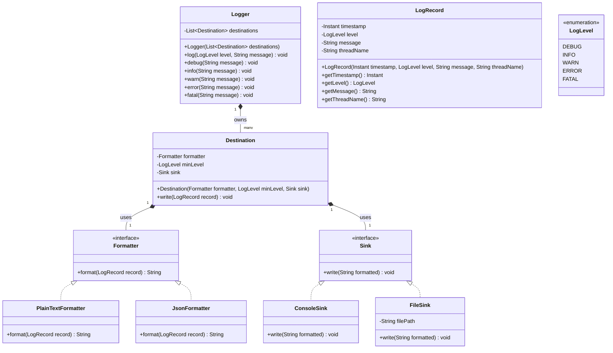

# ロギングサービス (Logging Service)

## 問題の理解 (Understanding the Problem)

### 📝 ロガー(Logger)とは？
ロガーとは、アプリケーションが実行時に何が起きているかを記録するために使用する、プロセス内（in-process）のライブラリです。コードはアプリ内のどこからでも `logger.info("user signed in")` を呼び出し、ライブラリはメッセージにタイムスタンプを付け、重要度（severity level）を付与し、コンソールやファイル、あるいはその両方などの1つ以上の場所に書き込みます。Log4j、SLF4J、Pythonの `logging` モジュールなどを思い浮かべてください。私たちが設計するのは、1つのアプリケーションの内部に存在するライブラリであり、分散型のログ集約サービスではありません。

## 要件 (Requirements)

面接に臨むと、プロンプトは意図的に短く提示されます：

> 「ロギングサービスを設計してください。あるいはロガーと呼んでも構いません、お好きな方で。」

設計の大部分は、彼らが言わなかったことの中に隠されています。図を描き始める前に、最初の数分を使ってそれを紐解いてください。

### 明確化のための質問 (Clarifying Questions)

最初に特定すべきは、これがどのような種類のロギングシステムかということです。「ロガー」は全く異なるものを意味する場合があります。

**あなた:** 「『ロギングサービス』というのは、アプリケーションがリンクするプロセス内のライブラリのことですか？それとも、ネットワーク経由でログを中央アグリゲータ（集約器）に送信するようなものですか？」
**面接官:** 「プロセス内のライブラリです。ネットワーク経由の送信、インジェストのパイプライン、および中央集約は他の誰かの仕事です。」

*この回答により、設計空間の大部分が削ぎ落とされます。キューも、スキーマレジストリも、サービス間のファンアウト（分散）もありません。成果物は、1つのアプリケーションのプロセス内で実行され、標準出力（stdout）やファイルのようなローカルの宛先に書き込むオブジェクトモデルです。*

**あなた:** 「どのような重要度（severity level）をサポートすべきですか？また、それらの間に順序はありますか？」
**面接官:** 「DEBUG, INFO, WARN, ERROR, FATALです。この順序で、最も重要度が低いものから最も高いものへと並んでいます。」

*自然な順序を持つ5つのレベル。これはレベルごとの固有の振る舞いを持たない有限のセットであり、教科書通りの `enum`（列挙型）です。もし `DebugLevel`、`InfoLevel` のような `Level` クラス階層を作ろうとするなら、それはやり過ぎです。*

**あなた:** 「1つのロガーが同時に複数の宛先に書き込むことはできますか？同じレコードをコンソールとファイルの両方に送信するなど。」
**面接官:** 「はい。それが一般的なケースです。ローカルで実行している開発者は、コンソールにログを出しつつ、後で検査するためにファイルにも保存したいと考えます。各呼び出しは、設定されたすべての宛先にファンアウト（分配）されるべきです。」

*これで「宛先 (destination)」が第一級の概念であり、1つのログ呼び出しがそれらすべてに到達することが分かりました。これは、ライブラリが宛先のリストを保持し、呼び出しごとにそれらを反復処理することを意味します。*

**あなた:** 「各宛先は独自のフィルターレベルを決定しますか、それともロガー上に1つのグローバルなレベルがありますか？」
**面接官:** 「宛先ごとです。各宛先は独自の最小レベルを持っています。コンソールは DEBUG 以上すべてを必要とするかもしれませんが、ファイルの宛先は WARN 以上だけを気にするかもしれません。宛先の閾値（threshold）を下回るレコードは、書き込まれる前に破棄されるべきです。」

*これにより、レベルフィルターをロガーに置くことが除外され、宛先に押し下げられます。また、同じレコードが各宛先によって独立して評価されることも意味しますが、レコード自体は作成後に不変（immutable）であるため問題ありません。*

**あなた:** 「レコードが書き込まれるフォーマットはどうですか？それは固定ですか、それとも変動しますか？」
**面接官:** 「変動します。プレーンテキストの時もあれば、JSONの時もあります。そしてフォーマットは宛先のタイプから独立しています。コンソールにJSONを書き込んだり、ファイルにプレーンテキストを書き込んだり、任意の組み合わせができるべきです。」

*これがクラスモデルを形作る要件です。もしフォーマットと宛先が結合（カップリング）していたら、`JsonFileDestination`、`PlainConsoleDestination` のように、（フォーマット、宛先）のペアごとにクラスを作成することになります。3つ目のフォーマットと3つ目のターゲットを追加すれば、9つのクラスができてしまいます。要件が「独立して変動する」と言っている以上、正しい選択はクラスを掛け合わせるのではなく、コンポジション（合成）を使用することです。*

> **TIP:** 要件で「独立して変動する2つの次元」が与えられた場合、それはほぼ常に、継承よりもコンポジション（合成）を使用せよというシグナルです。2つのインターフェースを合成することで、N×M個のクラスを書くことなく、任意の組み合わせを混在させることができます。LLDのプロンプトで、この「変動の軸（axes-of-variation）」のヒントに注意してください。

**あなた:** 「並行性（concurrency）についてはどうですか？同じアプリ内の複数のスレッドが同時に `log()` を呼び出します。期待されることは何ですか？」
**面接官:** 「スレッドセーフであること。各レコードのバイト列はアトミックに宛先に到達しなければなりません。つまり、あるレコードのバイト列が分割されたり、別のレコードのバイト列と混ざったりしてはいけません。単一スレッドの場合、レコードは呼び出し順に表示されます。複数スレッド間では、各レコードのタイムスタンプ以上の厳密な順序付けはありません。」

*並行性はスコープ内なので、ロックは最後に付け足すものではなく、設計の一部です。レコードごとのアトミック性が基準です。stdout バッファへ競合する2つのスレッドが、あるレコードのバイト列を別のレコードに塗りつけることはできません。複数スレッド間でのグローバルな厳密な投入順序はより難しい要件であり、キューや単一のライター（書き込み）スレッドへと誘導されるものですが、彼らはそれを求めていません。*

**あなた:** 「最後です。設定は静的（起動時に設定）ですか、それとも実行時に宛先やレベルのホットリロード（動的更新）を処理する必要がありますか？」
**面接官:** 「静的です。起動時に一度だけ設定されます。ホットリロード、非同期やバッファ付きの書き込み、ログローテーション、ネットワーク宛先はすべてスコープ外ですが、設計は後でリモート宛先を追加することを妨げるべきではありません。」

*最後の文が設計を形作ります。今はリモート宛先を作りませんが、後で追加するときに `Logger` の書き直しを強いないよう、モデルに拡張ポイントが必要です。宛先がインターフェースの背後でプラグイン可能（pluggable）である限り、問題ありません。*

### 最終要件 (Final Requirements)

このやり取りの後、ホワイトボードに次のように書きます：

**要件:**
1. 5つの重要度レベル: DEBUG < INFO < WARN < ERROR < FATAL。
2. 各レコードは、タイムスタンプ、レベル、メッセージ、発行元のスレッド名を保持する。
3. ロガーは、各レコードを（起動時に設定された）1つ以上の宛先に書き込む。
4. 各宛先は独自の最小レベル閾値と独自のフォーマットを持つ。フォーマットと宛先のタイプは独立して変動する。
5. 並行呼び出しは安全である。あるレコードのバイト列が、同じ宛先で別のレコードのバイト列と交互に混ざる（interleave）ことはない。

**スコープ外:**
- 実行時の設定のホットリロード
- 非同期 / バッファ付き書き込み
- v1におけるリモート / ネットワーク宛先（設計は適応可能であるべき）
- 階層的 / 名前付きロガー（`com.app.service` が `com.app` を継承するなど）

*注意すべきは、非同期書き込み、ホットリロード、リモート宛先をスコープ外として明示的に挙げたことです。これらは実際の運用上の関心事ですが、コアなオブジェクトモデルの一部ではなく、その上に乗る層です。名前を挙げて言及することは、それらを「考慮した上で作らないことを選択した」というシグナルであり、その存在を忘れているのとは全く異なって受け取られます。それらの多くは、いずれにせよ拡張性のセクションで自然に戻ってきます。*

## コアとなるエンティティと関係性 (Core Entities and Relationships)

要件が確定したら、次のステップはシステムを構成するオブジェクトを見つけ出すことです。要件の中の名詞を探しますが、すべてをクラスにしないでください。他のクラスのフィールドであるものもあれば、列挙型（enum）であるものもあり、単にメソッド間で渡される文字列であるものもあります。その名詞が「状態を所有しているか」「ルールを強制しているか」「独自のライフサイクルを持っているか」がフィルターになります。もし持っていなければ、クラスにする価値はありません。

候補を見ていきましょう：

- **アプリケーション (The application)** — エンティティではありません。`logger.info("...")` を呼び出すものはシステムの外部に存在します。私たちはそれをモデル化しません。**スレッド (threads)** も同様です。OSがそれを所有しています。私たちは呼び出し側で現在のスレッド名を読み取り、構築中のレコードに配置するだけです。
- **重要度レベル / タイムスタンプ / メッセージ (Severity level / timestamp / message)** — フィールドであり、エンティティではありません。これらは状態を所有せず、ルールを強制しません。レベルは5つの固定値の1つ、タイムスタンプはプリミティブ、メッセージは文字列です。それぞれが「他の何か」のフィールドです。興味深いのは、それらが何のフィールドかということであり、それが最初の本当のエンティティにつながります。
- **LogRecord** — エンティティです。`log()` へのすべての呼び出しは、タイムスタンプ、レベル、メッセージ、およびスレッド名からなるデータ単位を生成します。これらのフィールドは常に一緒に移動します。すべての宛先がそれらを受け取り、すべてのフォーマッターがそれらをシリアライズし、作成後に変更されることは決してありません。これは値オブジェクト（value object）の教科書的なケースです。これらを4つのパラメータとしてあちこちに渡すのではなく、1つのクラスとしてモデル化することで、フォーマッターに安定した形を与え、後でシステムのすべてのメソッドシグネチャを変更することなくフィールド（ロガー名、リクエストID、コンテキストマップなど）を追加できるようになります。
- **Logger** — エンティティです。何かがライブラリの公開インターフェースにならなければなりません。アプリケーションが `logger.info("...")` を呼び出したとき、何かがタイムスタンプとスレッド名をキャプチャし、`LogRecord` を構築し、設定されたすべての宛先にディスパッチする必要があります。それが `Logger` です。これは宛先のリストを所有し、`log()` と、呼び出し側が実際に使用する便利なヘルパー（`debug`, `info`, `warn`, `error`, `fatal`）を公開します。これはエントリーポイントであり、アプリケーションが触れる唯一のクラスです。
- **Destination** — エンティティです。各出力ターゲット（コンソール、ファイル、将来のリモート）には3つのものが必要です。フィルタリングするための最小レベルの閾値。レコードをシリアライズするためのフォーマット。そして実際の書き込みメカニズムです。これは独自のクラスとするのに十分な状態と振る舞いです。また、同期は保護されるリソースに属するべきであるため、宛先ごとのロックを置くのに自然な場所でもあります。
- **Formatter** — エンティティです。「フォーマットと宛先のタイプは独立している」という要件がこれを決定づけます。もし `Destination` 自身がフォーマットを行った場合、（フォーマット、ターゲット）のペアごとに別々の宛先クラスが必要になります。これは2次元のクラス爆発です。フォーマットを独自のインターフェースに引き出すことで、単一の `Destination` がフォーマッターと書き込みターゲットを合成（compose）し、任意の組み合わせは単なるコンストラクタ引数になります。現在2つの実装（プレーンテキスト、JSON）が存在し、さらに追加される現実的な可能性があるので、このインターフェースは十分な価値があります。

フィルタリングの後、以下のものが残りました：

| エンティティ | 責務 |
| --- | --- |
| **Logger** | オーケストレーター。構築後に不変となる宛先のリストを保持し、`log()` と便利なメソッドを公開し、呼び出しごとのデータ（タイムスタンプ、スレッド名）をキャプチャして `LogRecord` を構築する。 |
| **Destination** | 1つの設定された出力ターゲット。最小レベルの閾値を所有し、フォーマッターへの参照を保持し、フィルタ-フォーマット-書き込み のワークフローを直列化する。宛先ごとのロックが配置される場所。 |
| **Formatter** | `LogRecord` を文字列にシリアライズするためのインターフェース。2つの実装（プレーンテキストとJSON）が存在し、新しいフォーマットは既存のものに触れることなく新しい実装となる。 |
| **LogRecord** | 呼び出しごとの4つのデータ（タイムスタンプ、レベル、メッセージ、スレッド名）を運ぶ不変（immutable）な値オブジェクト。`Logger.log()` で作成され、すべての宛先で消費される。 |

これら4つに加えて、1つの列挙型（enum）がモデルを完成させます。`LogLevel` は要件からの5つの値を持つenumで、自然な順序を持っています。これはレコードの重要度と宛先の閾値の両方に現れます。レベルごとの振る舞いや、レベルごとのクラスはありません。`DebugLevel` / `InfoLevel` の階層は古典的な過剰モデル化のミスであり、私たちはそれを行いません。

関係性はシンプルです。`Logger` は多数の `Destination` インスタンスを保持し、構築時に固定されます。各 `Destination` は正確に1つの `Formatter` を保持します。`Logger` は `log()` 呼び出しごとに1つの `LogRecord` を作成し、同じレコードをすべての宛先に渡します。各宛先は独立してレベルを確認し、レコードをフォーマットし（または除外された場合は何もしない）、書き込みます。後方参照、循環、各宛先の自身のリソース外での共有された可変状態はありません。

*「実際にバイトを書き込むもの」に対する抽象化をまだ導入していないことにお気づきでしょう。それは意図的です。`ConsoleDestination` と `FileDestination` を見て、最初に書き込みターゲットを括り出したくなるのは自然ですが、その抽象化の最もクリーンなバージョンは、クラス設計における「継承 vs コンポジション」のトレードオフを検討した後に明らかになります。これをエンティティの段階で無理やり押し込むと、このセクションで最も有用な部分である「継承 vs コンポジション」の推論を飛ばすことになります。*

## クラス設計 (Class Design)

4つのエンティティが特定されたので、それらのインターフェースを定義する時間です。それぞれがどのような状態を保持し、どのようなメソッドを公開するのでしょうか？

`Logger` からトップダウンで進め、次にデータ型（`LogRecord`, `LogLevel`）、`Formatter` を処理し、最後に `Destination` で仕上げます。`Destination` には興味深い設計上の決定の大部分が含まれています。

各クラスについて、次の2つの質問をします：
1. 要件を満たすために、このクラスは何を覚えておく必要があるか（その状態）？
2. どのような操作をサポートする必要があるか（そのメソッド）？

### Logger

`Logger` はオーケストレーターです。アプリケーションは `logger.info("...")` を呼び出し、`Logger` はアプリケーションが知る必要がある唯一のクラスです。他のすべてはその背後に存在します。

要件から：

| 要件 | Loggerが追跡すべきもの |
| --- | --- |
| 「ロガーは各レコードを（アプリケーション起動時に設定された）1つ以上の宛先に書き込む」 | 宛先のリスト |

これだけです。`Logger` のフィールドは正確に1つです：

```java
class Logger {
    List<Destination> destinations; // 構築後は不変 (immutable)
}
```

**なぜ `destinations` は構築後に不変なのか。** 設定は起動時に一度だけ行われるため、リストは変更されません。リストの反復処理は、並行呼び出し下でもロックなしで安全です。`addDestination()` を持つ可変リストは、要件に求められていないのに、反復処理周りのロックを強制してしまいます。

次に操作です：

| 要件からのニーズ | Logger のメソッド |
| --- | --- |
| 「スレッドは5つのレベルのいずれかでログメッセージを発行できる」 | `log(level, message)` は `LogRecord` を構築してディスパッチする |
| 5つのレベルの便利メソッド | `debug`, `info`, `warn`, `error`, `fatal`。それぞれ `log` に委譲する |

```java
class Logger {
    List<Destination> destinations;

    Logger(List<Destination> destinations) { ... }
    void log(LogLevel level, String message) { ... }
    void debug(String message) { ... }
    void info(String message) { ... }
    void warn(String message) { ... }
    void error(String message) { ... }
    void fatal(String message) { ... }
}
```

コンストラクタは宛先を一度受け取り、不変のコピーを保存します。意図的に `addDestination` やセッター、ビルダーを設けていません。設定は起動時に固定されるため、APIはそれを変更する方法を公開しません。便利なメソッドは単なる委譲（delegation）です。`info(msg)` は単に `log(INFO, msg)` を呼び出します。これらを含める価値があるのは、呼び出し側が実際に使用するAPIと一致するからです。どこでも `log(LogLevel.INFO, "...")` を呼び出すのは機能しますが、`info("...")` よりも煩雑であり、ロガーは何万もの呼び出し元から触れられるインフラストラクチャであるため、使い勝手（エルゴノミクス）が重要です。

`log()` の興味深い部分は、**何をキャプチャし、何をキャプチャしないか**です。タイムスタンプとスレッド名は、`log` が実行された瞬間に呼び出し元のスレッドから取得されます（`now()` や `Thread.currentThread().getName()` など）。どちらも新しく構築された `LogRecord` に入り、すべての宛先に渡されます。レベルとメッセージは呼び出し元から来ます。`Logger` の状態は変異しません。宛先の反復処理は逐次的（sequential）で、呼び出し元のスレッドで実行されます。非同期のディスパッチはスコープ外であるため、ワーカー・スレッド間のファンアウトはありません。

### LogRecord

`LogRecord` はシステムを流れる値オブジェクト（Value Object）です。`log()` の呼び出しごとに1つ作成され、すべての宛先で消費され、構築後にフィールドが変更されることは決してありません。これは設計上、単なるデータの入れ物です — 振る舞いはなくデータのみで、ホットパスでの割り当てコストを安くするためにコンパクトにまとめられています。

| 要件 | LogRecordが追跡すべきもの |
| --- | --- |
| 「各ログレコードは、タイムスタンプ、レベル、メッセージ、およびスレッド名を保持する」 | これら4つのフィールドすべて |

```java
class LogRecord {
    Instant timestamp;
    LogLevel level;
    String message;
    String threadName;

    LogRecord(Instant timestamp, LogLevel level, String message, String threadName) { ... }
    // 全フィールドに対する getter
}
```

**なぜすべてのフィールドが読み取り専用なのか。** レコードは、あるスレッドの特定の瞬間に起こったことを表します。呼び出し地点以降、これらの事実が変わることはありません。フィールドを不変（immutable）にすることで、多くのバグを防ぐことができます。どの宛先、どのフォーマッター、将来のどの拡張も、別のスレッドとの競合や、共有された状態を誤って変更することを心配せずにレコードを読み取ることができます。値オブジェクトの場合、不変なフィールドがデフォルトです。ここでは防衛的コピー（defensive copy）を必要とするコレクションすらなく、プリミティブ、enum、タイムスタンプだけです。

**なぜこれが4つのパラメータではなくクラスなのか。** `LogRecord` を完全に省略して、`Logger.log()` が（タイムスタンプ、レベル、メッセージ、スレッド名）をすべての宛先に渡すようにするのは魅力的です。それはv1では機能しますが、すぐに腐敗（rot）します。ロガー名、リクエストID、コンテキストマップなどを追加した日には、システム内のすべてのメソッドシグネチャを変更しなければなりません。データをレコードとしてグループ化すれば、フィールドを追加しても、`Destination` や `Formatter` のすべてのシグネチャを変更するのではなく、1つのクラス定義とレコードを構築するオーケストレーターに触れるだけで済みます。（これは Parking Lot の `Ticket` を独自のクラスにするのと同じ理由です）。

*擬似コードでは明確さのために getter を示していますが、現代の言語ではこれは1行に収まります（Java の record、Kotlin の data class、Python の `@dataclass(frozen=True)`、TypeScript の readonly フィールド、Go の非公開フィールドを持つ struct）。それらはすべて、2005年当時の Java のような儀式なしに不変なレコードを提供します。*

### Formatter

`Formatter` は `LogRecord` を文字列にシリアライズするためのインターフェースです。現在2つの実装（プレーンテキスト、JSON）が存在し、拡張の軸（CSV、Key-Value、XML、言語固有の構造化フォーマット）は現実的であるため、このインターフェースは十分に価値があります。これは Strategy パターンです — フォーマットを独自のインターフェースの背後に引き出すことで、`Destination` は好きなフォーマッターを合成でき、明日 CSV フォーマッターを追加しても、既存のコードを変更することなく1つの新しいクラスを追加するだけで済みます。

```java
interface Formatter {
    String format(LogRecord record);
}

class PlainTextFormatter implements Formatter { ... }
class JsonFormatter implements Formatter { ... }
```

フォーマッターは純粋関数（pure functions）です。レコードを受け取り、文字列を返し、終了します。これにより、同期なしで複数の宛先やスレッド間で安全に共有できます。同期するものが何もないため、2つの宛先が同じ `JsonFormatter` インスタンスへの参照を保持しても問題ありません。

フォーマットを（`Destination` のメソッドとしてではなく）独自のインターフェースの背後に保つことが、この設計が2次元クラス爆発を回避する最大の理由です。「2つのフォーマット × 2つの宛先タイプ」の場合、フォーマットと宛先が結合していれば4つのクラスが必要になります。フォーマットを独自の型に引き出すことで、1つの `Destination` クラスがフォーマッターを合成し、任意の組み合わせはコンストラクタ引数で済みます。フォーマッターはシリアライズを所有し、宛先は書き込みを所有します。どちらも互いの内部を知りません。

### Destination

`Destination` は設計するのが最も楽しいクラスです。フィルタリングのための最小レベルの閾値、シリアライズのためのフォーマッター、そして出力のための実際の書き込みメカニズムを所有します。また、並行性の安全のための宛先ごとのロックも所有します。

候補者の最初の設計では、通常2つのパターンのいずれかになります。1つ目は、`write()` メソッド内で type フィールドによって分岐する単一の具象クラスです：

```java
class Destination {
    Formatter formatter;
    LogLevel minLevel;
    Type type; // CONSOLE, FILE
    String filePath;

    void write(LogRecord record) {
        if (type == CONSOLE) { ... }
        else if (type == FILE) { ... }
    }
}
```

2つ目は、抽象の `Destination` と `ConsoleDestination` / `FileDestination` サブクラスを持つ継承階層です。どちらも妥当な出発点であり、どちらも機能させることができます。しかし、これら2つと、その両方を上回る3つ目の選択肢の違いは、議論に値します。

ここでは**コンポジション（合成）**のバリアントを採用します。これにより、「フィルタリングとフォーマット」という不変のルールを1箇所にまとめ（継承アプローチの利点）、実質的な配当を生まない階層を回避し、要件で言及されているリモート宛先を新しい `Sink` としてきれいに着地させることができます。継承が本当にふさわしい場合を除き、コンポジションが継承に勝ります。そしてここでは継承はふさわしくありません。

`Destination` 自身は具象クラス（concrete class）のままです。有効な「フィルタ-フォーマット-ロック-委譲」の形は1つしかなく、バリエーションは `Destination` の中ではなく、`Sink` と `Formatter` インターフェースの背後に存在します。ここでは抽象化が真価を発揮します。1つの実装のために `IDestination` インターフェースを追加するのは無意味な間接化になりますが、これは重要な箇所で使用される**依存性逆転（Dependency Inversion）**です。高レベルのワークフロークラスは、`ConsoleSink` や `JsonFormatter` ではなく、`Sink` と `Formatter` の抽象に依存します。

*面接では継承のバリアントも弁護可能です。シニアのシグナルは、1つの答えを暗記することではなく、その選択を説明できることです。小規模でのシンプルさを理由に両方のオプションを説明し、継承を選ぶなら評価されます。設計が失敗するのは、なぜもう一方を選ばなかったのかを説明できない場合だけです。*

したがって、私たちの `Destination` は、フォーマッター、レベル閾値、シンクを合成する1つの具象クラスになります。

```java
class Destination {
    Formatter formatter;
    LogLevel minLevel;
    Sink sink;
    
    Destination(Formatter formatter, LogLevel minLevel, Sink sink) { ... }
    void write(LogRecord record) { ... }
}
```

### Sink

`Sink`（シンク）は「継承 vs コンポジション」の議論から生まれました。これは1つのメソッドと1つの責務を持つ小さなインターフェースであり、将来の拡張がプラグインされる場所です。

```java
interface Sink {
    void write(String formatted);
}

class ConsoleSink implements Sink { ... }
class FileSink implements Sink {
    String filePath;
}
```

`ConsoleSink` は標準出力（stdout）に書き込みます。`FileSink` は `filePath` でファイルを開き（または追記し）、書き込みます。どちらも意図的にダム（賢くない状態）に保たれています。フィルタリングも、フォーマットも、ロックもしません。それらの関心事は、1つ上の層である `Destination` に存在します。`Sink` は単に文字列をターゲット上のバイトに変換するだけです。この狭さが、要件で言及された将来のリモート宛先をクリーンに導入可能にします。ネットワークエンドポイントに書き込む `RemoteSink` は新しい `Sink` 実装であり、システム内の他のクラスを変更する必要はありません。

## 最終的なクラス設計 (Final Class Design)

これが完全なモデルです。`Logger` がディスパッチをオーケストレーションします。`LogRecord` はデータの不変単位です。`LogLevel` は5つの値を持つenumです。`Formatter` はシリアライズインターフェース、`Sink` は出力インターフェースです。`Destination` がそれらを合成します。パーツは、循環やクラス間での共有された可変状態なしに組み合わされ、`Logger` に触れることなくクリーンな拡張の軸（新しいシンク、新しいフォーマッター）を持っています。



設計は全面的に「関心事の分離（Separation of Concerns）」を実証しています。オーケストレーションは `Logger` に、データは `LogRecord` に、分類は `LogLevel` に、シリアライズは `Formatter` に、出力は `Sink` に、そして宛先ごとの不変ルール（フィルタリング、合成）は `Destination` にあります。すべてのクラスが変更すべき理由を正確に1つだけ持っています。これこそが、単に「小さなクラス」というだけでなく、「クラスにつき1つの変更の軸」という実践において本当に重要な単一責任（Single Responsibility）です。新しいフォーマット、シンク、構成の追加は、モデル全体ではなく1箇所のみを変更します。

## 実装 (Implementation)

クラス設計が確定したら、実際のメソッド本体を実装する必要があります。深く飛び込む前に、面接官に確認してください。特定の言語での動くコードを求める人もいれば、擬似コードを好む人もいて、ロジックを口頭で説明するだけでいいという人もいます。ここでは擬似コードを使用します。これは面接で最も一般的なアウトプットであり、言語固有の構文よりも設計の選択に集中できるためです。

各メソッドについて、以下のパターンに従います：
1. コアロジックを定義する - 要件を満たす正常系
2. エッジケースを処理する - 無効な入力、境界条件、予期しない状態

面接官は通常、最も興味深いメソッドに焦点を当てます。私たちのロガーでは以下の通りです：
- `Logger.log()` - 呼び出しごとのデータがどのようにキャプチャされ、宛先にファンアウト（分配）されるかを示します。
- `Destination.write()` - フィルタ-フォーマット-ロック-書き込み のパイプラインと、シンクの失敗をどのように処理するかを示します。

### Logger

`Logger.log()` はライブラリへのすべての呼び出しのエントリーポイントです。本体は短く、4行の擬似コードですが、これらの行の順序が重要です。

**コアロジック:**
1. 現在のタイムスタンプをキャプチャする。
2. 現在のスレッドの名前をキャプチャする。
3. それらと呼び出し元のレベルとメッセージから `LogRecord` を構築する。
4. 宛先を反復処理し、それぞれで `write(record)` を呼び出す。

**エッジケース:**
- メッセージが null または空
- 宛先の `write()` が例外をスローする

```java
void log(LogLevel level, String message) {
    LogRecord record = new LogRecord(
        now(),
        level,
        message,
        currentThread().name
    );
    
    for (Destination destination : destinations) {
        destination.write(record);
    }
}
```

`now()` と `currentThread().name` は宛先ごとに1回ではなく、`log()` の先頭で1回だけ呼び出されるため、すべての宛先は同じタイムスタンプと同じスレッド名を持つ同じレコードを参照します。これは要件と正確に一致します。1回の呼び出しがファンアウトし、すべての宛先が同じデータを独立してフィルタリングし、書き込みます。

`Logger` レベルでのレベルフィルタリングはありません。この設計において閾値は宛先ごとの関心事であり、フィルターは閾値が存在する場所に存在しなければならないからです。

また、反復処理自体にはロックがありません。`destinations` リストは構築後不変であるため、並行スレッドはお互いを妨害することなく歩き回ることができ、要件が実際に要求する同期処理は1層下の `Destination.write()` 内部、つまり保護する共有リソースのすぐ横に存在します。

エッジケースについて言えば、null または空のメッセージは防がれるのではなくそのまま受け入れられます。ロガーは呼び出し元が渡したものを検証するビジネスではなく、何万もの呼び出し元から発火するコードパスに防衛的な null チェックを付け加えることは、ほぼ保護にならない割にあちこちでノイズになります。正しいアプローチは、スタンスを決め、面接でそれを口に出し、そのまま進めることです。

より興味深いケースは、反復処理の途中で宛先の1つが例外をスローした場合です。私たちは、コンソールに到達したはずのレコードを、不安定なファイル宛先が静かに飲み込んでしまうことは避けたいですし、`Logger.log()` 自体が呼び出し元に例外を返し始めることも避けたいです。この修正は1層下の `Destination.write()` 内で行われます。これは自身の失敗をキャッチし、`Logger.log()` のループがそれを見ることはありません。`Destination` セクションでそれがどう機能するか説明します。

> 誘惑に駆られるのが、遅いファイル書き込みがコンソール書き込みをブロックしないように、宛先ごとにワーカー・スレッドを1つずつ使用してファンアウトし、反復を「高速化」することです。**やめましょう。** 宛先はすでに独立しており（それぞれが独自のロックを持っているため）、並行反復処理がもたらすのは `log()` 自体のレイテンシの短縮だけです。その代償は、呼び出しごとのスレッド生成、ライフサイクル管理、そして（言語によっては）推論が難しくなる並べ替えの保証です。非同期ディスパッチが重要な場合、それは「並行性」のトピックで扱う別の決定であり、`Logger.log()` 内で行うことではありません。このループは逐次的でシンプルなままにしてください。

便利なメソッドは1行です。呼び出し側が `log(INFO, "...")` ではなく `info("...")` と書けるようにするためだけに存在します。

```java
void debug(String message) { log(DEBUG, message); }
void info(String message)  { log(INFO, message); }
void warn(String message)  { log(WARN, message); }
void error(String message) { log(ERROR, message); }
void fatal(String message) { log(FATAL, message); }
```

シンプルです！タイムスタンプを `Destination.write()` で後から取得するのではなく、`log()` の先頭でキャプチャすることは、小さいですが現実の決定です。もし宛先内でキャプチャした場合、2つの宛先は同じレコードに対してわずかに異なる（マイクロ秒単位ですが）タイムスタンプを記録することになります。呼び出し地点で1度キャプチャすることで、すべての宛先が同じ瞬間を見ることになります。これは、後でログファイルを読んだときに呼び出し側が期待する挙動です。

### Destination

`Destination.write()` はフィルタリングし、フォーマットし、ロック下でシンクに書き込みます。本体には2つの興味深い決定が現れます — ロック戦略と、シンクがスローした時の対処法です。

**コアロジック:**
1. レコードのレベルが宛先の閾値を下回る場合はレコードを破棄する。
2. フォーマッターを使用してレコードをフォーマットする。
3. 宛先ごとのロックを獲得する。
4. フォーマットされた文字列をシンクに渡す。
5. （シンクがスローしても常に）ロックを解放する。

**エッジケース:**
- 閾値未満のレベル
- ロックの競合
- シンクの書き込み時のスロー

閾値未満のレコードは暗黙のドロップ（silent drop）になります — エラーも診断もありません、それが閾値の目的そのものだからです。ロックの競合は、ロックが空くまで呼び出し元スレッドをブロックするだけです。v1ではタイムアウトを気にしません。興味深いのはシンクがスローした場合で、これは後述します。まず、ロックがどこに存在するかを決定する必要があります。これは `write()` の残りの形を決めるからです。

要件5は、並行呼び出しは安全であり、レコードのバイト列が同じ宛先で別のレコードのバイト列と混ざってはならないと述べています。これは正確性の問題です — ファイルハンドルと stdout バッファは、2つのスレッドが競合することによって破損する可能性のある共有状態です。クラス設計では、宛先ごとのロックを指し示していました — 宛先がリソースを所有するため、ロックも所有します。最初の直感は通常、`Logger.log()` の周りを `synchronized` でラップするような、より粗いものです。2つの選択肢を比較検討する価値があります。

宛先ごとのロック（`sink.write` の周り）が正しいデフォルトです。これは「映画チケット予約」での上映ごとの座席予約や、「在庫管理」での倉庫ごとの在庫などに見られる、リソースごとのロックパターンと同じです。各共有リソースは独自のロックを取得し、オーケストレーター（ここでは `Logger`）はそれらすべてにまたがる単一のグローバルなロックを保持しません。これにより、遅いファイルの書き込みと瞬時のコンソール書き込みが、お互いをブロックすることなく共存できるようになります。

「ロガーでのスレッドセーフ」という枠組みが正しく聞こえるため、ロックを `Logger.log()` に引き上げたくなる誘惑に駆られますが、たいてい間違っています。共有状態は各宛先のシンク上にあり、ロガー自体にはないため、デフォルトではロックはシンクの横に置くべきです。共有状態が別の場所にある場合、それはロックもそこにあるべきという強いシグナルです。

もし面接官が呼び出し元のレイテンシ、バッチ処理、または厳密な宛先ごとの順序付けについてプレッシャーをかけてきた場合、当然の次のステップは宛先ごとの非同期書き込みです。これは拡張機能として後述します。v1では、宛先ごとのロックで十分です。

ロックが解決したので、実際のメソッド本体は次のようになります：

```java
void write(LogRecord record) {
    if (record.getLevel() < minLevel) {
        return; // 暗黙のドロップ (silent drop)
    }
    
    // ロックの外側でフォーマットする
    String formatted = formatter.format(record);
    
    lock.acquire();
    try {
        sink.write(formatted);
    } catch (Exception e) {
        // 後述のディープダイブ参照
        System.err.println("Logger failure: " + e.getMessage());
    } finally {
        lock.release();
    }
}
```

残るは catch ブロックです。`sink.write()` がスローしたとき、そこに何が入るのでしょうか？

本番環境ではより堅牢な処理が正しいデフォルトですが、面接の範囲では、例外を飲み込んで次に進むのは弁護可能な答えです。サイレント障害の問題に気付いており、実際の実装では標準エラー（stderr）への診断出力を追加すると言及して、次に進んでください。

### Formatter の実装

フォーマッターは `LogRecord` を受け取り、文字列を返します。これらは純粋関数であり、同期なしで宛先間およびスレッド間で安全に共有できる理由がここにあります。

```java
class PlainTextFormatter implements Formatter {
    String format(LogRecord record) {
        return record.getTimestamp() + " [" + record.getLevel() + "] " +
               "[" + record.getThreadName() + "] " + record.getMessage();
    }
}

class JsonFormatter implements Formatter {
    String format(LogRecord record) {
        return jsonEncode(Map.of(
            "timestamp", record.getTimestamp(),
            "level",     record.getLevel(),
            "thread",    record.getThreadName(),
            "message",   record.getMessage()
        ));
    }
}
```

どちらのフォーマットも例示です。実際のプレーンテキスト形式は通常、`"{timestamp} {level} [{thread}] {message}"` のような設定可能なテンプレートに従うため、コードを変更することなく出力の形を変更できます。面接の範囲ではハードコーディングで問題ありません。実際のインプリメンテーションではコンストラクタでフォーマット文字列を受け入れると言及すれば十分です。

### Sink の実装

`ConsoleSink` は標準出力（stdout）に書き込みます。`FileSink` は開かれたファイルハンドルに書き込みます。

```java
class ConsoleSink implements Sink {
    void write(String formatted) {
        System.out.println(formatted);
    }
}

class FileSink implements Sink {
    FileWriter fileWriter;
    
    FileSink(String filePath) {
        this.fileWriter = openFile(filePath, APPEND_MODE);
    }
    
    void write(String formatted) {
        fileWriter.append(formatted + "\n");
    }
}
```

`FileSink` のコンストラクタはファイルを一度開き、ハンドルを保持します。呼び出しごとに開き直さないでください。`open` システムコールはコストが高く、呼び出しごとに開き直すと、実際の書き込みコストを桁違いに上回ってしまいます。ファイルはアプリケーションのシャットダウン時か、正常終了したい場合に明示的な `close()` を呼び出したときに閉じられます。

両方のシンクが実際のバイト書き込みを言語の I/O プリミティブに委譲していることに注意してください。バッファリング、エンコーディング、OS レベルのフラッシュ - これらは基盤となる `OutputStream` や `FileWriter` の関心事です。シンクの仕事は正しいメソッドを呼び出すことだけです。

実際の `FileSink` では、最新のログ行がプロセスがクラッシュしたときに OS バッファに溜まったままにならないように、通常、各書き込みの後（またはある一定のインターバルの後）に明示的な `flush()` を行いたいと思うでしょう。ほとんどの言語のデフォルト動作は close 時に flush することですが、これはロガーにとって最悪のタイミングです - クリーンなシャットダウンの後ではなく、クラッシュの前に最近のログが見えるようにしたいはずです。

### LogRecord

コンストラクタは4つのフィールドを受け取り、保存します。ゲッターはそれらを返します。これがクラスのすべてです。

```java
class LogRecord {
    Instant timestamp;
    LogLevel level;
    String message;
    String threadName;

    LogRecord(Instant timestamp, LogLevel level, String message, String threadName) {
        this.timestamp  = timestamp;
        this.level      = level;
        this.message    = message;
        this.threadName = threadName;
    }
    
    Instant getTimestamp()  { return timestamp; }
    LogLevel getLevel()     { return level; }
    String getMessage()     { return message; }
    String getThreadName()  { return threadName; }
}
```

## 検証 (Verification)

LLD面接では、常に設計の検証をプロアクティブに行うべきです。ここではすべてを網羅するはずの3つのシナリオを使って簡単なチェックを行います：フィルタリングが機能するハッピーパス、並行アクセスのあるシナリオ、そしてシンクの失敗のあるシナリオです。

### シナリオ1. 異なる閾値を持つ2つの宛先、シングルスレッド
`minLevel = DEBUG` のコンソール宛先と、`minLevel = WARN` のファイル宛先があります。アプリケーションが `logger.info("user logged in")` を呼び出します。

```text
Logger.log(INFO, "user logged in"):
    record = LogRecord(2026-05-06T10:00:00, INFO, "user logged in", "main")
    宛先を反復処理:
        consoleDestination.write(record):
            INFO >= DEBUG → 続行
            formatted = "2026-05-06T10:00:00 [INFO] [main] user logged in"
            lock.acquire()
            consoleSink.write(formatted)  → 画面に表示される
            lock.release()
            
        fileDestination.write(record):
            INFO < WARN → 暗黙のドロップ、リターン
            
結果: コンソールは行を書き込み、ファイルは無視しました。
```
`INFO` は `DEBUG` 閾値をクリアするためレコードはコンソールに到達し、`INFO` は `WARN` を下回るためファイル宛先はそれをフィルタリングして除外します。各宛先は自身の閾値を使用して独立して決定を下しました。

### シナリオ2. 2つのスレッド、同じ宛先、書き込みの競合
`minLevel = WARN` の単一のファイル宛先があり、スレッドAとスレッドBが同時に `logger.error("...")` を呼び出します。

```text
スレッド A:                                    スレッド B:
log(ERROR, "A failed"):                      log(ERROR, "B failed"):
  record_A = LogRecord(t1, ERROR, ...)         record_B = LogRecord(t2, ERROR, ...)
  fileDestination.write(record_A):             fileDestination.write(record_B):
    ERROR >= WARN → 続行                           ERROR >= WARN → 続行
    formatted_A = format(record_A)               formatted_B = format(record_B)
    
    // 両方のスレッドが並列でフォーマット済み。安全（純粋関数）
    lock.acquire()    ← Aが勝利
                                                 lock.acquire()    ← ブロック、待機
    sink.write(formatted_A)
    lock.release()
                                                 lock.acquire()    ← アンブロック
                                                 sink.write(formatted_B)
                                                 lock.release()
```
結果: 両方のレコードはロック獲得順（この場合はAの次にB）でファイルに書き込まれます。インターリーブされた（交互に混ざった）バイトはありません — ロックにより、各 `sink.write` は同じ宛先上の他の `sink.write` に対してアトミックになります。

出力上の順序は誰が最初に `log()` を呼び出したかではなく、誰が最初にロックを獲得したかを反映します。要件は「書き込みが混ざったり出力を壊したりしないこと」であり、スレッド間で呼び出し順序をグローバルに保持することではありません。宛先ごとのロックはまさにそれを保証します。もし厳密な宛先ごとの順序付けが必要なら、先述の非同期キュー拡張を使用します。

### シナリオ3. シンクの失敗、他の宛先は影響を受けない
`minLevel = DEBUG` のコンソール宛先とファイル宛先が両方ありますが、ディスクが満杯になったため、`FileSink.write` が呼び出しごとに `IOException` をスローする状態です。アプリケーションが `logger.warn("disk space low")` を呼び出します — 満杯のディスクにディスク満杯警告を書き込もうとするロガーです。

```text
Logger.log(WARN, "disk space low"):
    record = LogRecord(now(), WARN, "disk space low", "main")
    宛先を反復処理:
        consoleDestination.write(record):
            ... 成功（標準出力に表示）
            
        fileDestination.write(record):
            WARN >= DEBUG → 続行
            formatted = format(record)
            lock.acquire()
            try:    fileSink.write(formatted)  → IOExceptionスロー
            catch:  stderr.write("logger failure")
            finally: lock.release()
            // 正常にリターン — 例外は Destination.write() から漏れ出さない
```
結果: コンソールの行は書き込まれ、ファイルの行はドロップされ、stderrに診断行が1行出力され、アプリケーションは実行を続けます。

1つの宛先の失敗は他の宛先や呼び出し元に伝播しません。

## 拡張性 (Extensibility)

実装後に時間が残っている場合、面接官は設計がクリーンに進化できるかを見るために「もし〜だったら（what if）」という質問をよくします。

ロガーの場合、最も一般的な2つのフォローアップは、非同期書き込み（要件で明示的にスコープ外としたもの）と、階層的名前付きロガー（実際のフレームワークが必ず持っているもの）です。ホットリロード、ログローテーションなどは、コアモデルを書き換えることなくきれいに組み込めます。

### 1. 「log() をノンブロッキングにするにはどうしますか？」

現在の設計は `sink.write()` の周りに宛先ごとのロックを保持しています。これは正しいですが、遅いファイル書き込みや不安定なネットワーク宛先が、I/Oにかかる時間だけ呼び出し元スレッドをブロックすることを意味します。

「各宛先のシンクの前に有界（bounded）ブロッキングキューを置きます。`log()` はレコードをキューに入れ、即座にリターンします。そして宛先ごとの専用ワーカー・スレッドがキューから取り出し、実際の書き込みを行います。並行なプロデューサーと、リソースごとの単一のコンシューマー（消費者）になるため、コンシューマー側はもはやロックを必要としません。」

```java
class Destination {
    Formatter formatter;
    LogLevel minLevel;
    Sink sink;
    BlockingQueue<LogRecord> queue; // 有界キュー
    Thread worker;
    
    Destination(..., int capacity) {
        this.queue = new BlockingQueue(capacity);
        this.worker = startThread(this::drain);
    }
    
    void write(LogRecord record) {
        if (record.getLevel() < minLevel) return;
        queue.put(record); // 満杯ならブロック（またはドロップ/スロー）
    }
    
    void drain() { // ワーカー・スレッドで実行
        while (running) {
            LogRecord record = queue.take();
            String formatted = formatter.format(record);
            sink.write(formatted); // 単一コンシューマー、ロック不要
        }
    }
}
```

これは、Log4jの `AsyncAppender` や Pythonの `QueueHandler` がプロダクションで搭載しているものです。利点：呼び出し元のレイテンシが「オブジェクトをキューに入れる」まで下がる、各宛先が厳密な順序付けを無料で得られる（FIFOキューから単一コンシューマーが引き出すため）、ワーカーがチャンク単位で引き出せばバッチ処理が可能になる、有界キューによりバックプレッシャーのポリシーを定義する明確な場所が得られる、などです。

ただし無料ではありません。優れた面接官は以下の点を突いてきます：
- **ワーカーのライフサイクル:** シャットダウン時にワーカーを停止するようシグナルを送り、キューにあるものをすべて書き出し、終了するのを待ってからプロセスを終了する必要があります。
- **オーバーフローのポリシー:** キューが満杯になった場合の決定を迫られます（ブロックするか、新しいものを捨てるか、古いものを捨てるか、例外を投げるか）。
- **デバッグ可能性:** 実際の書き込みは呼び出し元とは異なるスレッドで行われるため、I/O失敗時のスタックトレースがレコードを発行したコードを指し示さなくなります。

### 2. 「階層的な名前付きロガーをどのようにサポートしますか？」

本番環境のロガーは、グローバルな `Logger` を1つ構築して使い回すことはしません。`LoggerFactory.getLogger("com.app.service.payments")` を公開し、返されたロガーはドット区切りの名前ツリーにおいて親から設定を継承します。

「`Logger` に名前（name）フィールドと親（parent）へのポインタを追加し、構築の前に `LoggerFactory` を置きます。ファクトリーは名前をキーとするレジストリ（registry）を保持し、ドットのプレフィックスから親を検索し、存在しない場合はルートにフォールバックします。実効レベル（effective level）と実効宛先（effective destinations）は、ロガー自身に設定されていない場合、親チェーンを辿って検索します。」

聞かれたら言及する価値のある2つのこと：
- **キャッシング:** `log()` はシステムの最もホットなパスです。実際のフレームワークでは、呼び出しごとに親チェーンを辿るのではなく、各ロガーで実効レベルをキャッシュし、設定が変更されたときにそれを無効化（invalidate）します。
- **ファクトリーは意図的なグローバルである:** コードベースのどこでも `getLogger("com.app.service")` を要求する2つの呼び出し元が、同じインスタンスを受け取ることこそがレジストリの目的です。これは、共有アプリケーション状態が「事故」ではなく「要件」となる稀なケースです。
