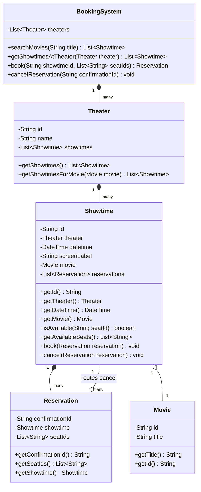

# 映画チケット予約 (Movie Ticket Booking)

**著者:** Evan King
**公開日:** 2026年2月3日
**難易度:** 中級 (medium)

## 問題の理解 (Understanding the Problem)

### 🎬 映画チケット予約システムとは？
映画チケット予約システム（Fandangoなど）は、ユーザーが映画を検索し、映画館と上映時間を閲覧し、座席表から特定の座席を選択してチケットを予約できるシステムです。システムは複数の映画館、それぞれの複数のスクリーンにわたって座席の空き状況を管理し、2人が同じ座席を予約するのを防ぎます。

## 要件 (Requirements)

面接は次のようなプロンプトから始まります：
「ユーザーが映画を閲覧し、映画館と上映時間を選択し、チケットを予約し、予約を管理できる、BookMyShowのような映画チケット予約システムを設計してください。」

これは広範です。要件を1つ書き出す前に、的を絞った質問でこれを絞り込む必要があります。

### 明確化のための質問 (Clarifying Questions)

コアとなる操作、スコープの境界、制約に質問を集中させます。

**あなた:** 「『映画を閲覧（browse movies）』というのは、全文検索ですか、あいまい（ファジー）検索ですか、それとも単なるタイトルの検索ですか？」
**面接官:** 「映画のタイトルによる単純なテキストマッチングです。複雑なものはありません。」

*つまり、映画のリストを反復処理し、各タイトルが検索語を含んでいるか確認し、一致するものを返すことができます。Elasticsearchや転置インデックス、ランキングアルゴリズムは不要です。メモリ内に数百本の映画があれば、線形スキャンはマイクロ秒で終わります。*

**あなた:** 「座席選択はどのように機能しますか？ユーザーは座席表から特定の座席を選びますか、それともシステムが自動的に割り当てますか？また、一度に複数の座席を予約できますか？」
**面接官:** 「ユーザーは座席表から特定の座席を選びます。そして、はい、1回のトランザクションで複数の座席を予約できます。」

*私たちは単なるチケットカウンターではなく、座席選択ピッカー（seat picker）を作っているということです。つまり、座席ごとの空き状況の追跡が必要です。座席表をレンダリングするための実際のUIはスコープ外ですが、フロントエンドがそれらを表示できるように、システムはどの座席が利用可能かを公開する必要があります。*

**あなた:** 「単一の映画館用に設計するのですか、それとも複数ですか？また、映画館には複数のスクリーンがありますか？」
**面接官:** 「複数の映画館で、それぞれに複数のスクリーンがあります。ユーザーは映画を検索してどこで上映されているか確認したり、特定の映画館に行って何が上映されているか確認したりできます。」

*複数のスクリーンを持つ複数の映画館。システムへの2つのエントリーポイント：映画のタイトルによるグローバルな検索と、特定の映画館の提供内容の閲覧です。どちらのパスも、上映時間を選び、座席を選ぶことに集約されます。両方の方向を効率的にサポートする必要があります。*

**あなた:** 「スクリーンによって座席の構成は異なりますか？それとも標準化できますか？」
**面接官:** 「標準化してください。すべてのスクリーンは同じレイアウトを持ちます：A列からZ列、座席0から20までです。」

*大きな単純化です。システム内のすべてのスクリーンで1つの一定の座席レイアウトになるということは、スクリーンごとの構成をモデル化する必要がないことを意味します。*

**あなた:** 「『予約の管理』には何が含まれますか？キャンセル、スケジュールの変更（リスケジュール）、変更などですか？」
**面接官:** 「キャンセルのみです。もし誰かが別の上映時間を希望する場合は、キャンセルして再予約します。」

*リスケジュールのロジックなし。これにより予約モデルがシンプルに保たれます。*

**あなた:** 「スコープに関する質問を2つ。価格が異なる座席タイプはありますか？また、支払い処理はスコープに含まれますか？」
**面接官:** 「両方とも『いいえ』です。すべての座席は同一であり、支払いはスコープ外です。常に成功すると仮定してください。」

*モデル化する機能が2つ減りました。価格階層なし、支払いの状態遷移（ステートマシン）なしです。*

**あなた:** 「並行性（concurrency）についてはどうですか？もし2人が同時に同じ座席を予約しようとしたら？」
**面接官:** 「処理してください。正確に1人だけが成功するべきです。」

*並行性はコア要件です。*

### 最終要件 (Final Requirements)

**要件:**
1. ユーザーはタイトルで映画を検索できる。
2. ユーザーは特定の映画館で上映されている映画を閲覧できる。
3. 映画館には複数のスクリーンがある。すべてのスクリーンは同じ座席レイアウトを共有する（A〜Z列、0〜20番）。
4. ユーザーはある上映時間で利用可能な座席を確認し、特定の座席を選択できる。
5. ユーザーは1回の予約で複数の座席を予約できる。予約は確認ID（confirmation ID）を返す。
6. 同じ座席への並行した予約：正確に1つだけが成功する。
7. ユーザーは確認IDを使って予約をキャンセルし、座席を解放できる。

**スコープ外:**
- 支払い処理（支払いは常に成功すると仮定）
- 可変の座席レイアウトや座席タイプ（すべての座席は同一）
- スケジュールの変更（代わりにキャンセルして再予約）
- UI / レンダリング

## コアとなるエンティティと関係性 (Core Entities and Relationships)

要件に目を通すと、候補のプールが得られます：`Theater`（映画館）、`Movie`（映画）、`Screen`（スクリーン）、`Seat`（座席）、`Showtime`（上映時間）、`Reservation`（予約）、そしてそれらすべてをオーケストレーションする何かです。すべての候補が独自のクラスになるわけではありませんが、リストアップする価値はあります。それらはそれぞれ、クラス、値オブジェクト、フィールド、または定数として、設計のどこかに現れます。

- **Theater** - 上映時間を開催する名前付きの場所。ユーザーは「今夜AMCで何が上映されているか？」と尋ねます。`Theater` は第一級のエンティティです。なぜなら、上映時間のスケジュールを所有し、ユーザーが直接それに対してクエリを行うからです。これは特定の場所で起こるすべてのことの自然なコンテナになります。
- **Movie** - ユーザーは映画をタイトルで検索します。同じ映画が複数の映画館、複数の上映時間で上映されます。`Movie` はそれらの上映時間を結びつけるものです。誰かが「インセプション」を検索したとき、私たちはそれを上映しているすべての映画館と時間枠を見つける必要があります。`Movie` はシステム全体の結果を接続する第一級の検索ターゲットです。
- **Screen** - 映画は映画館内の特定のスクリーンで上映されます。直感的には「クラスにする」べきだと思えます。しかし、私たちは面接官に「すべてのスクリーンは同じ座席レイアウトを使用する」と同意させたばかりです。可変のレイアウトがない場合、`Screen` は状態を追跡せず、ルールを強制せず、スクリーンごとに異なるデータを所有しません。それは「スクリーン3」のような単なるラベルであり、顧客にどの部屋に入ればいいかを伝えるだけです。したがって、`Showtime` の文字列フィールドに格下げすることができます。
  *これは元が取れるスコープ質問の典型です。「座席レイアウトを標準化できますか？」という質問により、エンティティ全体とそれに伴うすべての間接性が排除されました。*
- **Showtime** - 特定の時間とスクリーンでの特定の映画の上映。「午後7時、AMCのスクリーン3でのインセプション」。各上映には独自の座席セットがあるため、`Showtime` はどの座席が予約されているかを追跡し、2人のユーザーが同じ座席を取ろうとするケースを処理する場所です。
- **Reservation** - `Showtime` での予約が成功すると、ユーザーは確認IDを受け取ります。彼らは後でそのIDを使ってキャンセルします。予約は、キャンセル時に何を解放すべきか分かるように、座席のリストを保持します。
- **Seat** - ユーザーが座席を選択するため、`Seat` は独自のクラスが必要かもしれないと示唆されます。しかし、このシステムで `Seat` が実際に何をするかを考えてみてください。状態は変更しません。ルールを強制しません。振る舞いを維持しません。単なる識別子です：「A5」はA列5番を意味します。文字列で十分機能します。言語が組み込みの等価性とハッシュ化を備えた文字列を提供しているのに、カスタムクラスは不要です。
- **BookingSystem** - 誰が検索を処理するのでしょうか？「『インセプション』に一致するすべての映画を検索する」は、すべての映画館とその上映時間を横断します。この質問を所有する単一のエンティティはありません。「今夜AMCで何が上映されているか？」も同様で、映画館の上映時間を歩き回り、重複しない映画を集める必要があります。映画館を保持し、これらの横断的なクエリを提供する最上位のエントリーポイントが必要です。これが私たちのオーケストレーターです。

> **TIP:** 何かが独自のクラスに値するかどうかの良い発見的アプローチ（ヒューリスティクス）は、それが他のエンティティを接続しているか、クエリの対象になるか、あるいは独自の振る舞いを必要とするかを問うことです。`Movie` はユーザーが検索し、映画館を横断して上映時間を結びつけるため、クラスになります。`Screen` は顧客にどの部屋に入るか伝える単なるラベルです。

### 最終エンティティ (Final Entities)

| エンティティ | 責務 | タイプ |
| --- | --- | --- |
| **BookingSystem** | オーケストレーター。映画館を所有する。検索と映画館横断クエリのエントリーポイント。 | Class |
| **Movie** | 検索可能なエンティティ。タイトルとID。映画館を横断して上映時間を結びつける。 | Class |
| **Theater** | 名前付きの場所。上映時間のリストを所有する。 | Class |
| **Showtime** | 特定の上映。座席ごとの空き状況を追跡し、予約の並行性を処理する。 | Class |
| **Reservation** | ユーザーの予約参照。確認IDと予約された座席を保存する。キャンセルに使用される。 | Class |
| **Seat** | 特定の座席を識別する文字列（例："A5"）。振る舞いなし、単なる識別子。 | String |
| **Screen** | 上映時間がどの部屋で行われるかを識別するラベル（例："Screen 3"）。 | String field |

これらのエンティティが互いにどのように関係するか：

**主要な関係 (Key Relationships):**
- BookingSystem → List<Theater>
- Theater → List<Showtime>
- Showtime → Theater (ナビゲーションのための後方参照)
- Showtime → Movie (参照)
- Showtime → List<Reservation> (この上映時間に対する予約記録)
- Reservation → Showtime (キャンセルルーティングのための後方参照)
- Reservation → List<string> (例：`["A5", "A6"]`)

## クラス設計 (Class Design)

何を構築するかが分かりました。次に、それぞれが何を保存し、どのような操作を公開するかを定義する必要があります。すべてのクラスについて、2つのことを尋ねます：このエンティティは要件を満たすためにどのような状態を必要とするか、そして外部の世界はそれに対して何をする必要があるか？

オーケストレーターから始め、最も粒度の細かい型へと下がっていきます。

### BookingSystem

`BookingSystem` はシステムのエントリーポイントです。映画の検索、映画館のスケジュールの閲覧、座席の予約、予約のキャンセルなど、ユーザー向けのアクションはすべてここを経由します。映画館のコレクションを管理し、呼び出し元と適切な `Showtime` との間の予約フローを調整します。

| 要件 | BookingSystem が追跡すべきもの |
| --- | --- |
| 「映画を検索する」/「映画館の映画を閲覧する」 | すべての映画館のコレクション（映画は上映時間を通じて発見可能） |
| 「座席を予約する」/「予約をキャンセルする」 | 適切な上映時間へのルーティングが必要 |

```java
class BookingSystem {
    List<Theater> theaters;
    
    List<Showtime> searchMovies(String title) { ... }
    List<Showtime> getShowtimesAtTheater(Theater theater) { ... }
    Reservation book(String showtimeId, List<String> seatIds) { ... }
    void cancelReservation(String confirmationId) { ... }
}
```

`searchMovies` は映画のタイトルに対して大文字・小文字を区別しない部分文字列の一致（substring matching）を行い、すべての映画館から一致する映画の将来の上映時間をすべて返します。これにより、ユーザーに行動可能な情報を提供します：「インセプション」が存在するということだけでなく、いつ、どこで実際に予約できるかということです。

`getShowtimesAtTheater` は `Theater` オブジェクトを受け取り、その将来のすべての上映時間を返します。UIはこれらを映画ごとにグループ化して、「今夜何が上映されているか」と各映画の時間を表示できます。これにより、最初に映画を取得し、次に各映画の上映時間を別々にクエリするN+1クエリのパターンを回避できます。これはメモリ内のシステムであるため、IDを使用するよりも `Theater` オブジェクトを直接渡す方がクリーンです。

これら2つのメソッドは、映画のタイトルでグローバルに検索することから、特定の映画館で上映されているものを閲覧することまで、システムへの両方のエントリーポイントをカバーします。

`book` は `Reservation` を作成し（確認IDを生成し）、アトミックな検証と保存のために適切な `Showtime` に渡します。`cancelReservation` は予約を見つけ、その `Showtime` にルーティングし、キャンセルするように指示します。`BookingSystem` が予約や上映時間をどうやって効率的に見つけるかは、実装の詳細として後で取り組みます。

最上位に `reservations` フィールドがないのは、各 `Showtime` が自身の予約を所有しており、それらが変更する座席状態と同じ場所に配置されているためです。`BookingSystem` 自体に映画インデックスが必要かどうかは、後で取り組む実装の詳細です。

### Theater

`Theater` は映画が上映される物理的な場所を表します。ユーザーの観点からは、彼らは2つのことに関心があります：どの映画館に行くか、そしてそこで何が上映されているかです。これにより `Theater` は上映時間の自然なコンテナになります。

| 要件 | Theater が追跡すべきもの |
| --- | --- |
| 「映画館の映画を閲覧する」 | 映画館のアイデンティティ（名前、ID）と、その上映時間のリスト |
| 「映画館には複数のスクリーンがある」 | 上映時間にはスクリーンラベルが含まれる |

```java
class Theater {
    String id;
    String name;
    List<Showtime> showtimes;
    
    List<Showtime> getShowtimes() { ... }
    List<Showtime> getShowtimesForMovie(Movie movie) { ... }
}
```

`getShowtimesForMovie` は映画館の上映時間を反復処理し、指定された映画に一致するものを返す便利なフィルターです。`Theater` は予約ロジックについて何も知りません。それは上映時間のコンテナであり、予約フローの参加者ではありません。

### Showtime

興味深い設計の決定は `Showtime` に存在します。これは「午後7時、AMCのスクリーン3でのインセプション」のような、実際に予約可能な単位です。すべての予約とキャンセルは最終的に特定の `Showtime` を通過します。座席の空き状況、予約の保存、そして並行性制御はすべてこの1つのエンティティに集束します。

まず振る舞いについて考えます。座席ピッカーを開いたユーザーは、どの座席が空いていて、どれが取られているかを知る必要があります。予約フローは空き状況を確認し、座席を確保し、他の誰かが先に確保した場合を処理する必要があります。キャンセルは正しい予約を見つけ、それらの座席を解放する必要があります。その振る舞いはすべて1つの質問に集中します：この上映時間における各座席の現在の予約状態は何ですか？

それをサポートするために `Showtime` は何を追跡すべきでしょうか？

| 要件 | Showtime が追跡すべきもの |
| --- | --- |
| 「上映時間の利用可能な座席を見る」 | 現在どの座席が予約されているか |
| 「1回の予約で複数の座席を予約する」 | 予約とその座席 |
| 「予約をキャンセルし、座席を解放する」 | どの予約が存在するか（見つけて削除するため） |

一見すると、表は2つのことを求めているように見えます：予約を追跡する方法と、どの座席が予約済みかを追跡する方法です。しかし、予約に実際に何が含まれているかを見てください。それは予約された座席のリストを保持しています。したがって、上映時間のすべての予約があれば、各予約の座席リストをスキャンするだけで、どの座席が取られているかが正確に分かります。**予約こそが座席の状態です**。1つのリストで両方が得られます。

つまり、予約（booking）とは単にリストに予約（Reservation）を追加すること（その座席は「予約済み」になる）であり、キャンセルとは1つ削除すること（その座席は「空き」になる）です。両方の操作は1箇所で同じ単一のデータ構造を変更するため、オブジェクト間の一貫性を心配する必要はありません。

```java
class Showtime {
    String id;
    Theater theater;
    DateTime datetime;
    String screenLabel;
    Movie movie;
    List<Reservation> reservations;
    
    String getId() { ... }
    Theater getTheater() { ... }
    DateTime getDatetime() { ... }
    Movie getMovie() { ... }
    boolean isAvailable(String seatId) { ... }
    List<String> getAvailableSeats() { ... }
    void book(Reservation reservation) { ... }
    void cancel(Reservation reservation) { ... }
}
```

`Showtime` には映画館への参照がある一方、`Theater` には上映時間のリストがあることに注意してください。この双方向の関係は、ユーザーが 予約 → 上映時間 → 映画館 とナビゲートして、自分の予約がどこにあるかを確認できるようにするために存在します。実際には、呼び出し元は最初に `Theater` を作成し、次に `Theater` の参照を渡してその `Showtimes` を作成します。双方向リンクはセットアップ時に一度だけ確立され、変更されることはありません。`Theater` はアグリゲートルート（Aggregate Root）であり、`Showtime` の映画館参照は変更のためではなく、純粋にナビゲーションのためのものです。

`reservations` リストは、この上映時間の予約状態の「信頼できる唯一の情報源（source of truth）」です。予約されたすべての座席は、正確に1つの予約の中に、正確に1回表現されます。座席が取られているか確認するには、予約をスキャンします。利用可能なすべての座席を取得するには、予約されているものを集め、一定の座席レイアウト（A〜Z列、0〜20番）からそれらを引きます。別個のデータ構造は必要ありません。

`isAvailable` は、座席がいずれかの既存の予約の座席リストに存在するかどうかを確認します。`getAvailableSeats` は一定のレイアウトからすべての座席を生成し、予約済みのものをフィルタリングで除外して、UIが座席ピッカーをレンダリングするのに必要なものを提供します。

`book` は `Reservation` オブジェクト（`BookingSystem` によって確認IDと座席リストと共に既に作成されているもの）を受け取り、要求されたすべての座席がまだ利用可能であることを検証し、予約をアトミックに保存します。いずれかの座席が取られている場合、予約は失敗し、状態の変更は起こりません。`cancel` はリストから `Reservation` を削除し、その予約が主張するものがなくなるため、座席は再び利用可能になります。

### Movie

`Movie` は軽量なエンティティですが、システム内で重要な接続の役割を果たします。ユーザーが「インセプション」を検索すると、システムは一致する `Movie` オブジェクトを見つけ、それらを使用して、どの映画館や上映時間で上映されているかを検索する必要があります。`Movie` はユーザーの検索クエリと、異なる映画館に散らばる実際の予約可能な上映時間との間の「接着剤」です。

| 要件 | Movie が追跡すべきもの |
| --- | --- |
| 「タイトルで映画を検索する」 | タイトルの文字列 |
| 「映画館の映画を閲覧する」/「上映時間を見る」 | 上映時間をリンクするための映画アイデンティティ（ID） |

```java
class Movie {
    String id;
    String title;
    
    String getTitle() { ... }
    String getId() { ... }
}
```

IDが存在するのは、2つの映画がタイトルを共有する（リメイクや再公開など）可能性があるからです。タイトルはユーザーが検索するものです。もし要件が後で拡大されたら（上映時間、ジャンル、年齢制限など）、`Movie` とそのコンストラクタにフィールドを追加します。`BookingSystem`、`Showtime`、または予約フローに変更はありません。

### Reservation

`Reservation` はユーザーが何を予約したかをキャプチャし、後でそれを取り消すために必要な情報を提供します。

| 要件 | Reservation が追跡すべきもの |
| --- | --- |
| 「予約は確認IDを返す」 | 確認ID |
| 「1回の予約で複数の座席を予約する」 | 座席IDのリスト |
| 「確認IDで予約をキャンセルし、座席を解放する」 | `Showtime` への後方参照（キャンセルを正しい上映時間にルーティングするため） |

```java
class Reservation {
    String confirmationId;
    Showtime showtime;
    List<String> seatIds;
    
    String getConfirmationId() { ... }
    List<String> getSeatIds() { ... }
    Showtime getShowtime() { ... }
}
```

`confirmationId` は予約時に生成されます。これはユーザーのチケットに表示され、キャンセルするために入力するものです。この予約の外部識別子です。

`Showtime` への後方参照は、キャンセルルーティングに不可欠です。ユーザーが確認IDでキャンセルするとき、`BookingSystem` はどの `Showtime` がその予約を所有しているかを見つけ出す必要があります。後方参照はそのリンクを提供します。それがなければ、正しい予約を見つけるために、すべての映画館、すべての上映時間、すべての予約を検索しなければなりません。

`Reservation` 自身には `cancel()` メソッドがないことに注意してください。キャンセルは単なる「この予約の削除」ではありません。利用可能なプールに座席を解放する必要があり、これは `Showtime` の予約リストを変更することを意味します。`Reservation` はそのリストへのアクセスを持たず、持つべきではありません。もし `Reservation` が `Showtime` の状態を直接変更できたら、2つのオブジェクトが同じデータを変異させることになり、並行性を推論するのが難しくなります。したがって、実際のキャンセルロジックは `Showtime` に存在し、リストから予約を削除し、座席を再び利用可能にします。

## 最終的なクラス設計 (Final Class Design)



**定数:**
- `SEAT_LAYOUT`: A〜Z列、0〜20番（1上映につき546席）

5つのクラスと1つの定数。関心事のクリーンな分離に注目してください：
- `BookingSystem` は純粋なオーケストレーターです。映画館を保持し、映画館横断クエリ（検索、閲覧）を提供し、予約とキャンセルのリクエストをルーティングします。
- `Showtime` は座席状態と予約の両方を所有します。予約とキャンセルは単一オブジェクトでのアトミックな操作であるため、維持すべきオブジェクト間の一貫性はありません。
- `Reservation` は、キャンセルのルーティングのために `Showtime` への後方参照を持つデータレコードです。`BookingSystem` が作成し、`Showtime` が保存します。

## 実装 (Implementation)

実際の面接でこれらすべてを実装することはありません。実際には、価値の最も高いメソッドに集中します。この問題では、`Showtime.book()` と `Showtime.cancel()` です。これらは並行性、アトミック性、そしてコアの予約ロジックが存在する場所だからです。面接官は、オーケストレーションのフローを示すために `BookingSystem.book()` のウォークスルーを求めることもあります。残りの部分（検索、閲覧、単純な getter）は口頭で説明するか、素早くスケッチする程度です。

クラス設計が完了したので、メソッドを実装する準備が整いました。LLD面接の大多数が求める擬似コードを使用します。

各メソッドについて、以下のパターンに従います：
- コアロジックを定義する - 全てが正しくいった場合に何が起きるか
- エッジケースを処理する - 無効な入力、並行性、失敗する可能性のある操作

興味深い作業は2つのクラスに分かれています。`Showtime` は座席状態、予約の保存、並行性を処理します。`BookingSystem` はフローを調整し、`Reservation` オブジェクトを作成して正しい `Showtime` にルーティングします。

並行性の要件（R6：2人が同じ座席を予約したときに「正確に1つだけが成功する」）は重要です。これは `Showtime.book()` を実装する際に真正面から取り組みます。

### BookingSystem

`BookingSystem` はエントリーポイントです。操作を正しい上映時間にルーティングし、映画館を横断する検索や閲覧のクエリを提供します。

`searchMovies` に対する素朴なアプローチは、誰かが検索するたびに `Theater` → `Showtime` → `Movie` のチェーン全体を歩き回ることです。
これは機能しますが、検索のたびに `O(t × s)` （`t` は映画館数、`s` は映画館あたりの上映時間）になります。ユーザーが頻繁に検索し、映画カタログは滅多に変更されないシステムでは、この繰り返しの作業は無駄です。

改善するために、構築時にインデックスを作成できます。映画からタイトルへのマッピングは引き続き検索に必要ですが、今回は映画ではなく上映時間を返すので、両方をインデックス化します。

```java
// BookingSystem コンストラクタ
BookingSystem(List<Theater> theaters) {
    this.theaters = theaters;
    this.moviesById = new Map();
    this.showtimesByMovieId = new Map(); // Map<movieId, List<Showtime>>
    
    for (Theater theater : theaters) {
        for (Showtime showtime : theater.getShowtimes()) {
            Movie movie = showtime.getMovie();
            moviesById.put(movie.getId(), movie);
            
            // 効率的な検索のために上映時間を映画ごとにグループ化
            if (!showtimesByMovieId.containsKey(movie.getId())) {
                showtimesByMovieId.put(movie.getId(), new List());
            }
            showtimesByMovieId.get(movie.getId()).add(showtime);
        }
    }
}
```

これでユーザーが検索したとき、映画インデックス（せいぜい数百本）をスキャンして一致を見つけ、関連する上映時間を返します：

```java
List<Showtime> searchMovies(String title) {
    if (title == null || title.isEmpty()) return [];
    
    List<Showtime> results = [];
    String searchLower = title.toLowerCase();
    DateTime now = currentTime();
    
    for (Movie movie : moviesById.values()) {
        if (movie.getTitle().toLowerCase().contains(searchLower)) {
            // この映画の将来の上映時間をすべて追加
            for (Showtime showtime : showtimesByMovieId.get(movie.getId())) {
                if (showtime.getDatetime() > now) {
                    results.add(showtime);
                }
            }
        }
    }
    return results;
}
```

構築時のコストは同じ `O(t × s)` ですが、`searchMovies` は `O(一致する映画数 × 映画あたりの上映時間)` になり、システム内のすべての上映時間をスキャンするよりはるかに小さくなります。

次に、特定の映画館で何が上映されているかを閲覧できるようにする必要があります。

```java
List<Showtime> getShowtimesAtTheater(Theater theater) {
    if (theater == null) return [];
    
    List<Showtime> results = [];
    DateTime now = currentTime();
    for (Showtime showtime : theater.getShowtimes()) {
        if (showtime.getDatetime() > now) {
            results.add(showtime);
        }
    }
    return results;
}
```

これは過去の上映時間をフィルタリングするだけです。N+1クエリパターンを回避し、1回の呼び出しですべてを返します。
*古い上映時間は永遠に蓄積されるのでは？はい、この設計ではメモリ内に残り続けます。本番環境ではデータベースを使用するため問題になりませんが、インメモリの場合は有効期限切れの上映時間をクリーンアップする仕組みが必要になると面接官に言及する価値があります。*

`book` を介した予約フローは `BookingSystem` がオーケストレーションを行います。入力を検証し、正しい上映時間を見つけ、`Reservation` を作成し、アトミックな検証と保存のために `Showtime` に渡します。

予約とキャンセルのO(1)ルックアップのために、コンストラクタを更新して `showtimesById` と `reservationsById` マップも追加します。

```java
// BookingSystem コンストラクタ (最終版)
BookingSystem(List<Theater> theaters) {
    this.theaters = theaters;
    this.moviesById = new Map();
    this.showtimesByMovieId = new Map();
    this.showtimesById = new Map();
    this.reservationsById = new Map();
    
    for (Theater theater : theaters) {
        for (Showtime showtime : theater.getShowtimes()) {
            Movie movie = showtime.getMovie();
            moviesById.put(movie.getId(), movie);
            showtimesById.put(showtime.getId(), showtime);
            
            if (!showtimesByMovieId.containsKey(movie.getId())) {
                showtimesByMovieId.put(movie.getId(), new List());
            }
            showtimesByMovieId.get(movie.getId()).add(showtime);
        }
    }
}
```

`reservationsById` は最初空で、予約が入るたびにデータが追加されます。これらにより予約メソッドがクリーンになります。

```java
Reservation book(String showtimeId, List<String> seatIds) {
    if (showtimeId == null || seatIds == null || seatIds.isEmpty()) {
        throw new InvalidRequestException();
    }
    
    Showtime showtime = showtimesById.get(showtimeId);
    if (showtime == null) {
        throw new ShowtimeNotFoundException();
    }
    
    // 予約を事前に作成（まだ状態変更はないデータオブジェクト）
    Reservation reservation = new Reservation(
        generateConfirmationId(),
        showtime,
        seatIds
    );
    
    // アトミックな検証と保存のために showtime に渡す
    showtime.book(reservation);
    
    // cancelReservation が確認IDで見つけられるようにルーティングインデックスに登録
    reservationsById.put(reservation.getConfirmationId(), reservation);
    
    return reservation;
}
```

キャンセルは予約フローを逆転させます。

```java
void cancelReservation(String confirmationId) {
    if (confirmationId == null || confirmationId.isEmpty()) {
        throw new InvalidRequestException();
    }
    
    Reservation reservation = reservationsById.get(confirmationId);
    if (reservation == null) {
        throw new ReservationNotFoundException();
    }
    
    // 正しい上映時間へ後方参照をたどる
    Showtime showtime = reservation.getShowtime();
    
    // Showtime はアトミックに予約を削除し、座席を解放する
    showtime.cancel(reservation);
    
    // ルーティングインデックスから削除
    reservationsById.remove(confirmationId);
}
```

### Theater

`Theater` は `getShowtimes()` などを公開するだけです。予約ロジックについては何も知りません。

### Showtime

これまでに構築したすべてがこのクラスに流れ込みます。`Showtime` は状態が実際に変更される場所です。各予約はここに追加され、キャンセルはここから削除されます。ここは状態管理、並行性、アトミック性、および検証がすべて交差する場所です。

```java
class Showtime {
    String id;
    Theater theater;
    Movie movie;
    DateTime datetime;
    String screenLabel;
    List<Reservation> reservations;
    
    Showtime(String id, Theater theater, Movie movie, DateTime datetime, String screenLabel) {
        this.id = id;
        this.theater = theater;
        this.movie = movie;
        this.datetime = datetime;
        this.screenLabel = screenLabel;
        this.reservations = new List();
    }
}
```

「座席A5は取られているか？」にはどう答えるでしょうか？予約リストを直接確認します。

```java
boolean isAvailable(String seatId) {
    for (Reservation reservation : reservations) {
        if (reservation.getSeatIds().contains(seatId)) {
            return false;
        }
    }
    return true;
}
```

UI向けに利用可能な座席をすべて取得するには：

```java
List<String> getAvailableSeats() {
    Set<String> booked = new Set();
    for (Reservation reservation : reservations) {
        for (String seat : reservation.getSeatIds()) {
            booked.add(seat);
        }
    }
    
    List<String> available = new List();
    for (char row = 'A'; row <= 'Z'; row++) {
        for (int num = 0; num <= 20; num++) {
            String seatId = row + "" + num;
            if (!booked.contains(seatId)) {
                available.add(seatId);
            }
        }
    }
    return available;
}
```

ここまでは読み取り操作でした。しかし `book()` は異なります。2つのスレッドが座席A5をチェックし、両方とも空いていると見て、両方とも予約を追加した場合、座席が二重予約されてしまいます（要件R6違反）。

ロックレベルとして「座席ごと」と「上映時間ごと」の2つの選択肢があります。座席ごとのロックは並行性が高くなりますが、デッドロックを避けるためにソートされたロック獲得が必要であり、`Seat` を文字列からクラスへと昇格させます。ここでは、臨界領域（クリティカルセクション）が非常に短い（リストのスキャンと追加のみ）ため、「上映時間ごとのロック（`synchronized(this)`）」が最適（sweet spot）です。

```java
void book(Reservation reservation) {
    synchronized(this) {
        List<String> seatIds = reservation.getSeatIds();
        if (seatIds == null || seatIds.isEmpty()) {
            throw new InvalidRequestException("少なくとも1つの座席を選択してください");
        }
        
        // すべての座席がレイアウトに存在するか検証
        for (String seatId : seatIds) {
            if (!isValidSeatId(seatId)) {
                throw new InvalidSeatException(seatId);
            }
        }
        
        // すべての座席が利用可能かチェック
        for (String seatId : seatIds) {
            if (!isAvailable(seatId)) {
                throw new SeatUnavailableException(seatId);
            }
        }
        
        // すべてのチェックを通過 - 予約を保存
        reservations.add(reservation);
    }
}

boolean isValidSeatId(String seatId) {
    char row = seatId.charAt(0);
    int num = Integer.parseInt(seatId.substring(1));
    return row >= 'A' && row <= 'Z' && num >= 0 && num <= 20;
}
```

キャンセルメソッドも同様に同期化します。

```java
void cancel(Reservation reservation) {
    synchronized(this) {
        reservations.remove(reservation);
    }
}
```

リストから予約を削除するだけです。`isAvailable` は予約リストから答えを導出するため、座席は自動的に利用可能になります。クリーンアップすべき二次データ構造はありません。

### Reservation

`Reservation` には防衛的コピー（defensive copy）を入れることに注目してください。

```java
class Reservation {
    String confirmationId;
    Showtime showtime;
    List<String> seatIds;
    
    Reservation(String confirmationId, Showtime showtime, List<String> seatIds) {
        this.confirmationId = confirmationId;
        this.showtime = showtime;
        // 防衛的コピー
        this.seatIds = new List(seatIds);
    }
    
    // ...getters
    List<String> getSeatIds() {
        return new List(seatIds); // 変更を防ぐためコピーを返す
    }
}
```

## 拡張性 (Extensibility)

### 「上映時間、映画、映画館の動的な追加と削除をどのようにサポートしますか？」
現在の設計は構築時にすべてが設定されることを前提としています。追加は簡単です。`BookingSystem` に `addShowtime` メソッドを公開し、コンストラクタで入力したすべてのインデックスを更新します。
ただし、削除は困難です。エンティティがお互いを参照し合っているためです。「インセプション」の午後7時の上映を削除した場合、その予約を持つ人たちの予約がどこにも指し示さなくなります。面接の範囲での最もクリーンなアプローチは、アクティブな予約が存在する場合は削除を拒否（reject）することです。映画館が上映をキャンセルする必要がある場合は、まずすべての既存の予約をキャンセルし、その後システムから上映時間を削除します。

### 「チェックアウト中の座席の一時的な確保（ホールド）はどのように処理しますか？」
現状、予約は瞬時に行われますが、実際のシステムでは「座席選択」と「支払い完了」の間にギャップがあります。この間に他のユーザーが同じ座席を取ってしまうと、支払い画面を記入し終えたユーザーはガッカリします。
解決策は**一時的なホールド（temporary hold）**を導入することです。
`Showtime` は `List<Reservation>` に加えて、アクティブなホールドを追跡する `Map<String, SeatHold> holds` を持つようになります。`isAvailable` は、確定した予約に加えて、期限切れでないホールドにある座席も「利用不可」として扱うように変更されます。
`book()` は `holdSeats()`（一時確保）と `confirmHold()`（支払い後の確定）の2つのステップに分割されます。どちらも `synchronized(this)` の中で実行され、既存のロック戦略を維持したまま自然にスケールします。期限切れのホールドをクリーンアップするバックグラウンドタスクも必要になります。
