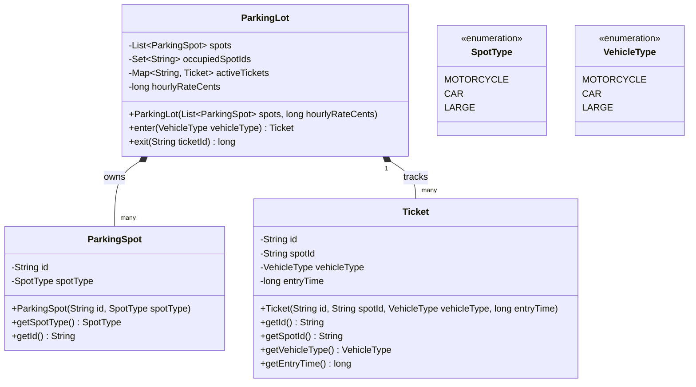

# 駐車場 (Parking Lot)

**著者:** Evan King
**公開日:** 2025年12月15日
**難易度:** 中級 (medium)

## 問題の理解 (Understanding the Problem)

### 🚗 駐車場システムとは？
駐車場システムは、複数の駐車スペースにわたる車両の駐車を管理します。車両が進入すると、システムは車両タイプに一致する利用可能なスペースを割り当て、チケットを発行します。車両が退出する際、システムは滞在時間に基づいて駐車料金を計算し、次の顧客のためにスペースを解放します。

## 要件 (Requirements)

面接に臨むと、おそらく次のような問題が出されます：

> 「様々な種類の車両が駐車でき、システムがスペースの割り当てを管理し、退出時に料金を計算する駐車場システムを設計してください。」

クラスについて考え始める前に、何を構築するのかを正確に特定する必要があります。数分かけて質問をし、これをより具体的なものに落とし込んでください。

### 明確化のための質問 (Clarifying Questions)

システムが何をするのか、エラーをどう処理するのか、スコープは何か、後で何が変更される可能性があるか、を中心に質問を組み立てます。

会話は次のように進むかもしれません：

**あなた:** 「つまり、車両が進入したとき、システムは自動的に特定のスペースを割り当てるということですか？」
**面接官:** 「はい、システムは車両タイプに一致する利用可能なスペースを割り当て、チケットを発行します。」

*あなたは「入庫時に特定の場所を指定される駐車場なんてあるのか？」と思うかもしれません。もっともな疑問です。現実の駐車場のほとんどは、自分で好きな場所を選べます。しかし、面接で場所指定のバージョンが出題されるのは、割り当てロジックを設計させるためです。変だとは思いつつも、ここは合わせましょう。*

**あなた:** 「システムはどのタイプの車両をサポートしますか？車だけですか、それともバイクやトラックなども必要ですか？」
**面接官:** 「3種類です。バイク、普通車、そしてSUVやバンのような大型車です。」

*良い質問です。これで車両のカテゴリと、システムがスペース割り当てを制御することがわかりました。*

**あなた:** 「車両が進入したときはどうなりますか？駐車したことを証明するためのチケットやコード、あるいは他の何かを受け取るのでしょうか？」
**面接官:** 「固有のIDが記載されたチケットを受け取ります。退出時にそのチケットが必要になります。」

*これで進入のフローがわかりました。*

**あなた:** 「料金設定はどうなっていますか？時間貸しですか、一律ですか、それとも車両タイプによって料金が異なりますか？」
**面接官:** 「シンプルにしましょう。全車両共通の時給制です。1時間単位で切り上げ、退出時に支払います。」

*面接官が「シンプルに」と言ったときは、過剰な設計（over-engineer）をしないためのシグナルです。明確に求められない限り、サージプライシングや割引のような複雑な料金エンジンを構築しないでください。*

**あなた:** 「誰かが進入しようとしたときに駐車場が満車だったらどうなりますか？また、無効なチケットで退出しようとしたらどうなりますか？」
**面接官:** 「互換性のあるスペースが空いていない場合は、進入を拒否してください。退出については、チケットが無効または既に使用されている場合はエラーを返してください。」

*エラー処理が明確になりました。*

**あなた:** 「誰かがチケットを紛失した場合はどうなりますか？そのケースに対処する必要がありますか？」
**面接官:** 「良い質問ですが、シンプルにしましょう。今のところ、チケットは絶対に紛失しないものと仮定してください。」

*面接官は、あなたがエッジケースや障害モードについて質問したことに気づきます。「チケットをなくしたらどうなるか？」「システムが満杯になったらどうなるか？」といった質問は、あなたが現実世界の問題について考えていることを示します。20個もエッジケースを挙げる必要はありませんが、「何が失敗する可能性があるか？」を問う習慣は、成熟したエンジニアの思考を示します。*

**あなた:** 「最後の質問です。スコープ外のものは何ですか？支払い処理、入場ゲート、カメラ、そういったインフラについても考慮する必要がありますか？」
**面接官:** 「いいえ。コアとなるロジックに集中してください。スペースの割り当て、チケット管理、料金計算です。物理的なハードウェア、支払いシステム、UIは省略してください。」

*完璧です。作るべきでないものが明確になりました。*

### 最終要件 (Final Requirements)

このやり取りの後、ホワイトボードに次のように書きます：

**要件:**
1. システムは3つの車両タイプをサポートする: Motorcycle（バイク）, Car（車）, Large Vehicle（大型車）
2. 車両が進入すると、システムは自動的に利用可能な互換性のあるスペースを割り当てる
3. システムは進入時にチケットを発行する
4. 車両が退出する際、ユーザーはチケットIDを提示する
   - システムはチケットを検証する
   - 滞在時間に基づいて料金を計算する（1時間単位で切り上げ）
   - 次の利用のためにスペースを解放する
5. 料金は時給制で、全車両共通
6. 互換性のあるスペースが空いていない場合、システムは進入を拒否する
7. チケットが無効または既に使用されている場合、システムは退出を拒否する

**スコープ外:**
- 支払い処理
- 物理的なゲートのハードウェア
- セキュリティカメラや監視
- UI/表示システム
- 予約機能

## コアとなるエンティティと関係性 (Core Entities and Relationships)

要件が明確になったので、システムを構成するオブジェクトを特定する必要があります。要件の中にある名詞を探しますが、すべての名詞をクラスにしないでください。一部のものは単なるデータです。

候補を見ていきましょう：

- **Vehicle (車両)** - 最初は明らかに見えます。車両を駐車するのだから、`Vehicle` クラスが必要ですよね？しかし、考えてみてください。車両はシステムの外部にあります。システムが管理したり、追跡したり、その状態を気にするものではありません。互換性のあるスペースと照合するために、そのタイプ（バイク、車、大型）を知る必要があるだけです。これは単一の分類データであり、モデル化すべきエンティティではありません。クラスではなく Enum として保持します。
- **ParkingSpot (駐車スペース)** - これは明確なエンティティです。スペースにはIDがあり、車両タイプと一致させるためのタイプがあり、それが占有されているかどうかを追跡する必要があります。これには状態と振る舞い（自分自身を占有中または空きとしてマークする機能）の両方があります。
- **Ticket (チケット)** - 車両が進入した際に発行します。そのチケットは駐車セッションの記録です。チケットID、どのスペースが割り当てられたか、どのタイプの車両か、そしていつ進入したかを保持します。（外部にある）Vehicleとは異なり、Ticketはシステムが作成し管理する内部状態です。アクティブな駐車セッションに関する関連データをグループ化します。単なるデータ保持者（data holder）であっても、クラスとしてモデル化する価値があります。
- **ParkingLot (駐車場)** - 何かがシステム全体をオーケストレーション（調整）する必要があります。車両が進入した際、何かが空きスペースを見つけ、チケットを生成し、スペースを占有済みとしてマークする必要があります。車両が退出する際、何かがチケットを検証し、料金を計算し、スペースを解放する必要があります。それが `ParkingLot` です。これはエントリーポイントであり、コーディネーターです。

フィルタリングの結果、3つのエンティティが残りました：

| エンティティ | 責務 |
| --- | --- |
| **ParkingLot** | オーケストレーター。すべてのスペースを所有し、アクティブなチケットを追跡し、進入時にスペースを割り当て、退出時にチケットを検証して料金を計算します。これがシステムの唯一の公開APIです。 |
| **ParkingSpot** | 1つの物理的な駐車スペースを表します。ID、タイプ（バイク用、車用、大型用）、および占有フラグを持ちます。空いているかどうかの確認や、占有/空きのマークを行うメソッドを提供します。チケットや料金については知らず、自身の状態だけを知っています。 |
| **Ticket** | 駐車セッションの記録。チケットID、割り当てられたスペース、車両タイプ、進入時間を保持します。作成後は読み取り専用です。ここにビジネスロジックはなく、ParkingLot が料金を計算し退出を検証するために必要な単なるデータです。 |

関係性はシンプルです。`ParkingLot` は `ParkingSpot` のコレクションを所有します。`ParkingLot` は車両の進入時に `Ticket` を作成します。`ParkingLot` は退出時に検証できるよう、アクティブなチケットを追跡します。

## クラス設計 (Class Design)

3つのエンティティを特定したので、次はそれらのインターフェースを定義します。それぞれがどのような状態を保持し、どのようなメソッドを公開するのでしょうか？

トップダウンで進めましょう。エントリーポイントである `ParkingLot` から始め、次に `ParkingSpot` と `Ticket` を掘り下げていきます。

各クラスについて、次の2つの質問をします：
1. このクラスは、要件を満たすために何を覚えておく必要があるか？（状態）
2. このクラスは、どのような操作をサポートする必要があるか？（メソッド）

### ParkingLot

`ParkingLot` はオーケストレーターです。すべてがここを通ります。要件から状態を導き出しましょう：

| 要件 | ParkingLotが追跡すべきもの |
| --- | --- |
| 「システムは自動的に利用可能な互換性のあるスペースを割り当てる」 | 駐車場内のすべての駐車スペース |
| 「システムは自動的に利用可能な互換性のあるスペースを割り当てる」 | どのスペースが現在占有されているか |
| 「システムは進入時にチケットを発行する」 | 退出時に検証するためのアクティブなチケット |
| 「滞在時間に基づいて料金を計算する（時給制）」 | 料金計算のための時給レート |

まず、スペースが占有されているかどうかは誰が追跡すべきでしょうか？スペース自身でしょうか、それとも駐車場（ParkingLot）でしょうか？選択肢を比較検討してみましょう。

この問題では、インデックスによるアプローチ（ParkingLot 側で保持する）を選択します。これにより占有状況の追跡が一元化され、O(1) のルックアップが可能になり、拡張性のセクションで議論する並行処理パターンにも適しています。しかし前述したように、他のアプローチも優先事項によっては等しく有効です。

> **Amazon Locker問題との違い:**
> Amazon Lockerの問題では、占有状況の追跡方法が異なります。オーケストレーターで `Set` を維持するのではなく、Compartmentエンティティに直接 `occupied` ブールフラグを持たせます。
> 
> なぜ違うのでしょうか？ Amazon Lockerでは、占有は「物理的な存在」を表します。荷物が物理的にコンパートメントに置かれ、その後トークンが生成されます。トークンの期限が切れた後も、荷物は物理的にそこにあります。これは**内在的な状態 (Intrinsic state)** です。
> 
> Parking Lot では、占有は「割り当て」を表します。チケットはゲートで発行され（割り当てが作成され）、車が物理的にスペースに到達する前に行われます。スペースは、車が駐車した時ではなく、私たちが割り当てた瞬間に「占有」されます。これは**関係的な状態 (Relational state)** です。
> 
> どちらの問題に対しても、どちらのアプローチも擁護可能です。ドメインをどのように考えるかに基づいて、異なる選択をしているのです。重要なのは、暗記することではなく、トレードオフを理解し、自分の推論を擁護できることです。

状態をどこに配置するかを決める際は、次のように問いかけてください：
**「これはエンティティ自身のプロパティか、それともシステムによって管理される関係性か？」**

- **Intrinsic (内在的 - エンティティが所有):** ID、サイズ、BROKEN のような物理的な状態
- **Relational (関係的 - オーケストレーターが所有):** 「現在チケットXに割り当てられている」「ユーザーYによって予約されている」

占有状況はリレーショナル（関係的）であり、「チケットがこのスペースを参照している」ことから導かれます。オーケストレーターがチケットを管理しているため、オーケストレーターが占有状況を管理すべきです。それをオンデマンドで計算するか、インデックスを維持するかは、パフォーマンスと並行性のニーズに依存します。

そうは言っても、この区別は絶対的なものではありません。Amazon Lockerでは占有を物理的状態（エンティティ上のフラグ）として扱います。ここでは関係的状態（オーケストレーター内のSet）として扱います。どちらのアプローチも両方の問題で機能します。この区別は有用なメンタルモデルであり、厳格なルールではありません。

これにより、次のようになります：

```java
class ParkingLot {
    List<ParkingSpot> spots;
    Set<String> occupiedSpotIds;
    List<Ticket> activeTickets;
    long hourlyRateCents;
}
```

各フィールドが必要な理由と、なぜそれが `ParkingLot` に属するのかを分解してみましょう：

- **`spots` がここにある理由:** 駐車場はすべての駐車スペースのコレクションを所有しています。車両が進入すると、ParkingLot はこのリストをスキャンして利用可能な互換性のあるスペースを探します。これはオーケストレーターが管理する中心的なリソースです。スペースは別の場所（例えば別の SpotManager クラス）に置くこともできますが、それは間接性を追加するだけです。駐車場がスペースを管理するので、駐車場がスペースを保持します。
- **`activeTickets` を List としている理由:** 退出時、システムはチケットID文字列を受け取ります。そのIDが存在するかどうかを検証し、料金計算のための進入時間を取得するために検索する必要があります。ここではシンプルなリストから始め、実装セクションでこれを改良します。
- **`hourlyRateCents` がここにある理由:** 料金設定は、駐車場が強制するシステムレベルのポリシーです。駐車場によって料金が異なる場合があります。これをここに保存することで、必要に応じて異なる料金の複数の ParkingLot オブジェクトをインスタンス化できます。別の方法としてグローバルにハードコーディングすることもできますが、それはテストを困難にします。また、毎回 `exit()` に料金を渡すこともできますが、それでは呼び出し元に料金について知ることを強制し、カプセル化を壊してしまいます。

> **TIP: お金の表現に浮動小数点（float）を使わないでください。**
> floatは小数の端数を正確に表現できません（内部的に二進分数を使用するため、0.1のような値は正確に保存できません）。これにより計算で蓄積される小さな誤差が生じます。最小単位（セントなど）を整数（integer）として保存してください。$5.47 は 547 セントになります。すべての計算は正確に保たれ、表示する時だけドルに変換します。

次に操作です。外部の世界はどのようなアクションを実行する必要があるでしょうか？

| 要件からのニーズ | ParkingLot のメソッド |
| --- | --- |
| 「車両が進入すると、システムはスペースを割り当て、チケットを発行する」 | `enter(vehicleType)` は `Ticket` を返す |
| 「車両が退出する際、チケットを検証し料金を計算する」 | `exit(ticketId)` は料金（fee）を返す |

これだけです。2つのメソッド。これが公開APIのすべてです。

```java
class ParkingLot {
    List<ParkingSpot> spots;
    Set<String> occupiedSpotIds;
    List<Ticket> activeTickets;  // 実装時に Map に改良します
    long hourlyRateCents;

    ParkingLot(List<ParkingSpot> spots, long hourlyRateCents) { ... }
    Ticket enter(VehicleType vehicleType) { ... }
    long exit(String ticketId) { ... }
}
```

コンストラクタは（外部で構成された）スペースのリストと料金を受け取ります。`enter` は車両タイプを受け取り、成功すればチケットを返し、空きスペースがなければエラーをスローします。`exit` はチケットIDを受け取り、セント単位で料金を返し、チケットが無効であればエラーをスローします。

*一部の候補者は、内部状態を公開する必要があると考えて `getAvailableSpots()` や `getParkingStatus()` といったメソッドを追加しようとします。要件で駐車場のステータスを照会する必要があると明示されていない限り、これらのメソッドを追加する必要はありません。それらはカプセル化を壊し、コアワークフローには不要です。面接官が後で監視やダッシュボードについて尋ねてきたら、その時に追加すればよいのです。*

### ParkingSpot

`ParkingSpot` は1つの物理的な駐車スペースを表します。要件から：

| 要件 | ParkingSpotが追跡すべきもの |
| --- | --- |
| 「システムは互換性のあるスペースを割り当てる」 | 車両タイプと照合するためのスペースタイプ（バイク、車、大型） |
| 「車両が退出する際、ユーザーはチケットIDを提示する」 | スペースの固有ID |

状態：
```java
class ParkingSpot {
    String id;
    SpotType spotType;
}
```

操作について：
| 要件からのニーズ | ParkingSpot のメソッド |
| --- | --- |
| 「システムは自動的に利用可能な互換性のあるスペースを割り当てる」 | `getSpotType()` はタイプを返す |
| 「システムは進入時にチケットを発行する」 | `getId()` はスペースIDを返す |

```java
class ParkingSpot {
    String id;
    SpotType spotType;

    ParkingSpot(String id, SpotType spotType) { ... }
    SpotType getSpotType() { ... }
    String getId() { ... }
}
```

`ParkingSpot` は意図的にシンプルにしています。これは駐車スペースの物理的特性を表す純粋なデータ保持者です。車両、チケット、料金、あるいは自分が占有されているかどうかさえ知りません — それらはすべて `ParkingLot` によって管理されます。

列挙型（Enum）：
```java
enum SpotType {
    MOTORCYCLE,
    CAR,
    LARGE
}

enum VehicleType {
    MOTORCYCLE,
    CAR,
    LARGE
}
```

同じ値を持っているにもかかわらず、2つの別々の列挙型（`SpotType` と `VehicleType`）を用意しています。これにより意味的に区別が保たれます。同じラベルを使用しているからといって、スペースのタイプと車両のタイプは同じ概念ではありません。もし後で「バイク用のスペースが満車の場合、バイクは車用のスペースを使える」といった要件が追加された場合、別々の列挙型を持っている方がそのロジックを明確に表現できます。

### Ticket

`Ticket` は駐車セッションの記録です。要件から：

| 要件 | Ticketが追跡すべきもの |
| --- | --- |
| 「車両が退出する際、ユーザーはチケットIDを提示する」 | チケットIDの文字列 |
| 「次の利用のためにスペースを解放する」 | 車両が駐車しているスペース |
| 「システムは3つの車両タイプをサポートする」 | 車両のタイプ（基本料金には使われませんが、タイプ別料金の拡張のために保存します） |
| 「滞在時間に基づいて料金を計算する」 | 進入した時間（料金計算に必要） |

状態：
```java
class Ticket {
    String id;
    String spotId;
    VehicleType vehicleType;
    long entryTimeMs;
}
```

- **なぜ `spotId` を `ParkingSpot` への参照ではなく文字列にするのか？** チケットはナビゲーションオブジェクトではなく、記録です。ドメインモデルの中に入り込むべきではありません。IDだけを保存することでシンプルさを保ち、チケットが誤ってスペースのメソッドを呼び出すことを防ぎます。これが **デメテルの法則 (Law of Demeter)** の実践です。
- **なぜ `entryTimeMs` を `long`（ミリ秒単位のタイムスタンプ）にするのか？** 滞在時間を計算する必要があり、それは時間の計算を行うことを意味します。ここでは擬似コードを言語に依存させないために、単純な `long` を使用しています。実際のコードでは、タイムゾーンや期間計算を適切に処理する各言語ネイティブの時間型（Javaの `Instant`、Pythonの `datetime`、JavaScriptの `Date` など）を使用できます。

料金計算ロジックをどこに置くかを決める必要があります。これは多くの候補者がつまずく一般的な設計の決断です。単一の駐車場を設計しているため、ここではチケットを純粋なデータ保持者とするアプローチを採用します。

```java
class Ticket {
    String id;
    String spotId;
    VehicleType vehicleType;
    long entryTime;

    Ticket(String id, String spotId, VehicleType vehicleType, long entryTime) { ... }
    String getId() { ... }
    String getSpotId() { ... }
    VehicleType getVehicleType() { ... }
    long getEntryTime() { ... }
}
```

すべてのフィールドはコンストラクタによる作成後、読み取り専用です。一度チケットが発行されると、それが変更されることはありません。これによりチケットはイミュータブル（不変）な値オブジェクト（Value Object）となり、記録としてまさに適した形になります。

## 最終的なクラス設計 (Final Class Design)

システム全体がどのように組み合わさるかは以下の通りです：
`ParkingLot` はオーケストレーターとして機能し、進入と退出の要求を受け取り、どのスペースが占有されているかを追跡し、利用可能なスペースを見つけ、チケットを生成し、料金を計算します。
`ParkingSpot` は物理的な駐車スペースを表す純粋なデータ保持者です（内在的プロパティのみ）。
`Ticket` は進入時に作成されるイミュータブルな記録であり、退出時の料金計算に必要な駐車セッションの詳細を捉えます。



設計は明確な関心事の分離（Separation of Concerns）を維持しています。オーケストレーション、リレーショナルな状態、およびビジネスルールは `ParkingLot` に、内在的プロパティは `ParkingSpot` に、そしてセッションデータは `Ticket` に分けられています。

## 実装 (Implementation)

クラス設計が確定したら、コアメソッドを実装する必要があります。始める前に、面接官に確認してください。特定の言語で動くコードを求める人もいれば、擬似コードを求める人もいれば、ただ口頭で説明してほしい人もいます。ここでは擬似コードを使用します。

各メソッドについて、以下のパターンに従います：
1. コアロジックを定義する - 要件を満たす正常系（Happy path）
2. エッジケースを処理する - 無効な入力、境界条件、予期しない状態

最も興味深いメソッドは `ParkingLot` の `enter` と `exit` です。これらがオーケストレーションを行う場所です。

### ParkingLot の改良

メソッドを実装する前に、1つの設計上の決定を改良しましょう。クラス設計では、`activeTickets` をリストとして保持していました。しかし退出時に、チケットIDによってチケットを検索する必要があります。リストをスキャンすることもできますが、`Map<String, Ticket>` を使用することで、「IDによる検索」という意図が明確かつクリーンになります。駐車場の規模ではパフォーマンスの差は無視できるほどですが、Map にすることでコードが読みやすくなります。

> パフォーマンスについて：200枚のチケットでベンチマークを取ると、Map の検索平均は 0.12 マイクロ秒、List のスキャン平均は 1.93 マイクロ秒でした。Map は技術的には16倍高速ですが、1.8マイクロ秒の差に過ぎません。車が物理的にゲートを通過する時間や、支払いを処理するためのネットワーク遅延は、この差よりも何桁も大きくなります。意図を明確にするために Map を使う、と説明できることが重要です。

改良された状態：
```java
class ParkingLot {
    List<ParkingSpot> spots;
    Set<String> occupiedSpotIds;
    Map<String, Ticket> activeTickets;  // ListからMapに変更
    long hourlyRateCents;
}
```

#### enter メソッド

`enter` から始めましょう。ここで車両が到着し、スペースが割り当てられます。

**コアロジック:**
1. 車両タイプに一致する利用可能なスペースを見つける
2. スペースが見つからない場合は、エラーをスローする
3. スペースIDを `occupiedSpotIds` に追加する
4. スペースID、車両タイプ、現在のタイムスタンプを使ってユニークなチケットを生成する
5. そのチケットを `activeTickets` マップに保存する
6. チケットを返す

**エッジケース:**
- この車両タイプに利用できるスペースがない
- 無効な車両タイプ（ただし列挙型がこれを防ぎます）

```java
Ticket enter(VehicleType vehicleType) {
    ParkingSpot spot = findAvailableSpot(vehicleType);
    if (spot == null) {
        throw new Error("No available spots");
    }
    
    occupiedSpotIds.add(spot.getId());
    
    Ticket ticket = new Ticket(
        generateId(),
        spot.getId(),
        vehicleType,
        currentTime()
    );
    
    activeTickets.put(ticket.getId(), ticket);
    return ticket;
}
```

フローは単純です。スペースを見つけ、Set で占有済みとマークし、チケットを作成して保存し、返します。スペースがない場合は、状態を変更する前にエラーをスローします。

#### exit メソッド

次に `exit` です。ここで車両が退出し、支払いを行います。

**コアロジック:**
1. `activeTickets` マップからIDでチケットを検索する
2. 見つからない場合はエラーをスローする（無効または使用済み）
3. 進入時間と現在時間に基づいて料金を計算する
4. `occupiedSpotIds` からスペースIDを削除する（スペースを解放する）
5. `activeTickets` からチケットを削除する（二重の退出を防ぐ）
6. 料金を返す

**エッジケース:**
- チケットIDが存在しない（無効または使用済み）
- チケットIDが null または空
- 時間計算のエッジケース（滞在が0分の場合はどうなるか？ → 「切り上げ」ルールにより1時間分の課金）

```java
long exit(String ticketId) {
    if (ticketId == null || ticketId.isEmpty()) {
        throw new Error("Invalid ticket ID");
    }
    
    Ticket ticket = activeTickets.get(ticketId);
    if (ticket == null) {
        throw new Error("Ticket not found or already used");
    }
    
    long exitTime = currentTime();
    long fee = computeFee(ticket.getEntryTime(), exitTime);
    
    occupiedSpotIds.remove(ticket.getSpotId());
    activeTickets.remove(ticketId);
    
    return fee;
}
```

チケットの存在を検証し、料金を計算し、スペースを解放し（Set から削除）、チケットを削除します。**チケットの削除は重要です。** これにより、同じチケットで2回退出するのを防ぎます。退出後、そのチケットIDは無効になります。

*「チケットが存在しなかった」のか「既に使用された」のかは区別していません。どちらも同じエラーを返します。もしより具体的なフィードバックを提供したいなら、使用済みのチケットを別の Set で追跡することもできますが、面接のスコープでは、両方を「無効なチケット」として扱うことで十分シンプルであり問題ありません。*

#### ヘルパーメソッド

`enter` メソッドで呼ばれる `findAvailableSpot` です。

```java
ParkingSpot findAvailableSpot(VehicleType vehicleType) {
    SpotType requiredSpotType = mapVehicleTypeToSpotType(vehicleType);
    
    for (ParkingSpot spot : spots) {
        if (spot.getSpotType() == requiredSpotType && !occupiedSpotIds.contains(spot.getId())) {
            return spot;
        }
    }
    return null;
}

SpotType mapVehicleTypeToSpotType(VehicleType vehicleType) {
    if (vehicleType == VehicleType.MOTORCYCLE) return SpotType.MOTORCYCLE;
    if (vehicleType == VehicleType.CAR) return SpotType.CAR;
    if (vehicleType == VehicleType.LARGE) return SpotType.LARGE;
    throw new Error("Unknown vehicle type");
}
```

これを複雑にする必要はありません。すべてのスペースを反復処理し、必要なスペースタイプと一致し、かつ `occupiedSpotIds` セットに存在しないかどうかを確認します。Set を使うことで、各スペースの検索が O(1) になります。利用可能なスペースが見つからない場合は null を返します。

*一部の候補者は、「入り口近くのスペースを優先する」などの複雑な割り当てロジックを追加して賢く見せようとします。要件で言及されていない限り、追加しないでください。誰も求めていない機能に時間を浪費することになります。面接官がよりスマートな割り当てを望む場合は、追加の質問として聞いてくるか、実装すべきかこちらから尋ねることができます。*

`computeFee` はどうでしょうか？

```java
long computeFee(long entryTime, long exitTime) {
    long durationMillis = exitTime - entryTime;
    long durationHours = durationMillis / (1000 * 60 * 60);
    
    // 1時間単位で切り上げ（5分は1時間になる）
    if (durationMillis % (1000 * 60 * 60) > 0) {
        durationHours++;
    }
    
    return durationHours * hourlyRateCents;
}
```

滞在時間を計算し、時間に変換し、切り上げ（部分的な時間は1時間としてカウント）、料金を掛けます。切り上げるため、5分駐車した人は1時間分課金されます — 別途「最低料金」のロジックは必要ありません。

## 検証 (Verification)

状態管理が正しく機能するかどうかを検証するために、シナリオをトレースしてみましょう。これにより、面接官が見つける前にバグをキャッチできます。

ParkingLotには3つのスペースがあります：スポットA (MOTORCYCLE)、スポットB (CAR)、スポットC (LARGE)。`occupiedSpotIds` は空です。アクティブなチケットはありません。時給は$5（500セント）です。

**車両が進入:** `enter(CAR)`
- 初期状態: spots=[A, B, C], occupiedSpotIds={}, activeTickets={}
- `findAvailableSpot(CAR)` → スポットBを見つける (タイプが一致し、occupiedSpotIdsにない)
- `occupiedSpotIds.add("B")` → set は {"B"} になる
- チケット生成: id="T123", spotId="B", vehicleType=CAR, entryTime=1000000
- `activeTickets.put("T123", ticket)` → map は {"T123" → ticket} になる
- チケット T123 を返す
- **状態:** occupiedSpotIds={"B"}, activeTickets には T123 がある
（スペースは Set で占有済みとマークされ、チケットが保存されました）

**2.5時間後に車両が退出:** `exit("T123")`
- `activeTickets.get("T123")` → チケットが見つかる
- exitTime = 1000000 + (2.5 hours in millis) = 10000000
- `computeFee(1000000, 10000000)`:
  - duration = 2.5 hours
  - 切り上げ → 3 hours
  - fee = 3 * 500 = 1500 cents
- `occupiedSpotIds.remove("B")` → set は空になる
- `activeTickets.remove("T123")` → map は空になる
- 1500セントを返す
- **状態:** occupiedSpotIds={}, activeTickets={}
（料金は2.5時間を3時間に正しく切り上げました。スペースは解放され、チケットは削除されました）

**同じチケットで再度退出しようとする:** `exit("T123")`
- `activeTickets.get("T123")` → null (既に削除されているため)
- `throw Error("Ticket not found or already used")`
（二重の退出が防がれました）

**満車の時に進入しようとする:** `enter(CAR)`
- すべての CAR スペースは `occupiedSpotIds` にあると仮定
- `findAvailableSpot(CAR)` → null を返す
- `throw Error("No available spots for vehicle type CAR")`
（状態を変更することなく進入が拒否されました）

これにより、コアなワークフロー、状態遷移、およびエラー処理がすべて正しく機能することが検証されました。

## 拡張性 (Extensibility)

実装後に時間が残っている場合、面接官は設計がクリーンに進化できるかを見るために「もし〜だったら（what if）」という質問をよくします。通常はこれらを実装する必要はなく、どこに適合するかを説明するだけです。

### 1. 「これを多層（マルチフロア）の立体駐車場に拡張するにはどうしますか？」

現在の設計は、スペースのフラットなリストを持つ単一のフロアを想定しています。しかし、数千のスペースを持つ10階建ての駐車場ならどうでしょうか？ 面接官は、設計を完全に書き直すことなくスケールできるかを見たがっています。

「主な変更点は、ParkingLot と ParkingSpot の間に `ParkingFloor` エンティティを導入することです。各フロアはスペースのコレクションを所有し、ParkingLot はフロアのコレクションを所有します。フロアはスペースのアイデンティティの一部となるため、スペースIDは『3-A15』（3階、Aセクション、15番スポット）のようになります。」

```java
class ParkingLot {
    List<ParkingFloor> floors;
    Map<String, Ticket> activeTickets;
}

class ParkingFloor {
    int floorNumber;
    List<ParkingSpot> spots;
    
    int getAvailableSpotCount(SpotType type) { ... }
    ParkingSpot findAvailableSpot(SpotType type) { ... }
}
```

スペースを見つけるロジックには複数の選択肢が生まれます。最も単純なアプローチは、順番にフロアを反復処理し、最初に見つかった空きスペースを返すことです：

```java
// シンプルな反復
ParkingSpot findAvailableSpot(VehicleType vehicleType) {
    SpotType requiredType = mapVehicleTypeToSpotType(vehicleType);
    for (ParkingFloor floor : floors) {
        ParkingSpot spot = floor.findAvailableSpot(requiredType);
        if (spot != null) return spot;
    }
    return null;
}
```

しかし、10フロアもある場合は、より賢い割り当て（例：バランスの取れた割り当て、目的地の近くなど）が必要になるかもしれません。占有率や時間帯に基づいて異なる割り当て戦略を実装するために、Strategy パターンを使用することもできます。

`Ticket` クラスは一切変更する必要はありません。引き続き `spotId` を保存するだけで、これにはフロア情報が暗黙的に含まれます。

### 2. 「車両タイプごとに異なる料金を設定するにはどうしますか？」

「これには2つの方法があります。単純な方法は、ParkingLot に `VehicleType` から料金へのマップを追加することです。そして `computeFee` で、チケットの車両タイプに基づいて料金を検索します。」

```java
class ParkingLot {
    Map<VehicleType, Long> hourlyRates; // 単一の料金の代わりにマップ
    
    long computeFee(long entryTime, long exitTime, VehicleType vehicleType) {
        long durationHours = calculateDuration(entryTime, exitTime);
        long rate = hourlyRates.get(vehicleType);
        return durationHours * rate;
    }
}
```

「サージプライシングや割引のような非常に複雑なルールを予想する場合は、Strategy パターンを導入するのがより洗練された方法です。しかし、3種類の異なる料金だけであれば、マップの方がシンプルです。」

### 3. 「複数の入り口があり、並行アクセス（Concurrent access）がある場合はどう処理しますか？」

大規模な駐車場に複数の入り口がある場合、2台の車両が同時に進入しようとすることがあります。これは典型的なレースコンディション（競合状態）を生み出し、両方のスレッドが同じスペースを「空いている」と判断し、それを割り当てようとする可能性があります。

「スペースが空いているかを確認し、それを `occupiedSpotIds` に追加するまでの間にレースコンディションが発生するウィンドウがあります。最もシンプルで正しい解決策は、`enter()` メソッド全体を同期（synchronize）して、すべての進入要求を直列化することです。これはほとんどの駐車場で十分です。より高い並行性が必要な場合は、再試行ロジックを備えた `occupiedSpotIds` Set での アトミックな check-and-add（チェックと追加）を使用できます。3〜5つの入り口と一般的なトラフィックを持つ駐車場の場合、メソッドレベルの同期が正しい選択です。それはシンプルで、正しく、パフォーマンスも問題になりません。」
