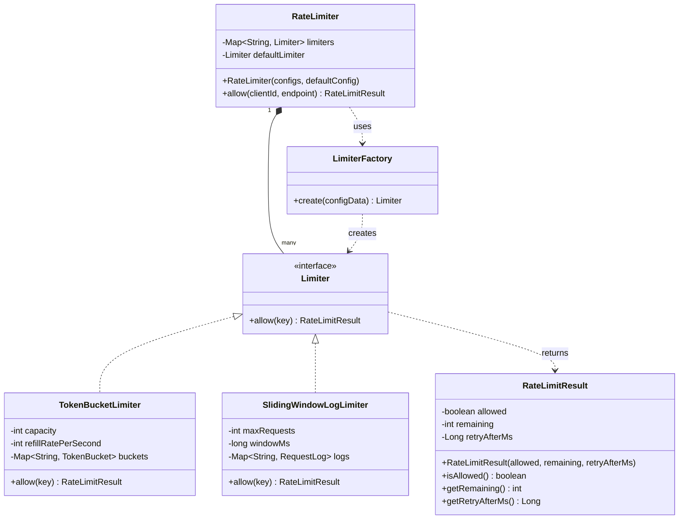

# レートリミッター (Rate Limiter)

**著者:** Evan King
**公開日:** 2025年12月17日
**難易度:** 上級 (hard)

## 問題の理解 (Understanding the Problem)

### 🚦 レートリミッターとは？
レートリミッターは、クライアントが特定の時間枠（タイムウィンドウ）内にAPIに対して行えるリクエストの数を制御します。リクエストが届いたとき、レートリミッターはクライアントが割り当て（クォータ）を超過しているかどうかを確認します。上限を下回っていれば、リクエストは進行します。上限に達していれば、リクエストは拒否されます。これによりAPIは乱用から保護され、クライアント間で公平なリソース配分が保証されます。

## 要件 (Requirements)

面接が始まると、次のようなお題が出されます：
「APIゲートウェイ用のインメモリ・レートリミッターを構築してください。システムは外部サービスから設定を受け取り、エンドポイントごとにレート制限のルールを提供します。各エンドポイントは独自の制限と特定のアルゴリズムを持つことができます。あるエンドポイントの設定例を次に示します：
```json
{
  "endpoint": "/search",
  "algorithm": "TokenBucket",
  "algoConfig": {
    "capacity": 1000,
    "refillRatePerSecond": 10
  }
}
```
この設定では、最大1000リクエストのバーストを許可し、1秒間に10リクエストの速度で補充（リフィル）します。
あなたの仕事は、これらのルールを強制するインメモリ・レートリミッターを構築することです。」

### 明確化のための質問 (Clarifying Questions)

これで問題の概要は掴めましたが、構築するシステムの完全な理解を得るために、面接官に質問する時間を少し取るべきです。会話は次のように進むかもしれません：

**あなた:** 「設定にはアルゴリズム固有のパラメータが含まれていますね。アルゴリズムごとに異なるパラメータセットがありますか？」
**面接官:** 「はい、アルゴリズムが違えば必要なパラメータも違います。ですので、`algoConfig` オブジェクトは常に存在しますが、その中のパラメータは変化します。」
*よし。これで設定が不均一（ヘテロジニアス）であることが分かりました。*

**あなた:** 「リクエストが届いたとき、どのような情報を受け取りますか？クライアントIDとエンドポイントですか、それとも他の何かですか？」
**面接官:** 「その通りです。各リクエストはクライアントIDとエンドポイントを提供します。クライアントIDはリクエストを行っている人物を一意に識別する単なる文字列です。」

**あなた:** 「リクエストをチェックするとき、何を返すべきですか？単に許可/拒否（allowed/denied）ですか、それともより詳細な情報ですか？」
**面接官:** 「3つのことを返してください：許可されたかどうか、クォータの残り回数、そして拒否された場合はいつ再試行できるかです。」
*これで、戻り値の型には単なるブール値ではなく構造が必要なことが分かりました。*

**あなた:** 「設定がないエンドポイントに対するリクエストが来た場合はどうなりますか？」
**面接官:** 「良い質問ですね。デフォルトの設定にフォールバックしてください。設定が不足しているという理由だけでリクエストを拒否しないでください。」

**あなた:** 「システムは複数のスレッドからの同時リクエスト（コンカレント・リクエスト）を処理する必要がありますか？」
**面接官:** 「最初は気にしないでください。時間があれば後で対応しましょう。」
*これは面接官のよくあるパターンです。「Xについて心配しないで」というのは、シンプルなものから始めてコアロジックを機能させるためです。*

**あなた:** 「スコープの確認ですが、複数サーバーにまたがる分散レート制限を構築するのですか、それとも単一プロセスのインメモリですか？」
**面接官:** 「単一プロセス、インメモリです。シンプルにしてください。」
*これは大きな簡略化です。ネットワークの調整やマシン間での状態の共有はありません。*

**あなた:** 「設定は動的ですか、それとも起動時に一度だけロードされますか？」
**面接官:** 「起動時にロードされます。システム実行中の設定のホットリロードについては心配しないでください。」

### 最終要件 (Final Requirements)

やり取りの後、ホワイトボードに次のように書きます：

**要件:**
1. 設定は起動時に提供される（一度だけロード）
2. システムは `(clientId: string, endpoint: string)` を持つリクエストを受け取る
3. 各エンドポイントには以下を指定する設定がある：
   - 使用するアルゴリズム（例: "TokenBucket", "SlidingWindowLog" など）
   - アルゴリズム固有のパラメータ
4. システムはエンドポイントの設定に対してクライアントIDをチェックし、レート制限を強制する
5. 構造化された結果を返す: `(allowed: boolean, remaining: int, retryAfterMs: long | null)`
6. エンドポイントに設定がない場合は、デフォルトの制限を使用する

**スコープ外:**
- 分散レート制限（Redis、調整）
- 動的な設定の更新
- メトリクスと監視
- 基本的なチェックを超えた設定の検証

## コアとなるエンティティと関係性 (Core Entities and Relationships)

要件から、振る舞いや状態を持つものを表す名詞をスキャンします。

- **Request (リクエスト)** - モデル化すべきでしょうか？いいえ。リクエストは外部のものです。`(clientId, endpoint)` を受け取り、すぐにルックアップに使用します。
- **Client (クライアント)** - これもシステム外部です。クライアントIDは状態を追跡するためのキーに過ぎません。
- **Endpoint (エンドポイント)** - 単なるラベルであり、文字列です。エンティティではありません。
- **Rate Limiting Algorithm (レート制限アルゴリズム)** - これは間違いなくエンティティです。各アルゴリズムは固有の設定、アルゴリズムごとに異なるキーごとの状態、独自の許可/拒否ロジックを持ちます。
- **RateLimiter** - システムをオーケストレーションするものが必要です。リクエストが到着したときに設定を調べ、適切なアルゴリズムインスタンスを選んで委譲します。これがエントリーポイントです。
- **RateLimitResult** - 構造化された戻り値（allowed, remaining, retryAfterMs）の型です。

フィルタリングの結果、3つのエンティティが残りました：

| エンティティ | 責務 |
| --- | --- |
| **RateLimiter** | オーケストレーターであり、システムのエントリーポイント。リクエストを受け取り、設定を調べ、適切なアルゴリズムインスタンスに委譲します。設定がない場合はデフォルトにフォールバックします。 |
| **Limiter (インターフェース)** | すべてのレート制限アルゴリズムが従うべき規約。`allow(key)` メソッドを持ち、`RateLimitResult` を返します。Token Bucket などの具体的なアルゴリズムがこれを実装します。 |
| **RateLimitResult** | レート制限の決定とメタデータをパッケージ化した値オブジェクト（Value Object）。作成後は不変（イミュータブル）です。 |

関係性は率直です。`RateLimiter` はエンドポイントの文字列からインスタンス化された `Limiter` へのマップを保持します。

## クラス設計 (Class Design)

### RateLimiter

| 要件 | RateLimiter が追跡すべきもの |
| --- | --- |
| 「各エンドポイントには...設定がある」 | エンドポイントから設定へのマップ |
| 「レート制限を強制する」 | 委譲先のアルゴリズムインスタンス |
| 「設定がない場合はデフォルトの制限を使用する」 | デフォルトの Limiter インスタンス |

```java
class RateLimiter {
    Map<String, Limiter> limiters;
    Limiter defaultLimiter;
    
    RateLimiter(List<Config> configs, Config defaultConfig) { ... }
    RateLimitResult allow(String clientId, String endpoint) { ... }
}
```

コンストラクタは、異種の設定データから適切なアルゴリズムタイプに基づいて `Limiter` 実装を作成する必要があります。これには Factory パターンを使用します。

### LimiterFactory

Factory の責務は単純です：生の設定データを受け取り、アルゴリズムの識別子を調べ、パラメータを抽出して、正しい `Limiter` コンストラクタに渡します。

```java
class LimiterFactory {
    Limiter create(ConfigData configData) { ... }
}
```

### Limiter

```java
interface Limiter {
    RateLimitResult allow(String key);
}
```

抽象基底クラス（Abstract Base Class）を使用すべきか迷うかもしれませんが、アルゴリズムによってキーごとに追跡する状態が根本的に異なります（Token Bucket はトークン数と時刻、Sliding Window Log はタイムスタンプのキュー）。共有する状態がないため、インターフェースが最適です。

### RateLimitResult

```java
class RateLimitResult {
    boolean allowed;
    int remaining;
    Long retryAfterMs; // 許可された場合は null
    
    // コンストラクタ、ゲッター等
}
```

## 最終的なクラス設計 (Final Class Design)



## 実装 (Implementation)

### LimiterFactory

```java
Limiter create(ConfigData externalConfig) {
    String algorithm = externalConfig.getString("algorithm");
    ConfigData algoConfig = externalConfig.getConfig("algoConfig");
    
    switch (algorithm) {
        case "TokenBucket":
            return new TokenBucketLimiter(
                algoConfig.getInt("capacity"),
                algoConfig.getInt("refillRatePerSecond")
            );
        case "SlidingWindowLog":
            return new SlidingWindowLogLimiter(
                algoConfig.getInt("maxRequests"),
                algoConfig.getLong("windowMs")
            );
        default:
            throw new IllegalArgumentException("Unknown algorithm: " + algorithm);
    }
}
```

### RateLimiter

```java
RateLimiter(List<ConfigData> configs, ConfigData defaultConfig) {
    LimiterFactory factory = new LimiterFactory();
    limiters = new HashMap<>();
    
    for (ConfigData config : configs) {
        String endpoint = config.getString("endpoint");
        Limiter limiter = factory.create(config);
        limiters.put(endpoint, limiter);
    }
    defaultLimiter = factory.create(defaultConfig);
}

RateLimitResult allow(String clientId, String endpoint) {
    Limiter limiter = limiters.get(endpoint);
    if (limiter == null) {
        limiter = defaultLimiter;
    }
    return limiter.allow(clientId);
}
```
ここでは起動時にすべての Limiter を作成する「先行インスタンス化（Eager instantiation）」を使用しています。

### レート制限アルゴリズム (Rate Limiting Algorithms)

| アルゴリズム | キーごとの状態 | トレードオフ |
| --- | --- | --- |
| Token Bucket | `(tokens, lastRefillTime)` | バーストを許可、スムーズな補充 |
| Sliding Window Log | `Queue<timestamp>` | 完璧な精度、メモリ使用量が大きい |

面接では、最も一般的な Token Bucket と Sliding Window Log の実装を求められることが多いです（通常はどちらか1つ）。

#### TokenBucketLimiter

```java
class TokenBucketLimiter implements Limiter {
    int capacity;
    int refillRatePerSecond;
    Map<String, TokenBucket> buckets;

    TokenBucketLimiter(int capacity, int refillRatePerSecond) {
        this.capacity = capacity;
        this.refillRatePerSecond = refillRatePerSecond;
        this.buckets = new HashMap<>();
    }

    RateLimitResult allow(String key) {
        TokenBucket bucket = getOrCreateBucket(key);
        long now = System.currentTimeMillis();
        long elapsed = now - bucket.lastRefillTime;
        
        // 追加するトークンを計算
        double tokensToAdd = (elapsed * refillRatePerSecond) / 1000.0;
        bucket.tokens = Math.min(capacity, bucket.tokens + tokensToAdd);
        bucket.lastRefillTime = now;
        
        if (bucket.tokens >= 1) {
            bucket.tokens -= 1;
            return new RateLimitResult(true, (int)Math.floor(bucket.tokens), null);
        } else {
            double tokensNeeded = 1 - bucket.tokens;
            long retryAfterMs = (long)Math.ceil((tokensNeeded * 1000) / refillRatePerSecond);
            return new RateLimitResult(false, 0, retryAfterMs);
        }
    }

    TokenBucket getOrCreateBucket(String key) {
        if (!buckets.containsKey(key)) {
            buckets.put(key, new TokenBucket(capacity, System.currentTimeMillis()));
        }
        return buckets.get(key);
    }
}

class TokenBucket {
    double tokens;
    long lastRefillTime;
    
    TokenBucket(double initialTokens, long time) {
        this.tokens = initialTokens;
        this.lastRefillTime = time;
    }
}
```
*注:* ここではバックグラウンドスレッドで補充するのではなく、リクエスト到着時に「オンデマンド」で経過時間からトークン数を計算します。

#### SlidingWindowLogLimiter

```java
class SlidingWindowLogLimiter implements Limiter {
    int maxRequests;
    long windowMs;
    Map<String, Queue<Long>> logs;

    SlidingWindowLogLimiter(int maxRequests, long windowMs) {
        this.maxRequests = maxRequests;
        this.windowMs = windowMs;
        this.logs = new HashMap<>();
    }

    RateLimitResult allow(String key) {
        Queue<Long> log = getOrCreateLog(key);
        long now = System.currentTimeMillis();
        long cutoff = now - windowMs;
        
        // タイムウィンドウ外の古いタイムスタンプを削除
        while (!log.isEmpty() && log.peek() < cutoff) {
            log.poll();
        }
        
        if (log.size() < maxRequests) {
            log.offer(now);
            return new RateLimitResult(true, maxRequests - log.size(), null);
        } else {
            long oldestTimestamp = log.peek();
            long retryAfterMs = (oldestTimestamp + windowMs) - now;
            return new RateLimitResult(false, 0, retryAfterMs);
        }
    }

    Queue<Long> getOrCreateLog(String key) {
        if (!logs.containsKey(key)) {
            logs.put(key, new LinkedList<>());
        }
        return logs.get(key);
    }
}
```

## 拡張性 (Extensibility)

### 1. 「新しいレート制限アルゴリズムを追加するにはどうしますか？」
システムはすでに Factory パターンによってそのように設計されています。`Limiter` インターフェースを実装する新しいクラスを作成し、`LimiterFactory` の `switch` 文にケースを1つ追加するだけです。

### 2. 「同時リクエストに対するスレッドセーフティをどう処理しますか？」
現状の実装はスレッドセーフではありません。同じクライアントIDに対して2つのスレッドが同時にアクセスすると競合が発生します。
「標準的な解決策はキー単位のロック（per-key locking）です。`ConcurrentHashMap` を使用し、バケットオブジェクト自体に対して `synchronized`（ロック）をかけます。」

```java
// スレッドセーフな TokenBucketLimiter の一部
class TokenBucketLimiter implements Limiter {
    ConcurrentHashMap<String, TokenBucket> buckets;
    
    // ...
    RateLimitResult allow(String key) {
        // アトミックにバケットを取得または作成
        TokenBucket bucket = buckets.computeIfAbsent(key, k -> new TokenBucket(capacity, System.currentTimeMillis()));
        
        // バケットオブジェクト自体をロック
        synchronized (bucket) {
            // トークンの計算・消費ロジック
        }
    }
}
```
これにより、異なるクライアント（キー）同士は並行して処理され、同じクライアントのリクエストのみが同期的に処理されます。
